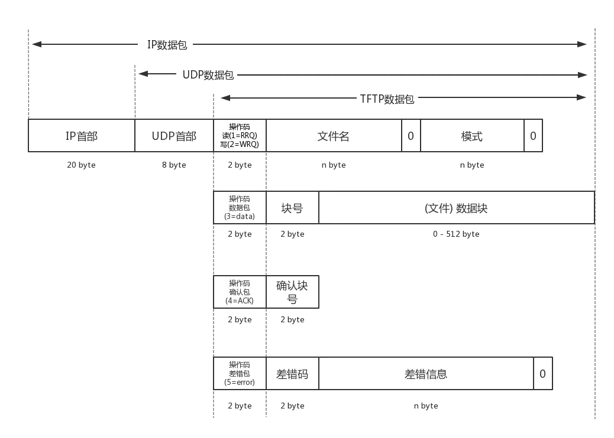

# iOS 实现 TFTP 客户端和服务器

> 📅 发布时间：2017-12-25
>
> 🏷️ 标签：`TFTP` `iOS` `Objective-C`
>
> ⏱️ 阅读时长：约 15 分钟

> TFTP (Trivial File Transfer Protocol)，简单文件传输协议，该协议在端口 69 上使用 UDP 服务。TFTP 协议常用于无盘工作站或路由器从别的主机上获取引导配置文件，由于 TFTP 报文体积小，能够迅速复制这些文件。

因为作者是做智能家居方向的开发，公司初期实现硬件升级的方案是：先通过手机端从服务器下载固件，再通过特定协议将固件传输给硬件设备，硬件设备接收完成后进行升级。这里涉及到一个协议的选择：固件本身并不大（一般在 1M 以内），此时 TFTP 协议无疑是最佳选择之一，其轻量级的特性使得传输不复杂且系统开销小。

由于网上相关的 iOS Demo 较少，本文将基于 Objective-C 搭建一个简单的 TFTP 通信客户端和服务器（暂不支持 IPv6，已包含超时处理和错误抛出）。

---

## 1. TFTP 概况

TFTP 是一个传输文件的简单协议，基于 UDP 协议实现。此协议设计初衷是进行小文件传输，因此它不具备 FTP 的许多高级功能（如列出目录、权限控制等），只能从服务器上读取或写入文件。

TFTP 传输始于一个读取（RRQ）或写入（WRQ）文件的请求。如果服务器批准此请求，则打开连接并以定长数据块传输（一般为 512 字节）。每个数据包包括一个数据块号，发送方在发送下一个数据包前必须得到接收方的确认（ACK）。

**结束判定**：如果一个数据包的大小小于规定的长度（如 512 字节），则表示传输结束。通信双方既是发送者也是接收者：一方发送数据并接收应答，另一方发出应答并接收数据。

---

## 2. TFTP 协议格式

在编写通信代码前，理解协议报文格式至关重要：



- **数据长度**：以字节为单位标识。
- **操作码 (Opcode)**：常用五种：`RRQ` (读请求)、`WRQ` (写请求)、`DATA` (数据包)、`ACK` (确认包)、`ERROR` (差错包)。
- **数据块大小**：通常定为 512 字节。
- **MTU 限制**：由于基于 UDP，受限于以太网 MTU (1500 字节)：
  `MTU(1500) - PPP 封装(8) - IP 头(20) - UDP 头(8) = 1464 字节`。
  为了避免系统分片导致的数据丢失，业界通用 512 字节作为数据块长度。
- **编码**：文件名和错误信息建议使用 ASCII 编码，因为嵌入式硬件（如单片机）不一定支持 UTF-8。

---

## 3. TFTP 通信流程


1. **监听**：服务器绑定端口号（默认 69）开始监听。
2. **请求**：客户端发送 RRQ 或 WRQ 数据包，包含文件名和传输模式。
3. **传输**：服务器找到文件，将其拆分为 512 字节的块。
4. **确认**：客户端每收到一块数据，回复一个 ACK（包含块号）。
5. **结束**：
   - 客户端收到小于 512 字节的包，判定为最后一包，回复 ACK 后关闭连接。
   - **特殊情况**：如果最后一包正好是 512 字节，发送方必须再发送一个数据长度为 0 的包，以明确告知接收方传输已结束。

---

## 4. 代码实现部分

**Demo 运行效果图：**（效果图为 GIF 动态图，动画只执行一次，看不到效果可以刷新页面重新播放）


[**Demo 代码地址(GitHub)**](https://github.com/SupermanChao/TFTP_Demo)

### 4.1 服务器端实现

#### ① 初始化套接字并绑定端口
创建 UDP 套接字并绑定地址。

```objectivec
//套接字初始化(Create Socket)
_sockfd = socket(AF_INET, SOCK_DGRAM, 0);
if (_sockfd <= 0) {
    [self throwErrorWithCode:errno reason:@"Failed to create socket"];
    return;
}

//绑定监听地址
struct sockaddr_in addr_server;
addr_server.sin_len = sizeof(struct sockaddr_in);
addr_server.sin_family = AF_INET;
addr_server.sin_port = htons(bindPort);
addr_server.sin_addr.s_addr = htonl(INADDR_ANY);

if (bind(_sockfd, (struct sockaddr*)&addr_server, addr_server.sin_len) < 0) {
    [self throwErrorWithCode:errno reason:@"Binding socket failed"];
    return;
}
```

#### ② 监听客户端连接
设置接收超时时间为 30s。

```objectivec
//申明一个接受客户端连接套接字的地址
struct sockaddr_in addr_clict;
socklen_t addr_clict_len = sizeof(struct sockaddr_in);
addr_clict.sin_len = addr_clict_len;

//设置接收请求连接超时时间为30s
struct timeval timeout = {30,0};
if (setsockopt(_sockfd, SOL_SOCKET, SO_RCVTIMEO, &timeout, sizeof(struct timeval)) < 0) {
    printf("开始设置Socket服务器接收连接超时失败: %s\n",strerror(errno));
}

while (1) {

    if (_isOpen == NO) return; //服务器关闭直接退出

    char recv_buffer[1024];     //接收数据缓冲区
    ssize_t result_recv = recvfrom(_sockfd, recv_buffer, sizeof(recv_buffer), 0, (struct sockaddr*)&addr_clict, &addr_clict_len);
    if (result_recv < 0 && _isOpen) {
        [self throwErrorWithCode:errno reason:@"Read data error"];
        return;
    }

    if (result_recv < 4) continue; //数据包长度必须大于或等于4,否则不是我们想要的数据

   //有接收到数据，进入下面的数据解析部分 ->③
}
```

#### ③ 数据解析与请求处理
`connect()` 在 UDP 中不创建实际连接，仅注册目的地址以简化后续收发。

```objectivec
if (recv_buffer[1] == TFTP_RRQ) { //操作码是读请求 -> 有客户端连接

    //注册客户端地址信息
    if (connect(_sockfd, (struct sockaddr*)&addr_clict, sizeof(addr_clict)) != 0) {
        [self throwErrorWithCode:errno reason:@"Registration destination address failed"];
        return;
    }

    //1. 解析出文件名
    char* cFileName = &recv_buffer[2];
    NSLog(@"[TFTPServer] 收到第一个请求包IP: %s, 文件名: %s",inet_ntoa(addr_clict.sin_addr),cFileName);

    //2. 拼接路径
    _filepath = [_filepath stringByAppendingPathComponent:[NSString stringWithCString:cFileName encoding:NSUTF8StringEncoding]];

    //3. 初始化一些数据
     _fileTotalLen = self.fileData.length;
     NSLog(@"[TFTPServer] 文件长度: %lu",(unsigned long)_fileTotalLen);
     if (_fileTotalLen == 0) {

        char send_buffer[512];
        NSUInteger len = [TFTPServerPacket makeErrorDataWithCode:1000
                                                          reason:"Request file name error"
                                                      sendBuffer:send_buffer];
        sendto(_sockfd, send_buffer, len, 0, (struct sockaddr*)&addr_clict, addr_clict.sin_len);

        [self throwErrorWithCode:errno reason:@"Request file name error"];
        return;
    }

    //一切准备就绪，开始传输数据 ->④
    [self beganToTransportData];
    return;
}
```

#### ④ 开启数据传输
设置 6s 超时时间。

```objectivec
//1. 局部变量的声明
char recv_buffer[1024];     //接收数据缓冲区
char send_buffer[1024];     //发送数据缓冲区
NSUInteger sendLen = 0;     //发送数据的长度

//2. 初始化一些数据
_blocknum = 1;
_alreadySendLen = 0;
int retry = 0;                  //同一个包重传次数
BOOL isLastPacket = false;      //记录是否是最后一个数据包

//3. 第一个数据包的发送
sendLen = [TFTPServerPacket makeDataWithTotalData:self.fileData
                                       sendBuffer:send_buffer
                                         location:_alreadySendLen
                                           length:TFTP_BlockSize
                                         blocknum:_blocknum];
if (sendLen < (TFTP_BlockSize + 4)) isLastPacket = YES; //记录下是发送的最后一个数据包

if (send(_sockfd, send_buffer, sendLen, 0) < 0 && _isOpen) {
    [self throwErrorWithCode:errno reason:@"Send data error"];
    return;
}
_alreadySendLen = sendLen - 4;

//开始传输数据时，定个数据包接收超时时间段为6s
struct timeval timeout = {6,0};
if (setsockopt(_sockfd, SOL_SOCKET, SO_RCVTIMEO, &timeout, sizeof(struct timeval)) < 0) {
    printf("设置Socket通信过程中，接收客户端数据超时失败：%s\n",strerror(errno));
}

//开始下面的监听ACK返回，发送接下来的数据包 ->⑤
```

#### ⑤ 循环监听确认包 (ACK)
包含重传机制。

```objectivec
//4. while循环监听数据包的返回
while (1) {

    if (_isOpen == NO) return; //服务器关闭直接退出监听

    ssize_t result_recv = recv(_sockfd, recv_buffer, sizeof(recv_buffer), 0);
    if (result_recv < 0 && _isOpen) {
        if (errno == EAGAIN) { //接收超时重传
            retry ++;
            if (retry >= MAX_RETRY) {
                NSLog(@"[TFTPServer] 接收ACK超时,发送差错包给客户端");
                sendLen = [TFTPServerPacket makeErrorDataWithCode:1001
                                                           reason:"The maximum number of retransmissions"
                                                       sendBuffer:send_buffer];
                send(_sockfd, send_buffer, sendLen, 0);
                [self throwErrorWithCode:1001 reason:@"The maximum number of retransmissions"];
                return;
            }else {
                NSLog(@"[TFTPServer] 接收客户端确认包超时 -> 重传上次的包(块号:%u)",_blocknum);
                if (send(_sockfd, send_buffer, sendLen, 0) < 0 && _isOpen) {
                    [self throwErrorWithCode:errno reason:@"Send data error"];
                    return;
                }
                continue;
            }
        }else {
            [self throwErrorWithCode:errno reason:@"Read data error"];
            return;
        }
    }

    //数据包长度小于4不要
    if (result_recv < 4) continue;

    //接下来解析客户端发送回来的数据和对应数据发送还有服务器端操作 ->⑥
}
```

#### ⑥ 解析确认包逻辑
校验操作码。

```objectivec
//先解析操作码
char opCode = recv_buffer[1];
if (opCode == TFTP_RRQ || opCode == TFTP_WRQ || opCode == TFTP_DATA) {
    NSLog(@"[TFTPServer] 客户端发错了数据包(操作码: %d), 不理",opCode);
}else if (opCode == TFTP_ACK) { //收到ACK数据包

     //收到设备端的ACK确认包->进行ACK块号确认，发送对应数据包 ->⑦

}else if (opCode == TFTP_ERROR) {

    //客户端那边发送过来了错误包
    NSString *errStr = [[NSString alloc] initWithBytes:&recv_buffer[4] length:result_recv-4 encoding:NSUTF8StringEncoding];
    NSLog(@"[TFTPServer] 客户端传送过来差错信息:  错误码 -> %u 错误信息 -> %@",(((recv_buffer[2] & 0xff) << 8) | (recv_buffer[3] & 0xff)),errStr);
    [self throwErrorWithCode:(((recv_buffer[2] & 0xff) << 8) | (recv_buffer[3] & 0xff)) reason:errStr];
    return;
}else {
    NSLog(@"[TFTPServer] 客户端发错了数据包(操作码: %d), 不理",opCode);
}
```

#### ⑦ 判断传输完成
校验块号。

```objectivec
//①. 解析出确认块号
uint clict_sureblocknum = ((recv_buffer[2]&0xff)<<8)|((recv_buffer[3]&0xff));
//NSLog(@"[TFTPServer] 收到客户端的ACK数据包,块号：%d",clict_sureblocknum);

//②. 判断是否是最后一个包的确认
if (isLastPacket == YES && _blocknum == clict_sureblocknum) { //是最后一个包了

    [self sendComplete];
    return;

}else {

    //不是最后一个数据包的确认块号，解析出块号并判断 ->⑧
}
```

#### ⑧ 发送下一数据块
```objectivec
if (_blocknum == clict_sureblocknum) {
    _blocknum ++;
    retry = 0;

    sendLen = [TFTPServerPacket makeDataWithTotalData:self.fileData
                                           sendBuffer:send_buffer
                                             location:_alreadySendLen
                                               length:TFTP_BlockSize
                                             blocknum:_blocknum];

    if (sendLen < (TFTP_BlockSize + 4)) isLastPacket = YES; //记录下是发送的最后一个数据包

    if (send(_sockfd, send_buffer, sendLen, 0) < 0 && _isOpen) {
        [self throwErrorWithCode:errno reason:@"Send data error"];
        return;
    }
    _alreadySendLen += (sendLen - 4);

}else if (clict_sureblocknum == (_blocknum - 1)) {
    //ACK块号不对,进入重发机制

    //上一个数据包客户端接收有误, 重传 ->⑨
}else {

    NSLog(@"[TFTPServer] 客户端返回的确认块号不对 _blocknum:%u clict_sureblocknum:%u",_blocknum,clict_sureblocknum);
    [self throwErrorWithCode:1002 reason:@"Request block number error"];
    return;
}
```

#### ⑨ 重传机制处理
```objectivec
retry ++;
if (retry >= MAX_RETRY) {
    NSLog(@"[TFTPServer] 接收ACK错误次数达到上限,发送差错包给客户端");
    sendLen = [TFTPServerPacket makeErrorDataWithCode:1001
                                               reason:"The maximum number of retransmissions"
                                           sendBuffer:send_buffer];

    send(_sockfd, send_buffer, sendLen, 0);
    [self throwErrorWithCode:1001 reason:@"The maximum number of retransmissions"];
    return;
}else {
    NSLog(@"[TFTPServer] 客户端发送ACK块号有误(块号:%u), 重传上次的包(块号:%u)",_blocknum,clict_sureblocknum);
    if (send(_sockfd, send_buffer, sendLen, 0) < 0 && _isOpen) {
        [self throwErrorWithCode:errno reason:@"Send data error"];
        return;
    }
}
```

---

### 4.2 客户端实现

#### ① 创建并绑定套接字
```objectivec
//初始化套接字
_sockfd = socket(AF_INET, SOCK_DGRAM, 0);

if (_sockfd <= 0) {
    [self throwErrorWithCode:errno reason:@"Failed to create socket"];
    return ;
}

struct sockaddr_in addr_bind;
addr_bind.sin_len = sizeof(struct sockaddr_in);
addr_bind.sin_family = AF_INET;
addr_bind.sin_port = htons(port);
addr_bind.sin_addr.s_addr = htonl(INADDR_ANY);

if (bind(_sockfd, (struct sockaddr*)&addr_bind, addr_bind.sin_len) < 0) {
    [self throwErrorWithCode:errno reason:@"Binding socket failed"];
    return;
}
```

#### ② 注册服务器信息与设置超时
```objectivec
//注册套接字目的地址
struct sockaddr_in addr_server;
addr_server.sin_len = sizeof(struct sockaddr_in);
addr_server.sin_family = AF_INET;
addr_server.sin_port = htons(port);
inet_pton(AF_INET, host.UTF8String, &addr_server.sin_addr);

if (connect(_sockfd, (struct sockaddr*)&addr_server, addr_server.sin_len) < 0) {
    [self throwErrorWithCode:errno reason:@"Registration destination address failed"];
    return;
}

//设置读取数据超时
struct timeval timeout = {6, 0};
if (setsockopt(_sockfd, SOL_SOCKET, SO_RCVTIMEO, &timeout, sizeof(struct timeval)) < 0) {
    printf("[TFTPClient] 设置接收数据超时失败：%s",strerror(errno));
}
```

#### ③ 发送读请求 (RRQ)
```objectivec
//1. 初始化一些变量
char sendBuffer[1024];      //发送数据缓存区
NSUInteger sendLen;         //发送数据长度
char recvBuffer[1024];      //接收数据缓存区
_blocknum = 0;              //接收块号记录
self.fileData.length = 0;   //接收文件缓存区
int retry = 0;              //记录同一个包的请求次数
BOOL isLastPacket = false;  //记录是否是最后一个数据包

//2. 发送文件请求包
sendLen = [TFTPClientPacket makeRRQWithFileName:filename
                                     sendBuffer:sendBuffer];
if (send(_sockfd, sendBuffer, sendLen, 0) < 0 && _isOpen) {
    [self throwErrorWithCode:errno reason:@"Read data error"];
    return;
}

//开始监听服务器数据发送了 -> ④
```

#### ④ 循环监听服务器数据
```objectivec
//3. 开始监听数据返回
while (1) {

    ssize_t result_recv = recv(_sockfd, recvBuffer, sizeof(recvBuffer), 0);
    if (result_recv < 0 && _isOpen) {

        if (errno == EAGAIN) { //读取数据超时
            retry++;
            if (retry >= MAX_RETRY) {
                NSLog(@"[TFTPClient] 请求超时,发送差错包给服务器");
                sendLen = [TFTPClientPacket makeErrorDataWithCode:1001
                                                           reason:"The maximum number of retransmissions"
                                                       sendBuffer:sendBuffer];
                send(_sockfd, sendBuffer, sendLen, 0);
                [self throwErrorWithCode:1001 reason:@"The maximum number of retransmissions"];
                return;
            }else {
                //重发上一个ACK确认包
                NSLog(@"[TFTPClient] 客户端请求数据块超时,重发上个ACK(块号:%u)",_blocknum);
                if (send(_sockfd, sendBuffer, sendLen, 0) < 0 && _isOpen) {
                    [self throwErrorWithCode:errno reason:@"Send data error"];
                    return;
                }
                continue;
            }
        }else {
            [self throwErrorWithCode:errno reason:@"Read data error"];
            return;
        }
    }

    //数据长度过短或不是我们需要服务器地址发送过来的数据都不是我们想要的数据, 直接丢掉
    if (result_recv < 4) continue;

    //是自己需要的数据，解析出操作码，进行相应的操作 ->⑤
}
```

#### ⑤ 解析操作码逻辑
```objectivec
//解析操作码
char opCode = recvBuffer[1];
if (opCode == TFTP_RRQ || opCode == TFTP_WRQ || opCode == TFTP_ACK) {

    NSLog(@"[TFTPClient] 服务器发送了错误数据包(操作码: %d)，不理",opCode);

}else if (opCode == TFTP_DATA) {
    /* 服务器发送过来数据包 */

    //进行接下来的数据解析和拼接，发送给确认包 ->⑥

}else if (opCode == TFTP_ERROR) {

    NSString *errStr = [[NSString alloc] initWithBytes:&recvBuffer[4] length:result_recv-4 encoding:NSUTF8StringEncoding];
    NSLog(@"[TFTPClient] 服务器传送过来差错信息: 错误码 -> %u 错误信息 -> %@",(((recvBuffer[2] & 0xff) << 8) | (recvBuffer[3] & 0xff)),errStr);
    [self throwErrorWithCode:(((recvBuffer[2] & 0xff) << 8) | (recvBuffer[3] & 0xff)) reason:errStr];
    return;
}else {
    NSLog(@"[TFTPClient] 服务器传过来不知名的数据包(操作码: %d)",opCode);
}
```

#### ⑥ 解析数据并回复 ACK
```objectivec
//解析出块号, 与自己的块号作比较, 看看服务器有没有发错
uint blocknum = (recvBuffer[2]&0xff)<<8 | (recvBuffer[3]&0xff);
//NSLog(@"[TFTPClient] 服务器发送过来数据包,块号：%u",blocknum);

if (blocknum == (_blocknum + 1)) {

    retry = 0;
    _blocknum = blocknum;

    //解析数据包, 并且判断是否是最后一个数据包
    NSData *data = [NSData dataWithBytes:&recvBuffer[4] length:result_recv-4];
    [self.fileData appendData:data];

    if (data.length < TFTP_BlockSize) isLastPacket = YES;

    //发送ACK确认包
    sendLen = [TFTPClientPacket makeACKWithBlockNum:_blocknum sendBuffer:sendBuffer];
    if (send(_sockfd, sendBuffer, sendLen, 0) < 0 && _isOpen) {
        [self throwErrorWithCode:errno reason:@"Send data error"];
        return;
    }
}else {
    //块号不对,进入重发机制
    //传送数据块号不对，进行重新确认 -> ⑦
}
```

#### ⑦ 客户端重试机制
```objectivec
retry++;
if (retry >= MAX_RETRY) {
    NSLog(@"[TFTPClient] 接收数据包错误次数达到上限,发送差错包给客户端");
    sendLen = [TFTPClientPacket makeErrorDataWithCode:1001
                                               reason:"The maximum number of retransmissions"
                                           sendBuffer:sendBuffer];
    send(_sockfd, sendBuffer, sendLen, 0);
    [self throwErrorWithCode:1001 reason:@"The maximum number of retransmissions"];
    return;
}else {
    NSLog(@"[TFTPClient] 服务器发送块号不对(块号:%u), 重发送上个ACK确认包(块号:%u)",blocknum,_blocknum);
    if (send(_sockfd, sendBuffer, sendLen, 0) < 0 && _isOpen) {
        [self throwErrorWithCode:errno reason:@"Send data error"];
        return;
    }
}
```

#### ⑧ 客户端传输完成判定
```objectivec
if (isLastPacket) { //就收完成
     [self recevComplete];
     return;
}
```

---

## 5. 结语

TFTP 虽然限制较多，但其极简的设计使其在固件升级等场景下非常高效。本文代码提供了一个基础的思路，实际项目中还需考虑复杂的网络环境和更健壮的异常处理。