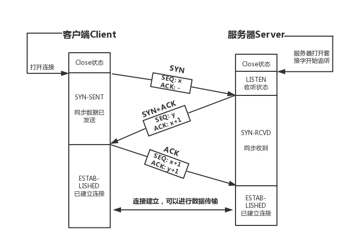
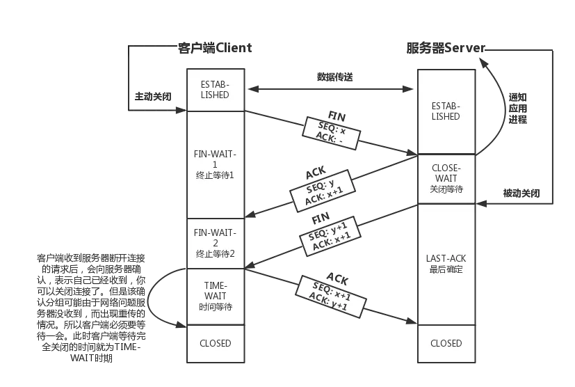
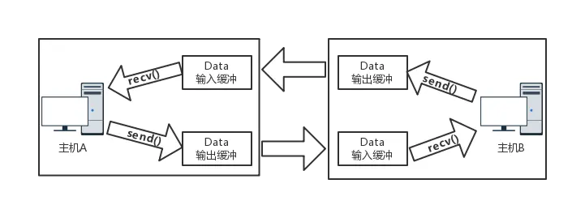

# 套接字(Socket)编程(二) 内部通信原理

> 📅 发布时间：2018-01-02
>
> 🏷️ 标签：`Socket` `TCP` `UDP`
>
> ⏱️ 阅读时长：约 15 分钟

> 起初我觉得学习套接字并不需要知道内部的通信原理，因为这些都是由系统处理的。但随着学习的深入，我发现这是个错误的想法——很多高级设置（如套接字选项、I/O 缓冲区大小等）都与内部通信原理息息相关。今天我们就来深入探讨套接字的底层通信机制。

上一篇我们介绍了 Socket 连接创建及通信流程的基本函数 [《套接字(Socket)编程(一) 函数概念篇》](/posts/2017-12-25-套接字(Socket)编程(一)函数概念篇/README.md)。本篇我们将重点讨论：**TCP 的连接与断开机制**、**I/O 缓冲区原理**以及 **UDP 的连接模式**。

---

## 1. TCP 连接的三次握手与断开的四次握手

在深入函数之前，我们必须理解 TCP 连接的状态变迁。虽然在代码层面上我们只需调用 `connect` 或 `accept`，但底层的状态转换直接影响着系统的稳定性和性能。

### 1.1 TCP 的 10 种状态

| 状态 | 描述 |
| :--- | :--- |
| **LISTEN** | 侦听来自远端的连接请求 |
| **SYN-SENT** | 发送连接请求后，等待匹配的连接请求 |
| **SYN-RECEIVED** | 收到和发送连接请求后，等待对方确认 |
| **ESTABLISHED** | 连接已建立，可以正常收发数据 |
| **FIN-WAIT-1** | 主动关闭方发送了中断请求，等待对方确认 |
| **FIN-WAIT-2** | 收到对方对中断请求的确认，等待对方也发送中断请求 |
| **TIME-WAIT** | 等待足够的时间，以保证远端收到最后的 ACK 确认 |
| **CLOSE-WAIT** | 被动关闭方等待本地应用层发起中断请求 |
| **LAST-ACK** | 被动关闭方发送中断请求后，等待最后的确认 |
| **CLOSED** | 没有任何连接，初始状态 |

### 1.2 TCP 连接时的三次握手 (Three-way Handshake)



1. **第一阶段 (SYN)**：客户端发送 **SYN** 同步消息。
   - `SEQ = x`：告知服务器，客户端将从序号 x 开始传输数据。
2. **第二阶段 (SYN+ACK)**：服务器回复 **SYN+ACK** 消息。
   - `ACK = x + 1`：确认已收到客户端的序号 x 包，期望下次收到 x + 1。
   - `SEQ = y`：告知客户端，服务器将从序号 y 开始传输数据。
3. **第三阶段 (ACK)**：客户端回复 **ACK** 消息。
   - `SEQ = x + 1`：当前发送的数据包序号为 x + 1。
   - `ACK = y + 1`：确认已收到服务器的序号 y 包，期望下次收到 y + 1。

> **为什么要三次握手？** 为了防止已失效的连接请求报文段突然又传到了服务器，导致服务器资源浪费。

### 1.3 数据交互细节


在通信过程中，ACK 的计算遵循公式：`ACK = SEQ + 传递的字节数`。
- **注意**：只有在握手阶段（SYN/FIN 为 1 时），ACK 才会额外加 1，因为这些标志位本身占据一个逻辑序号。在正常的纯数据传输中，ACK 指向的是期望收到的下一个字节的序列号。

### 1.4 TCP 断开的四次握手 (Four-way Handshake)



- **FIN-WAIT-1/2**：主动关闭方（通常是客户端）发起。
- **CLOSE-WAIT**：被动关闭方接收到 FIN 后进入该状态，表示“我正在处理剩余数据，稍后关闭”。
- **TIME-WAIT**：主动关闭方发送最后一个 ACK 后进入该状态，持续时长通常为 2MSL（Maximum Segment Lifetime）。

**为什么要等待 2MSL？**
1. **保证可靠性**：确保最后的 ACK 报文能够到达对端。如果该 ACK 丢失，对端会重传 FIN，处于 TIME-WAIT 的一方可以再次发送 ACK。
2. **防止旧连接干扰**：确保网络中所有残留的报文段都已消失，避免新旧连接序号冲突。

---

## 2. TCP 套接字中的 I/O 缓冲区

TCP 是面向字节流的协议，没有明确的数据边界。调用 `send` 函数并不是立即发送到网络，而是将数据移至系统的 **输出缓冲区**；同理，`recv` 是从系统的 **输入缓冲区** 读取数据。



**I/O 缓冲区特性：**
- 每个套接字独立拥有自己的输入/输出缓冲区。
- 缓冲区在创建套接字时自动生成。
- **关闭套接字后**：输出缓冲区中的残留数据仍会尝试发送给对方，但输入缓冲区的数据会立即丢失。

---

## 3. UDP 套接字中的 I/O 缓冲区

与 TCP 不同，**UDP 具有严格的数据边界**。这意味着：
- 输出函数（`sendto`）的调用次数必须与输入函数（`recvfrom`）的调用次数一一对应。
- 如果发送端发了 3 个 UDP 包，接收端必须调用 3 次读取函数才能拿完数据。

### 3.1 UDP 边界验证示例

**发送端 (C 语言)：**
```c
#include <stdio.h>
#include <unistd.h>
#include <string.h>
#include <sys/socket.h>
#include <arpa/inet.h>
#include <errno.h>

int sendPacket(void);

int main(int argc, const char * argv[]) {
    int send_result = sendPacket();
    if (send_result == 0) printf("开启发送失败\n");
    return 0;
}

int sendPacket()
{
    printf("请输入UDP数据传送IP地址:");
    char ip[INET_ADDRSTRLEN];
    scanf("%s",ip);

    int send_sock;
    send_sock = socket(AF_INET, SOCK_DGRAM, 0);
    if (send_sock < 0) return 0;

    struct sockaddr_in addr;
    memset(&addr, 0, sizeof(addr));
    addr.sin_family = AF_INET;
    addr.sin_port = htons(2001);
    inet_aton(ip, &addr.sin_addr);

    printf("开始连续三次发送数据\n");
    char msg1[] = "Hi";
    char msg2[] = "Hello";
    char msg3[] = "Nice to meet you";
    sendto(send_sock, msg1, sizeof(msg1), 0, (struct sockaddr*)&addr, sizeof(addr));
    sendto(send_sock, msg2, sizeof(msg2), 0, (struct sockaddr*)&addr, sizeof(addr));
    sendto(send_sock, msg3, sizeof(msg3), 0, (struct sockaddr*)&addr, sizeof(addr));

    printf("关闭UDP套接字\n");
    close(send_sock);
    return 1;
}
```

**接收端 (C 语言)：**
```c
#include <stdio.h>
#include <unistd.h>
#include <string.h>
#include <sys/socket.h>
#include <arpa/inet.h>
#include <errno.h>

int recvPacket(void);

int main(int argc, const char * argv[]) {
    int recv_result = recvPacket();
    if (recv_result == 0) printf("开启接收失败\n");
    return 0;
}

int recvPacket()
{
    int recv_sock;
    recv_sock = socket(AF_INET, SOCK_DGRAM, 0);
    if (recv_sock < 0) return 0;

    struct sockaddr_in addr,recv_addr;
    socklen_t len = sizeof(struct sockaddr_in);

    memset(&addr, 0, sizeof(addr));
    addr.sin_family = AF_INET;
    addr.sin_port = htons(2001);
    addr.sin_addr.s_addr = htonl(INADDR_ANY);

    if (bind(recv_sock, (struct sockaddr*)&addr, sizeof(addr)) < 0) {
        perror("bind failed");
        return 0;
    }

    printf("开始接收UDP数据\n");
    char recv_buffer[512];
    for (int i = 0; i<3; i++) {
        sleep(5); // 故意延迟读取，模拟缓冲区堆积
        memset(recv_buffer, 0, 512);
        ssize_t recv_len = recvfrom(recv_sock, recv_buffer, sizeof(recv_buffer), 0, (struct sockaddr*)&recv_addr, &len);
        if (recv_len <= 0) break;
        printf("recv: %s\n", recv_buffer);
    }
    close(recv_sock);
    return 1;
}
```

---

## 4. UDP 的连接模式 (Connected UDP)

默认情况下，UDP 是“非连接”的。调用 `sendto` 的流程是：
1. 向套接字注册目标 IP 和端口。
2. 传输数据。
3. 清除已注册的目标信息。

如果需要向同一目标频繁发送数据，上述步骤 1 和 3 会浪费约 1/3 的开销。此时可以利用 `connect()` 函数创建 **已连接 UDP 套接字**。

**如何创建：**
```c
int sock = socket(AF_INET, SOCK_DGRAM, 0);
struct sockaddr_in addr;
// ... 初始化 addr ...
connect(sock, (struct sockaddr*)&addr, sizeof(addr));
```
**注意**：UDP 的 `connect` 并不涉及三次握手，它仅仅是在内核中 **注册了默认的目标地址**。之后你可以直接使用 `send()` 和 `recv()`（无需传地址参数），性能更高，且只接收来自该指定地址的数据。

---

## 5. 结语

理解套接字的内部通信原理是进行网络性能调优的基础。掌握了三次握手、四次挥手以及 I/O 缓冲区的工作机制后，在面对网络延迟、丢包或高并发场景时，你将更有底气去调整系统参数或优化代码逻辑。