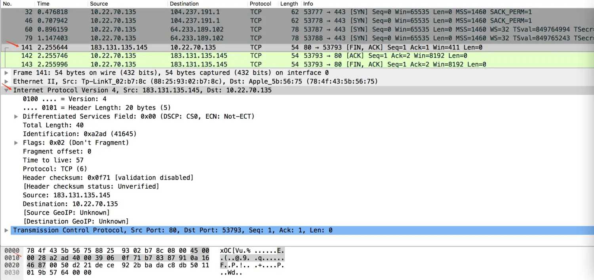
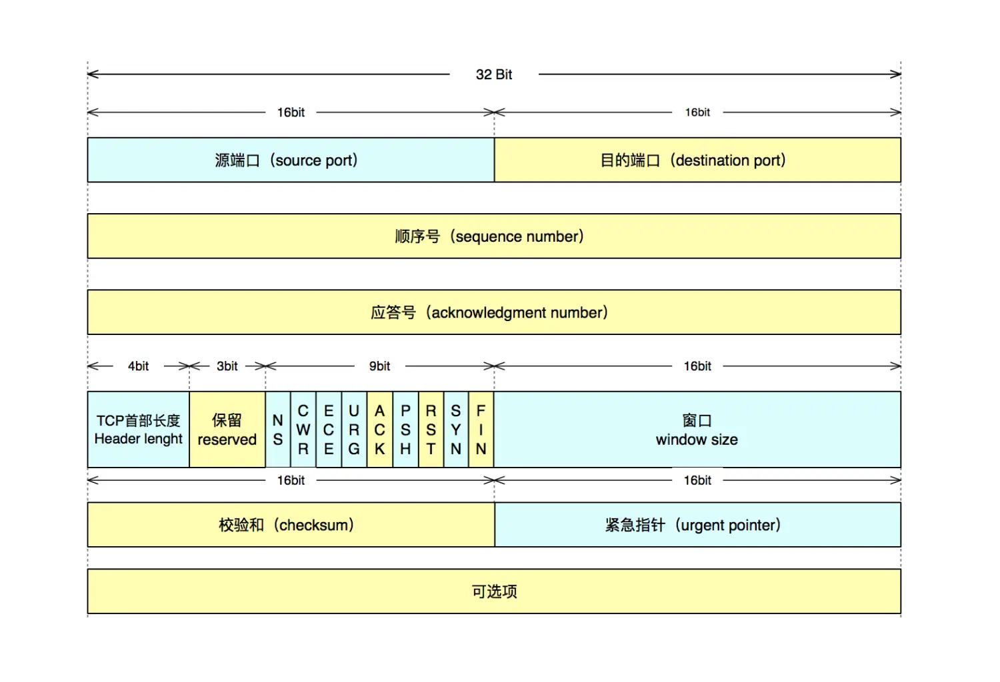
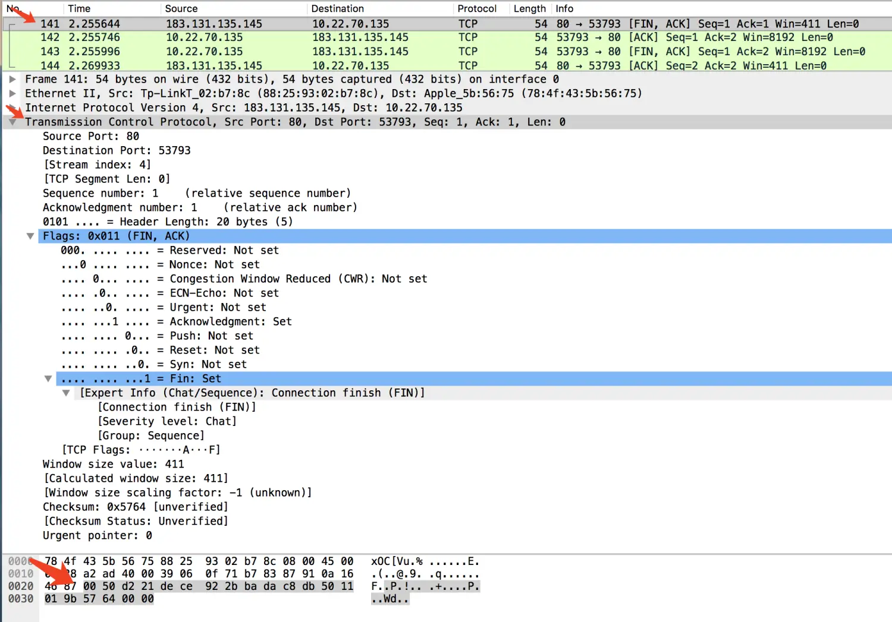
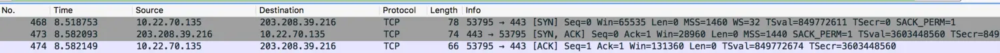
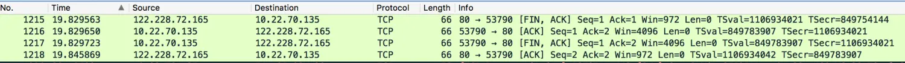

# TCP/IP 协议及数据格式

> 📅 发布时间：2018-01-20
>
> 🏷️ 标签：`TCP/IP` `IP协议` `TCP协议` `UDP协议` `ARP` `IPv6`
>
> ⏱️ 阅读时长：约 30 分钟

> 读懂了 TCP/IP 协议，也就基本了解的网络通信原理。本文是参照研究生教材《网络安全原理与应用》里面的内容加上自己实际抓包数据分析结合而来，去年第一次看这本书，上面读起来枯燥难懂，读一天也看不到一页，感觉说的又大又空，经过一年的网络编程实战之后再回过头来看这本书里面关于 TCP/IP 部分的讲解，解开了我很多的疑问。但是书中也只是讲个大概理论，有的地方描述不当或者不准确，网络上也充斥很杂的一些文章，有好的也有坏的，让人看起来眼花。下面来结合书上的讲解和我自己的理解来聊聊常见的 TCP/IP 协议。

## 1、TCP/IP 协议体系

为了减少网络设计的复杂性，大多数网络都采用了分层结构。不同的网络，层的数量、名字、内容和功能都不尽相同。相同网络中，一台机器上的第 N 层与另一台机器上的第 N 层利用第 N 层协议进行通信，协议基本上是双方关于如何进行通信所达成的一致。

TCP/IP 参考模型就是一个符合上面描述的网络体系结构。他是依据他的两个主要协议-TCP 和 IP 而命名的。这一网络细分一般是七层：应用层、表示层、会话层、传输层、网络层、数据链路层、物理层，有关于这七层协议想要了解的可以看下百度百科讲解的[网络七层协议](https://baike.baidu.com/item/网络七层协议/6056879?fr=aladdin)。

> **补充说明：** 实际上，TCP/IP 协议栈在工程实践中通常被简化为四层（链路层、网络层、传输层、应用层）或五层模型。OSI 七层模型更多用于教学和理论参考。

这里就不做过多的废话，重点在下面。

## 2、数据链路层（以太网帧）

在真实的物理网络中，所有数据最终都要封装成“帧”在物理介质上传输。最常见的帧格式是 **Ethernet II（以太网 II）**。

### 2.1 以太网帧格式

**以太网 II 帧结构示意图：**

```text
+------------+------------+-----------+-------------------------+-----------+
| 目的 MAC   | 源 MAC     | 类型      | 数据 (Payload)           | FCS 校验  |
| (6 字节)   | (6 字节)   | (2 字节)  | (46 - 1500 字节)        | (4 字节)  |
+------------+------------+-----------+-------------------------+-----------+
| <---------- 以太网首部 (14 字节) ----------> |
```

| 字段 | 长度 (字节) | 说明 |
| :--- | :---: | :--- |
| **目的 MAC 地址** | 6 | 接收方的网卡硬件地址 |
| **源 MAC 地址** | 6 | 发送方的网卡硬件地址 |
| **类型 (Type)** | 2 | 标明上层协议类型（如 0x0800 为 IPv4，0x0806 为 ARP） |
| **数据 (Payload)** | 46~1500 | 上层协议（如 IP 报文）数据，不足 46 字节需填充 |
| **FCS (校验序列)** | 4 | 用于检测数据在传输过程中是否出错（抓包软件常忽略） |

我们在 Wireshark 抓包中，看到的原始数据最前面的 **14 个字节**（6+6+2）就是以太网帧首部。

## 3、IP 协议

### 3.1 概念

IP 协议用于连接多个分组交换网，他提供在具有固定地址长度的主机之间传送数据报，以及根据各个数据包大小的不同，在需要时进行分段和重组大数据报的功能。IP 协议仅限于将数据从源端传送到目的端，而不提供可靠的传输服务。在传送出错时，IP 协议通过互联网控制消息协议（[ICMP, Internet Control Message Protocol](https://baike.baidu.com/item/ICMP)）报告。

### 3.2 功能

**IP 协议最基本的两个功能：寻址和分段**

**寻址：**IP 协议根据数据报头中所包含的目的地址将数据报传输到目的端，传送过程中对道路的选择称为**路由**

**分段：**当一些网络只能传送小数据报时，IP 协议将数据报分段并在报头里面注明。数据包也可以被标记为“不可分段”，如果一个数据报被如此标记，那么在任何情况下都不准对他进行分段，如果因此到不了目的地，那么数据包就会在中途被丢弃。

### 3.3 IP 协议数据报的头：

#### 3.3.1 IP 协议头部格式


- **版本**：记录数据报属于哪个版本的协议，例如可以用此区分出 IPv4 和 IPv6，这个字段可以使得在不同版本间传递数据变得可行。

- **头部长**：标明 IP 协议报头有多长，**其单位是 32bit 即 4 个字节**，其最小值为 5（`5 x 4 = 20 byte`，这个长度是除去可选项的长度），从上图中看出，其规定头部长为 4 bit，所以最大值为 15， `15 x 4 = 60 byte` 可以算出可选项长度最大为 40 个字节(即 `60 byte - 20 byte = 40 byte`)

- **服务类型**：用来指示当数据报在一个特定网络中传输时对实际服务质量的要求是什么，服务类型字段从左到右由一个 3 位的优先顺序字段、三个标志位(D、T、R)和两个保留位组成。优先顺序字段用于标志该数据报的优先级，D、T、R 三个标志位分别代表是否对低延迟(Delay)、高吞吐量(Throughput)、高可靠性(Reliability)有要求，不过实际上，现在的路由器都忽略服务类型这个字段。

- **总长**：是指整个数据报的长度，包括头部和数据部分，**单位是 1 个字节**，从图上可以看出，规定总长位数为 16bit，能存储最大数据为 65535 个字节的数据报。如长的数据报对大部分主机和网络来说是不现实的。所有主机必须能够接收长达 576 个字节的数据报(不管他们是以整个数据报到达还是以分片到达)，源端主机在确认目的地址能够接收大数据报的情况下才发送大于 576 字节的数据报。

- **标识**：该标识由发送者设定值，主要为了目的主机组装分段时判断新到的报文分段属于哪个分组，所有属于同一分组的报文分段都包含相同的标识。

- **标记**：长度为 3bit，从前到后分别是**保留位**、**不可分段位**(DF, Don't Fragment)和**分段位**(MF,More Fragment)。
  保留为始终为 0
  DF 位为 1 时表示该分组不能被分段
  MF 位为 1 时表示后面还有该分组的分段，在有分段的情况下，除了最后一个分段该位为 0 外，其他分段该位都为 1

- **分段偏移**：标记该分段在数据报的位置，**单位是 8 个字节**，第一个分段的偏移是 0

- **生命期**：用来限制分组生命周期的计数器，**单位是秒**，该字段长度为 8bit ，说明存储的最大数值是 255 ，在实际的应用过程中是以经过的节点计数的，每经过一个节点计数减 1 ，计数减到 0 时，分组要被丢弃。

- **协议**：指明 IP 层所封装的上层协议类型，如 ICMP -> 1、IGMP -> 2 、TCP -> 6、UDP -> 17、EIGRP -> 88 、OSPF -> 89 等

- **头部效验和**：只对头部进行效验，由于头部的一些字段始终在变化(例如：生命期字段)，头部效验和在每个节点都得重新进行计算。

- **源地址**：发送报文段的 IP 地址

- **目的地址**：接收报文段的 IP 地址

- **可选项**：可选项对于主机和网关的 IP 模块来说都是必须实现的，可选是指它们在特定数据报中是否出现是可选的，而不是指他们的实现，每个可选项都以 1 个字节表明它的类型。其长度从 1~40 个字节之间不固定，主要取决于设置的可选项数目，最终数据长度不够 32 位的倍数要填充 0 补齐，主要是为了让报头长度是 32 位的整数倍，一般正常的 IP 报文头部都是没有可选项的。
  目前已定义的可选项有 5 个，分别是安全性(指明数据报的机密程度)、严格路由选择(后面给出所规定的完全路由)、宽松路由选择(后面给出必须要经过的路由)、记录路由(记录下所经路由器附上其 IP 地址)、时间戳(要求所经路由器都附上其 IP 地址和时间标记)。

#### 3.3.2 IP 协议头部数据

下面是我用抓包工具抓到的一个 TCP 断开的四次握手，其他的咱不管，先看第一次发送 FIN 类型数据包的 IP 报头部分



最下面的是数据，去掉以前面**太网首部**的 14 个字节开始是 IP 数据报头部分，下面我们对着上面的格式来解析下

先单独把 IP 报头数据粘贴下来

```
//字节为单位 Hex+ASCII方式显示
45 00 00 28 a2 ad 40 00 39 06 0f 71 b7 83 87 91 0a 16 46 87

//二进制 bit流显示为
01000101 00000000 00000000 00101000
10100010 10101101 01000000 00000000
00111001 00000110 00001111 01110001
10110111 10000011 10000111 10010001
00001010 00010110 01000110 10000111
```

| 字段       |   位置    | 值                                  | 含义                                                                                                                              |
| ---------- | :-------: | ----------------------------------- | --------------------------------------------------------------------------------------------------------------------------------- |
| 版本       |    0-3    | 0100                                | 属于 IPv4 版本                                                                                                                    |
| 头部长     |    4-7    | 0101                                | 表示头部长度为 20 个字节(`5 x 4 byte = 20 byte`)                                                                                  |
| 服务类型   |   8-31    | 00000000                            | ....                                                                                                                              |
| 总长       |   32-47   | 00000000 00101000                   | IP 数据报总长(不包括以太网首部) 为 40 个字节(`40 x 1 byte = 40 byte`)                                                             |
| 标识       |  48 - 50  | 010                                 | 保留位为 0 ， 不可分段数据报                                                                                                      |
| 分段偏移   |  51 - 63  | 00000 00000000                      | 数据偏移为 0，数据报属于分组的第一个分段(其实这个数据包是不允许分段的，这里只是一个理论解释)                                      |
| 生命期     |  64 - 71  | 00111001                            | 生命期值是 57，理论解释是还可以经过 57 个节点                                                                                     |
| 协议       |  72 - 79  | 00000110                            | 值为 6，表示上层为 TCP 协议                                                                                                       |
| 头部效验和 |  80 - 95  | 00001111 01110001                   | ....                                                                                                                              |
| 源地址     | 96 - 127  | 10110111 10000011 10000111 10010001 | 因为 IP 地址在网络中传播是用网络排序(大端)表示，所以直接按顺序解析，16 进制表示：b7.83.87.91，转换成十进制表示为：183.131.135.145 |
| 目的地址   | 128 - 159 | 00001010 00010110 01000110 10000111 | 十进制点形式表示为：10.22.70.135                                                                                                  |
| 可选项     |     ~     | ~                                   | 没有可选项                                                                                                                        |

### 3.4 IP 地址分类

#### 3.4.1 IP 地址分类

IP 地址包含网络号和主机号两部分，网络号代表一个子网络，主机号则表示该子网络下某一台具体的主机标号，IP 地址根据功能和用途的不同可以划分为五类。

- **A 类地址**：1 . 0 . 0 . 0 ~ 126 . 255 . 255 . 255，前 8 位为网络号，后 24 位为主机号
- **B 类地址**：128 . 0 . 0 .0 ~ 191 . 255 . 255 . 255，前 16 位为主机号，后 16 位为主机号
- **C 类地址**：192 . 0 . 0 . 0 ~ 223 . 255 . 255 . 255，前 24 位为网络号，后 8 位为主机号
- **D 类地址**：224 . 0 . 0 .0 ~ 239 . 255 . 255 . 255
- **E 类地址**：240 . 0 . 0 . 0 ~ 254 . 255 . 255 . 255

A、B、C 三类地址是根据网络规模大小来分配给用户的，例如 A 类地址有 24 位的主机号，同一个网络下，一个 A 类地址可以容纳 2^24 - 2 = 16777213 台主机，但是 A 类地址一共只能分配 126 个网络(这里只是做一个理论上的运算，并不代表实际分配情况)，所以这类地址一般分配给那些为数不多的大网络。D 类地址用来多播，E 类地址做保留地址。

**另外还有一些特殊地址：**

- ①. 例如主机号全为 1 是该网络的广播地址(例如在一个 C 类地址的网络中，192. 192 . 192 . 255 , 网络号是前面三个字节， 主机号是后面的一个字节，8 位全为 1，那么这个地址则是 网络号位 192.192.192.0 这个网络的广播地址)。其中 255 . 255 . 255 . 255 也是主机所在网络的广播地址；
- ②. 主机号全为 0 则是该网络的网络地址；
- ③. 127 . 0 . 0 . 0 ~ 127 . 255 . 255 . 255 是主机会送地址，通常用来做网络测试，调试主机与路由是否连接畅通;
- ④. **其中 10 . 0 . 0 . 0 ~ 10 . 255 . 255 . 255、172 . 16 . 0 . 0 ~ 172 . 31 . 255 . 255、192 . 168 . 0 . 0 ~ 192 . 168 . 255 . 255 保留给内部网络使用。**

#### 3.4.2 子网掩码、超网

传统的 IP 地址分类确定是不能在网络内部使用路由，这样对于较大的网络，例如一个 A 类网络，由于主机数太多而变得难以管理，为此引入了子网掩码以从一个大网络上划分成一些小网络。子网掩码由一系列 0 和 1 构成，通过与 IP 地址做与运算来得到一个 IP 地址的网络号，例如 A 类地址的子网掩码是 255 . 0 . 0 . 0，B 类地址的子网掩码是 255 . 255 . 0 . 0，C 类地址的子网掩码是 255 . 255 . 255 . 0。要是想将一个 B 类地址(例：129 . 145 . 0 . 0)划分为多个小的 C 类网络，只需要将其子网掩码设为 255 . 255 . 255 . 0 就可以了，这样 129 . 145 . 1 . 0 和 129 . 145 . 2 . 0 就属于不同网络了，因为虽然是 B 类地址，但是与给定的子网掩码做与运算出来的网络号不一样了，就属于不同网络。像这样通过子网掩码将一个大网络划分成若干个小网络叫做划分子网。

超网：与子网功能相反，将若干个小网络划分成一个大网络。例如一个单位分配到了 8 个 C 类(前三个字节为网络号)地址：202 . 120 . 224 . 0 ~ 202 . 120 . 231 . 0，只要将其子网掩码设置为 255 . 255 . 248 . 0 就能使这些 C 类网络相通。

**计算原理：**
这 8 个 C 类地址的第三个字节分别是：
- 224: `11100 000`
- 225: `11100 001`
- ...
- 231: `11100 111`

可以看到，这 8 个数字的前 5 位都是相同的（`11100`）。原本 C 类地址的掩码在第三个字节是 `11111111` (255)，现在我们将掩码向左移动 3 位，变为 `11111000` (即 248)，这样这 8 个网络的网络号在掩码匹配下就完全一致了，从而合并成了一个超网。这种技术也被称为 **CIDR（无类别域间路由）**。

### 3.5 ARP 协议

在局域网中，IP 协议报文最终需要通过以太网协议封装并发送。虽然 IP 协议使用 IP 地址寻址，但数据链路层（以太网）却是通过 **MAC 地址**（硬件地址）来寻找目的地的。

**ARP (Address Resolution Protocol)** 的作用就是：**根据 IP 地址获取其对应的物理 MAC 地址。**

- **过程**：当主机需要向某个 IP 发送数据时，会先检查自己的 **ARP 缓存表**。如果没有找到，它会发送一个 **ARP 请求广播**（“谁是这个 IP，请告诉我你的 MAC 地址？”）。对应的目标主机收到后会回复一个 **ARP 响应**，告知其 MAC 地址。
- **重要性**：没有 ARP，IP 报文就无法在以太网这类广播型网络中正确投递。

## 4、TCP 协议

### 4.1 概念

TCP 协议是用于主机到主机的通信协议。他是面向连接的端到端的可靠协议，提供可靠字节流传输和对上层应用提供连接服务。TCP 协议建立在 IP 协议的基础之上，可以根据 IP 协议提供的服务传输大小不定的数据段。IP 协议负责数据的分段、重组及在多种网络和互联的网关间传输数据报。

为了在不可靠的 IP 数据传输服务上实现面向连接的可靠数据传输，**TCP 协议使用序列号和应答号来保证其传输的可靠性，TCP 协议是面向字节流的，每个字节都有一个序列号，一个数据段的第一个字节的序列号将随同数据段被发送，并且作为这个数据段的序列号。数据段同时还带有一个应答序号，表明它期望对方下次发送的字节的顺序号。**当 TCP 协议传输一个数据段的时候，会同时将其放入重传队列，并启动一个定时器。如果这个数据段的应答能在定时器超时前收到，那么就将它从重传队列中移除，否则重发此数据段。应答未能收到，既可能是接收方未收到所发数据段，也可能是应答本身丢失。

TCP 协议提供了端口来区分他所处理的不同数据流。由于端口号是由操作系统、TCP 协议进程或用户自行确定，所以有可能不唯一。为此将网络地址同端口号组合起来形成套接字保证其在整个互联网络上的唯一性。

### 4.2 TCP 协议数据报的头

#### 4.2.1 TCP 协议头部格式



- **源端口**：发送数据端套接字的端口号

- **目的端口**：目的套接字端口号

- **顺序号**：该数据报第一个数据字节的序列号，用作标识该报文段序列号

- **应答号**：存放的是发送方期望收到的数据段序号，算作是对收到报文的一个确认。ACK 标志为 0 时，应答号部分无效(例如首个连接的[SYN]数据包)，ACK 标志为 1 时应答号才有效

- **TCP 首部长度**：标明 TCP 协议报头长度，**单位是 32bit 即 4 个字节**，其最小值为 5（`5 x 4 = 20 byte`，这个长度是除去可选项的长度），从上图中看出，其规定头部长为 4 bit，所以最大值为 15， `15 x 4 = 60 byte `可以算出可选项长度大为 40 个字节(`60 byte - 20 byte = 40 byte`)

- **保留位**：保留字段长度为 3 位，必须全置为 0

- **标记**：

| 标志位简写 | 全写                      | 含义                                                       |
| :--------: | ------------------------- | ---------------------------------------------------------- |
|     NS     | Nonce                     | 有效排除潜在的 ECN 滥用                                    |
|    CWR     | Congestion Window Reduced | 拥塞窗口减少标志                                           |
|    ECE     | ECN-Echo                  | ECN 标志                                                   |
|    URG     | Urgent                    | 紧急指针有效性标志                                         |
|    ACK     | Acknowledgment            | 确认序号有效性标志，一旦一个连接建立起来，该标志总被置为 1 |
|    PSH     | Push                      | Push 标志（接收方应尽快将报文段提交至应用层）              |
|    RST     | Reset                     | 重置连接标志                                               |
|    SYN     | Synchronization           | 同步序号标志(建立连接时候使用)                             |
|    FIN     | Fin                       | 传输数据结束标志(断开连接时使用)                           |

- **窗口**：表示发送方还可以接受数据大小，防止对方发送数据大于自己的缓冲数据区，从应答字段的顺序号开始计。

- **效验和**：效验和覆盖整个 TCP 报文段，强制字段，由发送端计算存储，接收端进行验证

- **紧急指针**：当 Urgent 标志置 1 时，紧急指针才有效

- **可选项**：可选项可以有 0 到多个，可选项字段以第一个字节表明其类型，第二个字节表示该可选项的总长度，后面紧跟可选项的值(长度为可选项的总长度-2)。可选项字段可以从任何字节边界开始，但若最后选项长度不足的话，要填充以补足定义的数据段长度。具体解释请看下面 **3.2.2**

#### 4.2.2 TCP 报头可选项字段

**TCP 报头可选项字段的数据一般拼接格式(不是全部可选项都是这个格式)**

类型`kind`(1byte) + 长度`length`(1byte) + 值`value `(length-2byte)

**TCP 报头可选项和含义：**

| kind | 字段                       | 长度(单位 byte)                    |
| ---- | -------------------------- | ---------------------------------- |
| 0    | End of Option List (EOL)   | 0 (没有长度，只有类型)             |
| 1    | No-Operation (NOP)         | 0 (没有长度，只有类型)             |
| 2    | Maximum segment size (MSS) | 1 (用一个字节来表示该可选项的总长) |
| 3    | Window scale               | 1 (用一个字节来表示该可选项的总长) |
| 4    | SACK Permitted             | 1 (用一个字节来表示该可选项的总长) |
| 5    | SACK                       | 1 (用一个字节来表示该可选项的总长) |
| 8    | Timestamps                 | 1 (用一个字节来表示该可选项的总长) |

- **①. End of Option List (EOL)：**`kind = 0`，当可选项总长度不够 32 位的倍数，用该可选项来填补，实际就是用 0 填补
- **②. No-Operation (NOP)：**`kind = 1`，**no operation**，设计该字段主要是用来明确不同可选项之间的分割点，假设有多个可选项的情况下，一般用该可选项来分割下，因此在一个数据包中出现多个 nop  也不奇怪的。**注意 No-Operation 可选项没有长度和值，只有一个类型占一个字节，也就是有涉及到该可选项解析只需解析一个字节，后面可能是另一个可选项的类型**
- **③. Maximum segment size (MSS)：**`kind = 2`，**最大报文传输段**，每一个 TCP 报文段中数据字段的最大长度，**注意：只是数据部分的字段，不包括 TCP 的头部**。TCP 在三次握手中，每一方都会通告其期望收到的 MSS（MSS 只出现在 SYN 数据包中）如果一方不接受另一方的 MSS 值则定位默认值 536byte。
  MSS 值太小或太大都是不合适，太小，例如 MSS 值只有 1byte，那么为了传输这 1byte 数据，至少要消耗 20 字节 IP 头部+20 字节 TCP 头部=40byte，这还不包括其二层头部所需要的开销，显然这种数据传输效率是很低的。MSS 过大，导致数据包可以封装很大，那么在 IP 传输中分片的可能性就会增大，接收方在处理分片包所消耗的资源和处理时间都会增大，如果分片在传输中还发生了重传，那么其网络开销也会增大。因此合理的 MSS 是至关重要的。MSS 的合理值应为保证数据包不分片的最大值。对于以太网 MSS 可以达到 1460byte (`MTU(1500byte) - IP首部(20byte) - TCP首部(20byte) = 1460byte`)。

- **④. Window scale：**`kind = 3`，**窗口扩大选项**，我们知道 TCP 最大的窗口大小为 65535byte，在早期网络这是够用的，但随着各种复杂网络的产生，特别是类似卫星通信这种时延和带宽都比较大的通信产生，需要更大窗口来满足性能和高吞吐率，于是窗口扩大选项便产生了。
  我们假设 主机 A — 主机 B  是一条高速的 WAN 链路，A 向 B 发送大量数据，由于有足够带宽，那么 A 在很短时间内就可以发送完 65535byte 的数据，而由于窗口过小，A 只能停止发送，直到 B 对 A 发送的数据进行 ACK 确认。假设通信距离较远，延时也由于距离的原因变大，这么一发一确认可能需要等上很长时间，在这个等待的时间里面  A-B 是没有实际数据发送的，因此大量的时间被浪费在了等待对方回应上。
  这个时候我们可以通过增大窗口的大小来使一次可以传输更多的数据，从而减少等待确认的时间。
  窗口扩大选项占值占一个字节，表示移位值 S。新的窗口值等于 TCP 首部的窗口位数从 16 增大到（16+S）。这相当于把窗口值向左移动 S 位后获得实际的窗口大小。移位值准许使用的最大值是 14，相当于窗口最大值增大到 `2^(16+14) = 1073741824 byte = 1048576 kb = 1024 M = 1GB`，方便理解和记忆一般用`TCP头中的窗口值 x 2^S`来表示实际窗口的大小。窗口扩大选项在 TCP 建立之初进行协商，如果已经实现了窗口扩大，当不再需要其扩大窗口时，发送 S=0 选项就可以恢复到窗口大小为 16 位。

- **⑤. SACK Permitted：** `kind = 4`，**选择确认选项可以使用**，SACK Permitted 选项在 TCP 建立连接时由 SYN 数据包中加上(只有类型和长度，没有值)，表示该链接允许接下来 SACK 的实现。

- **⑥. SACK：** `kind = 5`，**选择确认选项(Selective Acknowledgements )**，我们假设 TCP 传输中有这种情况出现，收到的报文无差错，只是未按序列号，中间还缺少一些序列号，那么能否只传输缺少的数据，而不重传已经正确到达的数据？这就是选择确认的技术。
  举例：主机 A 向主机 B 传输 3 个数据包，五个包的序号分别是 1 2 3，主机 B 只收到了序号为 1 和 3 的数据包，而中间的 2 没有收到，那么如果设置可选项 SACK 的值，这样就可以让 A 主机知道只传输丢失的序列号为 2 的块号。
  原理：拿上面的例子来说，丢了 2 号块，收到 1 和 3 块号的数据包，那么回给主机 A 的确认包对于设置 SACK 值来说就要有一个上下的边界(表明从序列号为多少的字节传输到序列号为多少的字节中间这段数据)，序列号在 TCP 报头中占 4 个字节，表示上下边界就需要消耗 8 个字节(4byte x 2)，由上面讲的可知 IP 可选项的最大长度为 40 个字节，加上表示 SACK 字段需要占用 1 个字节，表示长度也需要占一个字节，因此最多可以指明 4 个字块的边界信息( `(40 - 2) / 8 ≈ 4`)。

- **⑦. Timestamps：**`kind = 8`，**时间戳选项**，时间戳选项占 10 个字节，其中最主要的字段时间戳字段（4 字节）和时间戳回送回答字段（4 字节）。
  时间戳选项主要的功能有两个：
  _ 用来计算往返时间 RTT，发送方在发送报文段时把当前时钟的时间值放入时间戳字段，接收方在确认该报文段时把当前时间赋值到时间戳回送回答字段。因此，发送方在收到确认报文后，可以准确计算出 RTT。
  _ PAWS:防止回绕的序号，我们知道序列号只有 32 位，而每增加 2^32 = 4294967295 个序列号后就会重复使用原来用过的序列号。假设我们有一条高速网络，通信的主机双方有足够大的带宽用来快速的传输数据。例如 1Gb/s 的速率发送报文段，则不到 35 秒钟数据字节的序列号就会重复。这样对 TCP 传输带来混乱的情况。而采用时间戳选项，可以很容易的分辨出相同序列号的数据报，哪个是最近发送，哪个是以前发送的。

#### 4.2.3 TCP 协议头部数据

下面是我用抓包工具抓到的一个 TCP 断开的四次握手，其他的咱不管，先看第一次发送 FIN 类型数据包的 TCP 数据的头部



最下面的是数据，去掉以前面**太网首部** 14 个字节和**IP 报头** 20 个字节开始是 TCP 数据报头部分，下面我们对着上面的格式来解析下

先单独把 TCP 头部数据粘贴下来

```
//字节为单位 Hex+ASCII方式显示
00 50 d2 21 de ce 92 2b ba da c8 db 50 11 01 9b 57 64 00 00

//二进制 bit流显示
00000000 01010000 11010010 00100001
11011110 11001110 10010010 00101011
10111010 11011010 11001000 11011011
01010000 00010001 00000001 10011011
01010111 01100100 00000000 00000000
```

| 字段         |   位置    | 值                                  | 含义                                                               |
| ------------ | :-------: | ----------------------------------- | ------------------------------------------------------------------ |
| 源端口       |  0 - 15   | 00000000 01010000                   | 网络字节排序解析，源端口为 80                                      |
| 目的端口     |  16 - 31  | 11010010 00100001                   | 目的端口 53793                                                     |
| 顺序号       |  32 - 63  | 11011110 11001110 10010010 00101011 | 顺序号为~                                                          |
| 应答号       |  64 - 95  | 10111010 11011010 11001000 11011011 | 确认号为~                                                          |
| TCP 首部长度 |  96 - 99  | 0101                                | 长度为 20 字节 `5 x 4 byte = 29 byte`                              |
| 保留位       | 100 - 102 | 000                                 | ~                                                                  |
| 标记         | 103 - 111 | 0 00010001                          | ACK 位为 1 标记应答号有效，FIN 位为 1 表示该数据包为结束标识数据包 |
| 窗口         | 112 - 127 | 00000001 10011011                   | 窗口值为 411，标识发送套接字缓存区最大容纳 411 字节数据            |
| 效验和       | 128 - 143 | 01010111 01100100                   | ~                                                                  |
| 紧急指针     | 144 - 159 | 00000000 00000000                   | 紧急指针标记位(URG)为 1 时这里的数据才有效                         |
| 可选项       |     ~     | ~                                   | ~                                                                  |

### 4.3 TCP 通信数据交互细节和实践

关于 TCP 连接的三次握手、中间数据交互以及断开连接的四次握手理论部分请参考我前面的一片文章[套接字(Socket)编程(二) 内部通信原理](https://www.jianshu.com/p/1b71b6ff4334)，这里就不做重复的解释了

#### 4.3.1 TCP 建立连接的三次握手抓包数据部分

首先来看下抓包过程截图



① 客户端发送[SYN]同步消息

```
//以太网头部+IP报头+TCP报头+TCP数据(字节为单位位 Hex+ASCII方式显示)
88 25 93 02 b7 8c 78 4f 43 5b 56 75 08 00 45 00
00 40 00 00 40 00 40 06 f6 72 0a 16 46 87 cb d0
27 d8 d2 23 01 bb 2e f0 89 c5 00 00 00 00 b0 02
ff ff b3 39 00 00 02 04 05 b4 01 03 03 05 01 01
08 0a 32 a6 80 43 00 00 00 00 04 02 00 00

//提取TCP报头+TCP数据(去掉以太网头部14byte和IP报头20byte)
d2 23 01 bb
2e f0 89 c5
00 00 00 00
b0 02 ff ff
b3 39 00 00
02 04 05 b4 01 03 03 05 01 01 08 0a 32 a6 80 43 00 00 00 00 04 02 00 00
```

解析：从上面可以解析出源端口号为：0xd23 = 353795；目的端口号：0x01bb = 443；序列号：SEQ = 0x2ef089c5；ACK = 0x00000000；TCP 报头长为：`0xb = 11(32 bit)，11 x 4 byte = 44 byte`，即 TCP 报头长为 44 个字节；窗口大小为 0xffff = 65535 byte；
保留位和标志位：0x002 = 0b000000000010；**按位解析标志位为 0b000000010**，NS: 0，CWR: 0，ECE: 0，URG: 0，ACK: 0，PSH: 0，RST: 0，SYN: 1，FIN: 0，**从解析里面可以看出该报文 ACK 字段无效，只有 SYN 字段有效，是第一个请求连接[SYN]同步数据报**；
可选项部分：可以看出该 TCP 报头最后的 24 个字节表示可选项，解析如下

```
02 04 05 b4            kind = 2, len = 4，MMS Value = 0x05b4 表示MSS = 1460byte
01                     kind = 1  No-Operation
03 03 05               kind = 3，len = 3，value = 0x05  窗口选项偏移5位，即实际窗口大小为 0xffff x 2^5
01                     kind = 1  No-Operation
01                     kind = 1  No-Operation
08 0a 32 a6 80 43 00 00 00 00   kind = 8，len = 10  时间戳选项，Timestamp Value(TSval): 0x32a68043 = 849772611，Timestamp echo reply(TSecr): 0
04 02                  kind = 4，len  =2  SACK Permitted，选择确认选项有效
00 00                  kind = 0  补充够32bit，即4byte的倍数
```

② 服务器回复[SYN+ACK]消息

```
//以太网头部+IP报头+TCP报头+TCP数据(字节为单位位 Hex+ASCII方式显示)
78 4f 43 5b 56 75 88 25 93 02 b7 8c 08 00 45 00
00 3c 66 f2 00 00 38 06 d7 84 cb d0 27 d8 0a 16
46 87 01 bb d2 23 f4 36 9f 4a 2e f0 89 c6 a0 12
71 20 a5 e3 00 00 02 04 05 a0 04 02 08 0a d6 c8
42 f0 32 a6 80 43 01 03 03 08

//提取TCP报头+TCP数据(去掉以太网头部14byte和IP报头20byte)
01 bb d2 23
f4 36 9f 4a
2e f0 89 c6
a0 12 71 20
a5 e3 00 00
02 04 05 a0 04 02 08 0a d6 c8 42 f0 32 a6 80 43 01 03 03 08
```

解析：从上面可以解析出源端口号为：0x01bb = 443；目的端口号：0xd23 = 353795；序列号：SEQ = 0xf4369f4a；ACK = 0x2ef089c6**(即第一个包的 SEQ+1，对第一个同步包的确认)**；TCP 报头长为：0xa = 10(32 bit)，10 x 4 byte = 40 byte，即 TCP 报头长为 40 个字节；窗口大小为 0x7120 =28960 byte；

保留位和标志位：0x012 = 0b000000010010；按位解析标志位为 0b000010010，NS: 0，CWR: 0，ECE: 0，URG: 0，ACK: 1，PSH: 0，RST: 0，SYN: 1，FIN: 0，**从解析里面可以看出该报文 ACK 字段和 SYN 字段有效，是对第一个连接请求包的确认[SYN+ACK]数据报**；

可选项部分：可以看出该 TCP 报头最后的 20 个字节表示可选项，解析如下

```
02 04 05 a0       kind = 2, len = 4，value = 0x05a0 表示MSS = 1440 byte
04 02             kind = 4  SACK Permitted，选择确认选项有效
08 0a d6 c8 42 f0 32 a6 80 43  kind = 8, len = 10 时间戳选项，Timestamp Value(TSval): 0xd6c842f0 = 36033448560，Timestamp echo reply(TSecr): 0x32a68043 = 849772611
01   kind = 1     NOP
03 03 08  kind = 3, len = 3，value = 8 窗口选项偏移8位，即实际窗口大小为 0x7120 x 2^8
```

③ 客户端回复[ACK]消息，表示连接成功

```
//以太网头部+IP报头+TCP报头+TCP数据(字节为单位位 Hex+ASCII方式显示)
88 25 93 02 b7 8c 78 4f 43 5b 56 75 08 00 45 00
00 34 00 00 40 00 40 06 f6 7e 0a 16 46 87 cb d0
27 d8 d2 23 01 bb 2e f0 89 c6 f4 36 9f 4b 80 10
10 09 35 75 00 00 01 01 08 0a 32 a6 80 82 d6 c8
42 f0

//提取TCP报头+TCP数据(去掉以太网头部14byte和IP报头20byte)
d2 23 01 bb
2e f0 89 c6
f4 36 9f 4b
80 10 10 09
35 75 00 00
01 01 08 0a 32 a6 80 82 d6 c8 42 f0
```

解析：从上面可以解析出源端口号为：0xd23 = 353795；目的端口号：0x01bb = 443；序列号：SEQ = 0x2ef089c6；ACK = 0xf4369f4b (即上一个包的 SEQ +1，对上一个同步包的确认)；TCP 报头长为：0x8 = 8(32 bit)，8 x 4 byte = 32 byte，即 TCP 报头长为 32 个字节；窗口大小为 0x1009 =4105 byte；

保留位和标志位：0x010 = 0b000000010000；按位解析标志位为 0b000010000，NS: 0，CWR: 0，ECE: 0，URG: 0，ACK: 1，PSH: 0，RST: 0，SYN: 0，FIN: 0，**从解析里面可以看出该报文 ACK 字段有效，是对上一个服务器确认请求连接包的确认[ACK]数据报**；

可选项部分：可以看出该 TCP 报头最后的 12 个字节表示可选项，解析如下

```
01     kind = 1     NOP
01     kind = 1     NOP
08 0a 32 a6 80 82 d6 c8 42 f0  时间戳选项，Timestamp Value(TSval): 0x32a68082 = 849772674，Timestamp echo reply(TSecr): 0xd6c842f0 = 36033448560
```

#### 4.3.2 TCP 数据交互抓包数据部分

下面来一组 TCP 连接中间交换数据部分

① 客户端发送数据

```
//以太网头部+IP报头+TCP报头+TCP数据(字节为单位位 Hex+ASCII方式显示)
88 25 93 02 b7 8c 78 4f 43 5b 56 75 08 00 45 00
00 f5 00 00 40 00 40 06 f5 bd 0a 16 46 87 cb d0
27 d8 d2 23 01 bb 2e f0 89 c6 f4 36 9f 4b 80 18
10 09 43 d2 00 00 01 01 08 0a 32 a6 80 82 d6 c8
42 f0  + 193byte TCP数据

//提取TCP报头+TCP数据(去掉以太网头部14byte和IP报头20byte)
d2 23 01 bb
2e f0 89 c6
f4 36 9f 4b
80 18 10 09
43 d2 00 00
01 01 08 0a 32 a6 80 82 d6 c8 42 f0
+ 193byte TCP数据
```

解析：从上面可以解析出源端口号为：0xd23 = 353795；目的端口号：0x01bb = 443；序列号：SEQ = 0x2ef089c6；ACK = 0xf4369f4b；TCP 报头长为：0x8 = 8(32 bit)，8 x 4 byte = 32 byte，即 TCP 报头长为 32 个字节；窗口大小为 0x1009 =4105 byte；
保留位和标志位：0x018 = 0b000000011000；按位解析标志位为 0b000011000，NS: 0，CWR: 0，ECE: 0，URG: 0，ACK: 1，PSH: 1，RST: 0，SYN: 0，FIN: 0，**从解析里面可以看出该报文 ACK 字段和 PUSH 有效，希望传输层尽快将数据交到应用层**；
可选项部分：可以看出该 TCP 报头最后的 12 个字节表示可选项

② 服务器端回复 ACK 确认

```
//以太网头部+IP报头+TCP报头+TCP数据(字节为单位位 Hex+ASCII方式显示)
78 4f 43 5b 56 75 88 25 93 02 b7 8c 08 00 45 00
00 34 66 fa 00 00 38 06 d7 84 cb d0 27 d8 0a 16
46 87 01 bb d2 23 f4 36 9f 4b 2e f0 8a 87 80 10
00 76 44 09 00 00 01 01 08 0a d6 c8 43 2e 32 a6
80 82

//提取TCP报头+TCP数据(去掉以太网头部14byte和IP报头20byte)
01 bb d2 23
f4 36 9f 4b
2e f0 8a 87
80 10 00 76
44 09 00 00
01 01 08 0a d6 c8 43 2e 32 a6 80 82
```

解析：从上面可以解析出源端口号为：0x01bb = 443；目的端口号：0xd23 = 353795；序列号：SEQ = 0xf4369f4b；
ACK = 0x2ef08a87**(前面数据包的 SEQ(0x2ef089c6) + 193 = 0x2ef08a87 PS:这里需要注意下，很多网络和书上都说这个 ACK 的值应该是上个包的 SEQ + TCP 数据大小 + 1，这种说法是不准确的，拿上个数据来讲，数据的第一个字节序号也就是上个数据包的序号是 0x2ef089c6，那么第二个字节序号就是 0x2ef089c7，现在 TCP 数据一共是 193 个字节，那么接下来的第 194 个字节序号应该是 0x2ef089c6 + 193 = 0x2ef08a87，所以服务器期望收到下个包的序号应该是 0x2ef08a87)**；
TCP 报头长为：0x8 = 8(32 bit)，8 x 4 byte = 32 byte，即 TCP 报头长为 32 个字节；窗口大小为 0x0076 = 118 byte；
保留位和标志位：0x010 = 0b000000010000；按位解析标志位为 0b000010000，NS: 0，CWR: 0，ECE: 0，URG: 0，ACK: 1，PSH: 0，RST: 0，SYN: 0，FIN: 0，**从解析里面可以看出该报文 ACK 字段有效，对上个数据包的一个确认，表示可以接着传送后面的数据了(从字节编号为 0x2ef08a87 开始)，是一个[ACK]确认数据报**；
可选项部分：可以看出该 TCP 报头最后的 12 个字节表示可选项

#### 4.3.3 TCP 断开连接的四次握手抓包数据部分

首先来看下抓包过程截图



① 主动断开方发送[FIN]数据报

```
//以太网头部+IP报头+TCP报头+TCP数据(字节为单位位 Hex+ASCII方式显示)
78 4f 43 5b 56 75 88 25 93 02 b7 8c 08 00 45 00
00 34 89 5e 40 00 39 06 a4 3f 7a e4 48 a5 0a 16
46 87 00 50 d2 1e a9 ba 9e eb 65 ee 19 b0 80 11
03 cc 9e 50 00 00 01 01 08 0a 41 fa 79 05 32 a6
38 20

//提取TCP报头+TCP数据(去掉以太网头部14byte和IP报头20byte)
00 50 d2 1e
a9 ba 9e eb
65 ee 19 b0
80 11 03 cc
9e 50 00 00
01 01 08 0a 41 fa 79 05 32 a6 38 20
```

解析：从上面可以解析出源端口号为：0x0050 =80；目的端口号：0xd21e =53790；序列号：SEQ = 0xa9ba9eeb；ACK = 0x65ee19b0；TCP 报头长为：0x8 = 8(32 bit)，8 x 4 byte = 32 byte，即 TCP 报头长为 32 个字节；窗口大小为 0x03cc =972 byte；

保留位和标志位：0x011 = 0b000000010001；按位解析标志位为 0b000010001，NS: 0，CWR: 0，ECE: 0，URG: 0，ACK: 1，PSH: 0，RST: 0，SYN: 0，FIN: 1，**从解析里面可以看出该报文 ACK 字段和 FIN 字段有效，是请求断开连接的[FIN+ACK]数据报**；

可选项部分：可以看出该 TCP 报头最后的 12 个字节表示可选项，解析如下

```
01     kind = 1     NOP
01     kind = 1     NOP
08 0a 41 fa 79 05 32 a6 38 20 时间戳选项，Timestamp Value(TSval): 1106934021，Timestamp echo reply(TSecr): 849754144
```

② 被断开方发送[ACK]数据包，对主动对方数据报进行确认

```
//以太网头部+IP报头+TCP报头+TCP数据(字节为单位位 Hex+ASCII方式显示)
88 25 93 02 b7 8c 78 4f 43 5b 56 75 08 00 45 00
00 34 00 00 40 00 40 06 26 9e 0a 16 46 87 7a e4
48 a5 d2 1e 00 50 65 ee 19 b0 a9 ba 9e ec 80 10
10 00 1d d9 00 00 01 01 08 0a 32 a6 ac 63 41 fa
79 05

//提取TCP报头+TCP数据(去掉以太网头部14byte和IP报头20byte)
d2 1e 00 50
65 ee 19 b0
a9 ba 9e ec
80 10 10 00
1d d9 00 00
01 01 08 0a 32 a6 ac 63 41 fa 79 05
```

解析：从上面可以解析出源端口号为：0xd21e =53790；目的端口号：0x0050 =80；序列号：SEQ = 0x65ee19b0；ACK = 0xa9ba9eec ；TCP 报头长为：0x8 = 8(32 bit)，8 x 4 byte = 32 byte，即 TCP 报头长为 32 个字节；窗口大小为 0x1000 = 4096 byte；

保留位和标志位：0x010 = 0b000000010000；按位解析标志位为 0b000010000，NS: 0，CWR: 0，ECE: 0，URG: 0，ACK: 1，PSH: 0，RST: 0，SYN: 0，FIN: 0，**从解析里面可以看出该报文 ACK 字段有效，是对断开连接请求的确认[ACK]数据报**；

可选项部分：可以看出该 TCP 报头最后的 12 个字节表示可选项，解析如下

```
01     kind = 1     NOP
01     kind = 1     NOP
08 0a 32 a6 ac 63 41 fa 79 05 时间戳选项，Timestamp Value(TSval): 849783907 ，Timestamp echo reply(TSecr): 1106934021
```

③ 被断开方处理完自己的逻辑，发送[FIN]数据报到断开方

```
//以太网头部+IP报头+TCP报头+TCP数据(字节为单位位 Hex+ASCII方式显示)
88 25 93 02 b7 8c 78 4f 43 5b 56 75 08 00 45 00
00 34 00 00 40 00 40 06 26 9e 0a 16 46 87 7a e4
48 a5 d2 1e 00 50 65 ee 19 b0 a9 ba 9e ec 80 11
10 00 1d d8 00 00 01 01 08 0a 32 a6 ac 63 41 fa
79 05

//提取TCP报头+TCP数据(去掉以太网头部14byte和IP报头20byte)
d2 1e 00 50
65 ee 19 b0
a9 ba 9e ec
80 11 10 00
1d d8 00 00
01 01 08 0a 32 a6 ac 63 41 fa 79 05
```

解析：从上面可以解析出源端口号为：0xd21e =53790；目的端口号：0x0050 =80；序列号：SEQ = 0x65ee19b0 ；ACK = 0xa9ba9eec ；TCP 报头长为：0x8 = 8(32 bit)，8 x 4 byte = 32 byte，即 TCP 报头长为 32 个字节；窗口大小为 0x1000 = 4096 byte；
保留位和标志位：0x011 = 0b000000010001；按位解析标志位为 0b000010000，NS: 0，CWR: 0，ECE: 0，URG: 0，ACK: 1，PSH: 0，RST: 0，SYN: 0，FIN: 1，**从解析里面可以看出该报文 ACK 字段和 FIN 字段有效，是被断开方发送的断开连接[FIN+ACK]数据报**；
可选项部分：可以看出该 TCP 报头最后的 12 个字节表示可选项，解析如下

```
01     kind = 1     NOP
01     kind = 1     NOP
08 0a 32 a6 ac 63 41 fa 79 05 时间戳选项，Timestamp Value(TSval): 849783907 ，Timestamp echo reply(TSecr): 1106934021
```

④ 断开方对被对开放发送的断开数据报发送[ACK]数据报进行确认

```
//以太网头部+IP报头+TCP报头+TCP数据(字节为单位位 Hex+ASCII方式显示)
78 4f 43 5b 56 75 88 25 93 02 b7 8c 08 00 45 00
00 34 42 6b 40 00 39 06 eb 32 7a e4 48 a5 0a 16
46 87 00 50 d2 1e a9 ba 9e ec 65 ee 19 b1 80 10
03 cc 29 f7 00 00 01 01 08 0a 41 fa 79 1a 32 a6
ac 63

//提取TCP报头+TCP数据(去掉以太网头部14byte和IP报头20byte)
00 50 d2 1e
a9 ba 9e ec
65 ee 19 b1
80 10 03 cc
29 f7 00 00
01 01 08 0a 41 fa 79 1a 32 a6 ac 63
```

解析：从上面可以解析出源端口号为：0x0050 =80；目的端口号：0xd21e =53790；序列号：SEQ = 0xa9ba9eec；ACK = 0x65ee19b1；TCP 报头长为：0x8 = 8(32 bit)，8 x 4 byte = 32 byte，即 TCP 报头长为 32 个字节；窗口大小为 0x03cc =972 byte；

保留位和标志位：0x010 = 0b000000010000；按位解析标志位为 0b000010000，NS: 0，CWR: 0，ECE: 0，URG: 0，ACK: 1，PSH: 0，RST: 0，SYN: 0，FIN: 0，**从解析里面可以看出该报文 ACK 字段有效，是对断开连接请求的确认[ACK]数据报**；

可选项部分：可以看出该 TCP 报头最后的 12 个字节表示可选项，解析如下

```
01     kind = 1     NOP
01     kind = 1     NOP
08 0a 41 fa 79 1a 32 a6 ac 63 时间戳选项，Timestamp Value(TSval): 1106934042，Timestamp echo reply(TSecr): 849783907
```

## 5、UDP 协议

UDP 协议是 IP 协议上层的另一个重要协议，他是面向无连接的、不可靠的数据报传输协议，他仅仅将要发送的数据报传送至网络，并接受从网络上传来的数据报，而不与远端的 UDP 协议模块建立连接。UDP 协议为用户的网络应用程序提供服务。

### 5.1 UDP 协议数据报头

#### 5.1.1 UDP 协议头部格式


- **源端口**：套接字发送端端口号
- **目的端口**：目的套接字端口号
- **数据包长**：UDP 报头+UDP 数据报的长度，单位 1byte

#### 5.1.2 UDP 协议头部数据

```
//以太网头部+IP报头+UDP报头+UDP数据(字节为单位位 Hex+ASCII方式显示)
01 00 5e 4b 00 fe f8 32 e4 8a ef e5 08 00 45 00
00 74 49 b6 00 00 01 11 2f 50 0a 16 46 14 ef 4b
00 fe c1 5f 26 e5 00 60 19 b1 00 00 00 58 4f 47
45 4d 52 41 59 2d 4e 42 00 00 00 00 00 00 00 00
00 00 00 00 00 00 00 00 00 00 00 00 00 00 41 4a
52 40 31 32 33 34 35 36 00 00 00 00 00 00 00 00
00 00 00 00 00 00 00 00 00 00 00 00 00 00 01 00
00 00 00 00 00 00 00 00 00 00 00 00 00 00 00 00
00 00

//UDP报头+UDP数据(去掉以太网头部14byte和IP报头20byte)
c1 5f 26 e5 00 60 19 b1
00 00 00 58 4f 47 45 4d 52 41 59 2d 4e 42 00 00
00 00 00 00 00 00 00 00 00 00 00 00 00 00 00 00
00 00 00 00 41 4a 52 40 31 32 33 34 35 36 00 00
00 00 00 00 00 00 00 00 00 00 00 00 00 00 00 00
00 00 00 00 01 00 00 00 00 00 00 00 00 00 00 00
00 00 00 00 00 00 00 00
```

从上面数据抓包可以看出：
源端口：0xc15f = 49503
目的端口：0x26e5 = 9957
数据包长(UDP 报头加+UDP 数据)：0x0060 = 96 byte
效验值：0x18b1

## 6、常用服务及端口号

在 TCP/IP 体系中，应用层协议通常使用传输层的固定端口进行通信。

| 协议 | 端口号 | 说明 |
| :--- | :---: | :--- |
| **HTTP** | 80 | 超文本传输协议（非加密） |
| **HTTPS** | 443 | 超文本传输安全协议（加密） |
| **FTP** | 20/21 | 文件传输协议（20 数据，21 控制） |
| **SSH** | 22 | 安全外壳协议，常用于远程登录 |
| **DNS** | 53 | 域名系统（通常使用 UDP，大数据时使用 TCP） |
| **SMTP** | 25 | 简单邮件传输协议 |
| **Telnet** | 23 | 远程终端协议（明文传输，安全性低） |

## 7、IPv6 简介

由于 IPv4 的 32 位地址空间已经枯竭，IPv6 应运而生。

- **地址空间**：IPv6 采用 128 位地址长度（例如 `2001:0db8:85a3:0000:0000:8a2e:0370:7334`），理论上可以为地球上的每一粒沙子分配一个 IP 地址。
- **简化报头**：IPv6 报头比 IPv4 更简洁，固定 40 字节，提高了路由器的转发效率。
- **安全性**：IPv6 原生支持 IPsec 加密协议，安全性更高。
- **无状态自动配置**：主机可以根据链路层地址自动生成 IPv6 地址，实现即插即用。

## 8、结语

对于 TCP/IP 通信的基本原理和过程就总结到这，顺带说下上面的抓包软件叫**Wireshark**。
