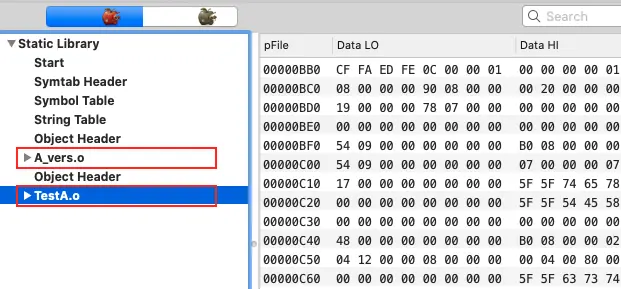
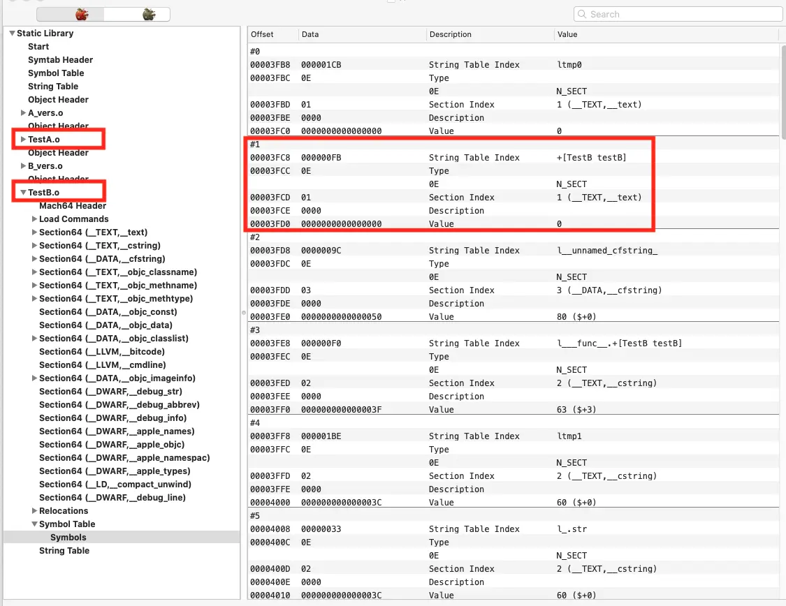
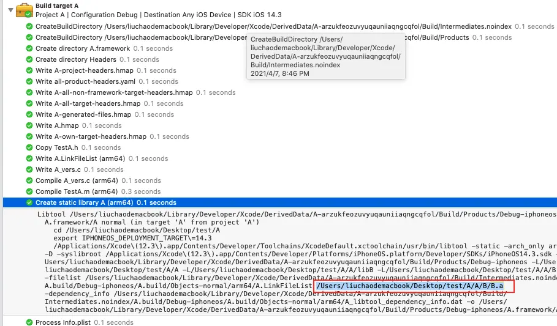
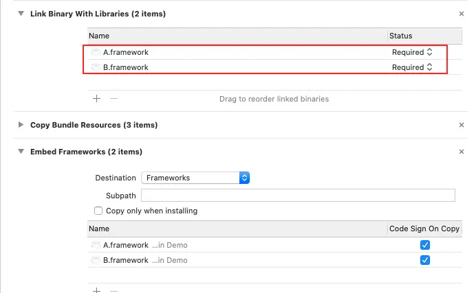
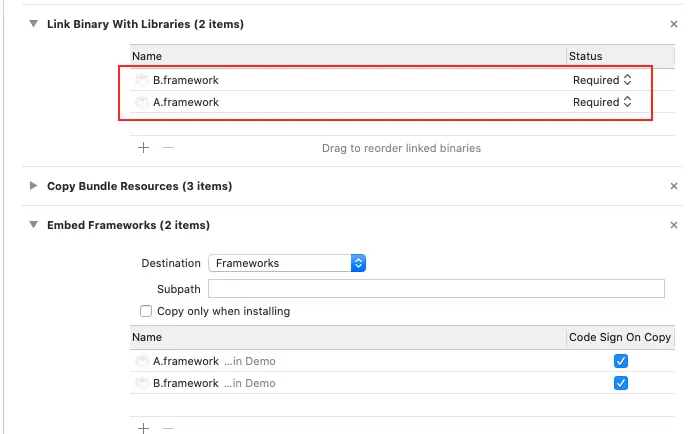
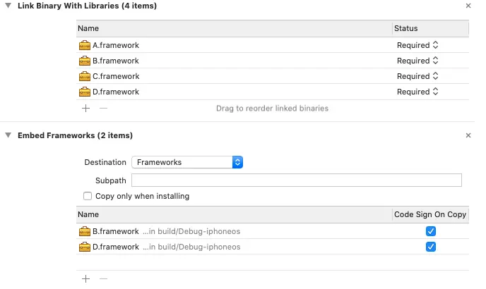

# iOS 静态库&动态库依赖探索

> 📅 发布时间：2018-10-09
>
> 🏷️ 标签：`iOS` `静态库` `动态库`
>
> ⏱️ 阅读时长：约 30 分钟

> 最近工作中进行项目模块化，根据功能分类，将项目由一个整包拆分为一个个 framework，各个 framework 之间相互依赖，涉及到动态库和静态库相互依赖，这里写篇摸索笔记，记录下摸索的过程。

**结论写在前面：**

- 两个静态库里面不能包含相同类（符号），如果有在链接的时候就会报符号重复的错误（2.1 场景 1）
- 静态库（以`.a`或`.framework`结尾）构建完成后的产物不会包含依赖的另一个以`.framework`结尾的静态库的代码（2.1 场景 2）
- 静态库（以`.a`或`.framework`结尾）构建完成后的产物包含依赖的另一个以`.a`结尾的静态库的代码（2.1 场景 3）
- 多个包含有相同符号的动态库集成到工程里面去并不会报符号冲突，系统会挑取先 link 的用（2.2 场景 1）
- 动态库在构建的时候不会包含依赖的另一个动态库的代码，所以在使用时，两个库都需要 Link 和 Embedded（2.2 场景 2）
- 多个动态库依赖各自的动态库之间包含有相同符号，在工程中调用起来是各走各的，互相之间没有影响（2.2 场景 3）
- 静态库依赖动态库，在构建完之后，静态库并不会包含动态库的相关代码（2.3 场景 1）
- 静态库依赖的动态库之间有相同符号，则最终都会使用先 Link 进来的动态库的符号，而不是各自依赖的动态库相关符号（2.3 场景 2）
- 动态库依赖静态库，静态库代码最终都会被链接进动态库生成的可执行文件里面。（2.4 场景 1）
- 动态库依赖的各自的静态库里面有重复的符号，动态库调用各自依赖的静态库代码互不影响，各调各的（2.4 场景 2）
- 静态库代码永远都比动态库代码先加载进内存（3.1）
- 将动态库加载进内存时，如果发现该动态库中的某个类已经存在于内存中了（可能是工程自带的，也可能是先加载的动态库里面有这个类），那么该动态库中的这个类不会被加载进内存，但是库中其他的内存中没有的类还是会被加载进内存（3.2）
- -ObjC 配置能保证静态库的类别也被链接进动态库或 app 工程生成的可执行文件里面（3.3）

## 1. 库简介

### 1.1 库的存在形式

iOS 这边库可以分为**静态库（Static Library）**和**动态库（Dynamic Library）**

创建库的步骤：File -> New -> Project -> Framework & Library

- **Framework：**根据`Mach-O Type`不同，可以分为动态库（`Dynamic Library`）和静态库（`Static Library`），构建出来都是以`.framework`结尾的文件。更改 Framework 工程的`Mach-O Type`是在`Build Settings -> Linking -> Mach-O Type`这个位置
- **Static Library：**静态库，构建出来都是以`.a`结尾的文件（注：更改`Mach-O Type`为`Dynamic Library`构建出来的动态库目前是不支持加载的，所以没有啥意义，暂不考虑）

### 1.2 库的区别

#### `.framework` 静态库 & `.a` 静态库

**相同点**

最终构建出来的文件只是停留在编译阶段，将对应的`.m`文件编译成`.o`文件，然后将所有的`.o`文件合成一个可执行文件（ps：在构建过程里面可以看到 Create static library xx 这一步，这里可以理解为简单的压缩）。

**差异点**

- 如果静态库 A（`.framework`/`.a`结尾）依赖静态库 B（`.framework`结尾），那么 A 构建的可执行文件里面**不包含 B 的代码**。如果静态库 A（.framework/.a）依赖静态库 B（`.a`结尾），那么 A 构建的可执行文件里面**包含 B 的代码**。这个在后面静态库依赖静态库场景里面有详细介绍。
- `.framework` 静态库要比 .a 静态库显得整齐，构建出来的可执行文件和头文件有统一文件收纳。

#### `.framework` 动态库

构建过程经历过了**编译 -> 链接 -> 生成可执行文件**，也就是说，它是一个真正链接好的可执行文件，拖到工程里面不会再参与编译和链接，只有在 app 启动的时候才会去动态库所在文件里面加载动态库代码到内存中。

## 2. 库依赖场景探索

### 2.1 静态库依赖静态库

#### 场景 1

##### ① 测试场景

静态库 A、B 均采用 Framework 的方式来创建，其中 A、B 包含同一个类`Test`，然后将 A、B 同时集成到工程中去。

##### ② 测试结果

在链接（link）阶段报符号重复，具体错误如下图，从提示可以看到是两个`_OBJC_CLASS_$_Test`符号冲突了，解释起来就是有两个名字为 Test 的 Object Class。


##### ③ 测试结论

两个包含有相同符号（类名一样等）的静态库不能**直接**同时集成到一个项目中，不然会报符号冲突。

#### 场景 2

##### ① 测试场景

静态库 A、B 均采用 Framework 的方式来创建，A 依赖 B。其中 A 包含类`TestA`，该类有测试方法`testA`，B 包含类`TestB`，该类有测试方法`testB`，在 `testA`里面调用`testB`，然后将 A、B 同时集成到工程中去。

##### ② 测试代码

A.framework >> TestA.m

```swift
+ (void)testA {
    NSLog(@"A TestA testA");
    [TestB testB];
}
```

B.framework >> TestB.m

```swift
+ (void)testB {
    NSLog(@"B TestB testB");
}
```

Demo 中调用代码

```swift
[TestA testA];
```

##### ③ 测试结果

首先我们用 [MachOView](https://github.com/gdbinit/MachOView) 软件打开 A 库，发现了里面包含了两个可执行文件（`A_vers.o`和`TestA.o`），这都是 A 库的相关类，并没有 B 库的相关类。**这也就说明了构建的 A 库根本就没有包含 B 库代码**。所以在将 A 拖进工程之后，也需要将 B 拖进工程里面，不然调用 A 库相关方法时，会因为找不到依赖的 B 库相关方法而发生 Crash。



也可以通过在 Xcode 里面直接查看 A 构建过程中的日志，查看 Create static library A 这一步是否将 B 库相关代码给放进去，结论是没有。

测试控制台输出如下

```
2018-10-09 20:12:23.471100+0800 Demo[28628:8770145] A TestA testA
2018-10-09 20:12:23.471317+0800 Demo[28628:8770145] B TestB testB
```

##### ④ 测试结论

静态库依赖静态库，前者构建的可执行文件里面并不会包含后者的相关代码，所以有工程使用前者时，也需要将后者依赖进工程里面去。

#### 场景 3

##### ① 测试场景

静态库 A，采用 Framework 方式创建（对于我们本次验证，该库构建产物是`.a`方式还是`.framework`方式创建效果都一样）、B 采用`.a`的方式来创建。
其中 A 包含类`TestA`，该类有测试方法`testA`。
B 包含类`TestB`，该类有测试方法`testB`。
在`testA`里面调用`testB`，然后将 A 集成到工程中去。

##### ② 测试代码

跟场景 2 一样

##### ③ 测试结果

首先我们用 [MachOView](https://github.com/gdbinit/MachOView) 软件打开 A 库，发现了里面包含了 A 库的相关可执行文件（`TestA.o`），同时也有 B 库的相关可执行文件（`TestB.o`），各自的可执行文件包含了各自相关的类和方法。



同时也可以通过在 Xcode 里面直接查看 A 构建过程中的日志，查看 Create static library A 这一步是否将 B 库相关代码给放进去，如下图，是有的。



测试控制台输出如下

```
2018-10-09 20:37:27.781220+0800 Demo[28638:8779708] A TestA testA
2018-10-09 20:37:27.781457+0800 Demo[28638:8779708] B TestB testB
```

##### ④ 测试结论

当一个静态库依赖的静态库是以`.a`形式存在时，前者构建的可执行文件里面是包含后者的代码的，所以在工程中使用前者时，不需要导入后者。

#### 总结

- 两个静态库里面不能包含相同类（符号），如果有在链接的时候就会报符号重复的错误
- 静态库（以`.a`或`.framework`结尾）构建完成后的产物不会包含依赖的另一个以`.framework`结尾的静态库的代码
- 静态库（以`.a`或`.framework`结尾）构建完成后的产物包含依赖的另一个以`.a`结尾的静态库的代码

### 2.2 动态库依赖动态库

#### 场景 1

##### ① 测试场景

动态库 A、B 均采用 Framework 的方式来创建，其中 A、B 都包含同一个类`Test`，然后将 A、B 同时集成到工程中去。

##### ② 测试代码

A.framework >> Test.m

```swift
+ (void)test {
    NSLog(@"A Test test");
}
```

B.framework >> Test.m

```swift
+ (void)test {
    NSLog(@"B Test test");
}
```

Demo 中调用代码

```swift
[Test test];
```

##### ③ 测试结果

首先在程序启动（加载动态库）时控制台上会报一个警告

```
objc[28657]:
  Class Test is implemented in both /private/var/containers/Bundle/Application/4A71E378-E594-475E-A733-14CAF16CE7DC/Demo.app/Frameworks/B.framework/B (0x102e841b0) and /private/var/containers/Bundle/Application/4A71E378-E594-475E-A733-14CAF16CE7DC/Demo.app/Frameworks/A.framework/A (0x102e501b0). One of the two will be used. Which one is undefined.
```

大概意思就是 A.framework 和 B.framework 的可执行文件里面都包含了`Test`这个类，系统将选取其中一个，至于选哪个，我们下面输出试验下。

首先依赖顺序如下，A 在 B 的前面



控制台输出

```
2018-10-09 21:19:08.880892+0800 Demo[28657:8795669] A Test test
```

再测试 B 在 A 的前面



控制台输出

```
2018-10-09 21:19:08.880892+0800 Demo[28657:8795669] B Test test
```

##### ④ 测试结论

当两个动态库定义了相同符号时，不会报冲突，但是系统会选取先加载的动态库里面的符号，后面动态库如果包含有相同符号则会被舍弃。
动态库加载的先后顺序就依赖于 Build Phases 里面的 Link Binary With Libraries 里面动态库的排放顺序。

#### 场景 2

##### ① 测试场景

动态库 A 依赖动态库 B，其中 A 包含类`TestA`，该类有测试方法`testA`，B 包含类`TestB`，该类有测试方法`testB`，在`testA`里面调用`testB`，然后将 A、B 同时集成到工程中去。

##### ② 测试代码

A.framework >> TestA.m

```swift
+ (void)testA {
    NSLog(@"A TestA testA");
    [TestB testB];
}
```

B.framework >> TestB.m

```swift
+ (void)testB {
    NSLog(@"B TestB testB");
}
```

Demo 中调用代码

```swift
[TestA testA];
```

##### ③ 测试结果

首先我们用 [MachOView](https://github.com/gdbinit/MachOView) 软件打开构建的 A 库，发现了里面包含了一个可执行文件，查看它的符号表发现，只看到了自己的类和方法相关符号，并没有 B 库的类和方法相关符号。这也就说明了构建的 A 库根本就没有包含 B 库代码。所以在将 A 拖进工程之后，也需要将 B 拖进工程里面，不然调用 A 库相关方法时，会因为找不到依赖的 B 库相关方法而发生 Crash。


也可以通过在 Xcode 里面直接查看 A 构建过程中的日志，查看链接（Link）这一步是否将 B 库相关代码给链接进来，结论是没有。

测试控制台输出如下

```
2018-10-09 21:46:50.192080+0800 Demo[28685:8807659] A TestA testA
2018-10-09 21:46:50.192333+0800 Demo[28685:8807659] B TestB testB
```

##### ④ 测试结论

动态库 A 依赖动态库 B，但是 A 在构建时候并不会去链接 B 的代码，实际上两个还是相互独立的，所以有工程使用 A 时，也需要将 B 依赖进工程里面去。

#### 场景 3

##### ① 测试场景

动态库 A 依赖动态库 B，其中 A 包含类`TestA`，该类有测试方法`testA`，B 包含类`Test`，该类有测试方法`test`，在`testA`里面调用`test`。
动态库 C 依赖动态库 D，其中 C 包含类`TestC`，该类有测试方法`testC`，D 包含类`Test`，该类有测试方法`test`，在`testC`里面调用`test`。
现在将 A、B、C、D 同时集成到工程中去。

##### ② 测试代码

A.framework >> TestA.m

```swift
+ (void)testA {
    NSLog(@"A TestA testA");
    [Test test];
}
```

C.framework >> TestC.m

```swift
+ (void)testC {
    NSLog(@"C TestC test");
    [Test test];
}
```

B.framework >> Test.m

```swift
+ (void)test {
    NSLog(@"B Test test");
}
```

D.framework >> Test.m

```swift
+ (void)test {
    NSLog(@"D Test test");
}
```

Demo 中调用代码

```swift
[TestA testA];
[TestC testC];
```

##### ③ 测试结果

不管 A、B、C、D 四个库在 Link Binary With Libraries 中的排放顺序，最终输出都是一样

```
2021-04-08 10:51:04.593637+0800 Demo[28998:8914767] A TestA testA
2021-04-08 10:51:04.593936+0800 Demo[28998:8914767] B Test test
2021-04-08 10:51:04.594075+0800 Demo[28998:8914767] C TestC testC
2021-04-08 10:51:04.594191+0800 Demo[28998:8914767] D Test test
```

##### ④ 测试结论

这次与上面的场景 1 有些不同，虽然 B、D 都存在相同类`Test`，并有相同方法`test`，但是被 A、C 分别引用后，都还是各调各的，B、D link 的顺序对各自的调用没有影响。

#### 总结

- 多个包含有相同符号的动态库集成到工程里面去并不会报符号冲突，系统会挑取先 link 的用
- 动态库在构建的时候不会包含依赖的另一个动态库的代码，所以在使用时，两个库都需要 Link 和 Embedded
- 多个动态库依赖各自的动态库之间包含有相同符号，在工程中调用起来是各走各的，互相之间没有影响

### 2.3 静态库依赖动态库

#### 场景 1

##### ① 测试场景

静态库 A 依赖动态库 B，其中 A 包含类`TestA`，该类有测试方法`testA`，B 包含类`TestB`，该类有测试方法`testB`，在`testA`里面调用`testB`。然后将 A、B 同时集成到工程中去。

##### ② 测试代码

A.framework >> TestA.m

```swift
#import <B/TestB.h>

+ (void)testA {
    NSLog(@"A TestA testA");
    [TestB testB];
}
```

B.framework >> TestB.m

```swift
+ (void)testB {
    NSLog(@"B TestB testB");
}
```

Demo 中调用代码

```swift
[TestA testA];
```

##### ③ 测试结果

首先我们用 [MachOView](https://github.com/gdbinit/MachOView) 软件打开构建的 A 库，发现可执行文件里面根本没有包含 B 库相关符号。说明静态库 A 在构建的时候并没有将依赖的动态库 B 的代码加进来，所以工程在使用的时候需要将两个库都依赖进工程里面去，不然调用 A 库相关方法时，会因为找不到依赖的 B 库相关方法而发生 Crash。


也可以通过在 Xcode 里面直接查看 A 构建过程中的日志，查看 Create static library A 这一步是否将 B 库相关代码给放进去，结论是没有。

控制台输出

```
2021-04-08 14:38:40.997687+0800 Demo[29191:8982737] A TestA testA
2021-04-08 14:38:40.997853+0800 Demo[29191:8982737] B TestB testB
```

##### ④ 测试结论

静态库工程构建的可执行文件中并不会包含依赖的动态库的代码，所以工程中要使用静态库时，必须将依赖的动态库也拖进工程里面去。

#### 场景 2

##### ① 测试场景

静态库 A 依赖动态库 B，其中 A 包含类`TestA`，该类有测试方法`testA`，B 包含类`Test`，该类有测试方法`test`，在`testA`里面调用`test`。
静态库 C 依赖动态库 D，其中 C 包含类`TestC`，该类有测试方法`testC`，D 包含类`Test`，该类有测试方法`test`，在`testC`里面调用`test`。
然后将 A、B、C、D 同时集成到工程中去。

##### ② 测试代码

A.framework >> TestA.m

```swift
#import <B/Test.h>

+ (void)testA {
    NSLog(@"A TestA testA");
    [Test test];
}
```

C.framework >> TestC.m

```swift
#import <D/Test.h>

+ (void)testC {
    NSLog(@"C TestC testC");
    [Test test];
}
```

B.framework >> Test.m

```swift
+ (void)testB {
    NSLog(@"B TestB testB");
}
```

D.framework >> Test.m

```swift
+ (void)test {
    NSLog(@"D Test test");
}
```

Demo 中调用代码

```swift
[TestA testA];
[TestC testC];
```

##### ③ 测试结果

首先 B、D Link 中排放顺序如下，B 在 D 前面



控制台输出如下

```
2021-04-08 15:00:05.209634+0800 Demo[29220:8991860] A TestA testA
2021-04-08 15:00:05.209868+0800 Demo[29220:8991860] B Test test
2021-04-08 15:00:05.210111+0800 Demo[29220:8991860] C TestC testC
2021-04-08 15:00:05.210240+0800 Demo[29220:8991860] B Test test
```

再更改 B、D Link 中排放顺序，D 在 B 前面


控制台输出如下

```
2021-04-08 15:00:58.960115+0800 Demo[29222:8992661] A TestA testA
2021-04-08 15:00:58.960492+0800 Demo[29222:8992661] D Test test
2021-04-08 15:00:58.960613+0800 Demo[29222:8992661] C TestC testC
2021-04-08 15:00:58.960703+0800 Demo[29222:8992661] D Test test
```

##### ④ 测试结论

静态库依赖各自的动态库之间有相同符号，在实际调用中会根据 Link 的顺序来决定加载谁的符号，先 Link 进来的会被使用，后 Link 的会被丢弃。这个跟上面动态库依赖各自动态库那个场景有些不一样。

#### 总结

- 静态库依赖动态库，在构建完之后，静态库并不会包含动态库的相关代码
- 静态库依赖的动态库之间有相同符号，则最终都会使用先 Link 进来的动态库的符号，而不是各自依赖的动态库相关符号。

### 2.4 动态库依赖静态库

#### 场景 1

##### ① 测试场景

动态库 A 依赖静态库 B，其中 A 包含类`TestA`，该类有测试方法`testA`，B 包含类`TestB`，该类有测试方法`testB`，在`testA`里面调用`testB`。然后将 A 集成到工程中去。

##### ② 测试代码

A.framework >> TestA.m

```swift
#import <B/TestB.h>

+ (void)testA {
    NSLog(@"A TestA testA");
    [TestB testB];
}
```

B.framework >> TestB.m

```swift
+ (void)testB {
    NSLog(@"B TestB testB");
}
```

Demo 中调用代码

```swift
[TestA testA];
```

##### ③ 测试结果

首先我们用 [MachOView](https://github.com/gdbinit/MachOView) 软件打开构建的 A 库，发现里面包含了 B 库代码，所以这里直接将 A 库拖进工程里面即可


也可以通过在 Xcode 里面直接查看 A 构建过程中的日志，查看链接（Link）这一步是否将 B 库相关代码给放进去，结论是有。

控制台输出

```
2021-04-08 15:25:21.652323+0800 Demo[29249:9000857] A TestA testA
2021-04-08 15:25:21.652552+0800 Demo[29249:9000857] B TestB testB
```

##### ④ 测试结论

动态库最终生成的可执行文件里面包含了依赖的静态库代码，所以使用时，直接将动态库拖进工程即可。

#### 场景 2

##### ① 测试场景

动态库 A 依赖静态库 B，其中 A 包含类`TestA`，该类有测试方法`testA`，B 包含类`TestB`，该类有测试方法`testB`，在`testA`里面调用`testB`。
动态库 C 依赖静态库 D，其中 C 包含类`TestC`，该类有测试方法`testC`，D 包含类`Test`，该类有测试方法`test`，在`testA`里面调用`test`。
然后将 A、C 同时集成到工程中去。

##### ② 测试代码

A.framework >> TestA.m

```swift
#import <B/Test.h>

+ (void)testA {
    NSLog(@"A TestA testA");
    [Test test];
}
```

C.framework >> TestC.m

```swift
#import <D/Test.h>

+ (void)testC {
    NSLog(@"C TestC testC");
    [Test test];
}
```

B.framework >> Test.m

```swift
+ (void)test {
    NSLog(@"B Test test");
}
```

D.framework >> Test.m

```swift
+ (void)test {
    NSLog(@"D Test test");
}
```

Demo 中调用代码

```swift
[TestA testA];
[TestC testC];
```

##### ③ 测试结果

不管 A、C 在 Link Binary With Libraries 中的顺序怎么样，输出结果都如下

```
2021-04-08 15:44:53.908470+0800 Demo[29262:9007461] A TestA testA
2021-04-08 15:44:53.908716+0800 Demo[29262:9007461] B Test test
2021-04-08 15:44:53.908849+0800 Demo[29262:9007461] C TestC testC
2021-04-08 15:44:53.908952+0800 Demo[29262:9007461] D Test test
```

##### ④ 测试结论

动态库依赖的各自的静态库有相同代码，最终静态库代码都会被链接进动态库的可执行文件里面去，集成到工程里面，动态库之间的调用互不影响。

#### 总结

- 动态库依赖静态库，静态库代码最终都会被链接进动态库生成的可执行文件里面。
- 动态库依赖的各自的静态库里面有重复的符号，动态库调用各自依赖的静态库代码互不影响，各调各的。

## 3. 库相关扩展

### 3.1 动态库&静态库加载顺序

从上面静态库依赖静态库的场景我们可以知道，两个静态库如果包含有相同符号，项目链接过程会报符号冲突的错误。
从上面动态库依赖动态库的场景我们可以知道，两个动态库的链接顺序主要就是看他们在 Link Binary With Libraries 里面的排放顺序，如果后面遇到同样的符号则舍弃，项目调用过程中会使用最先 Link 进来的符号。

如果是静态库和动态库包含有相同符号呢？

#### ① 测试场景

现动态库 A 和静态库 B，都包含有一个相同的类`Test`，该类里面有相同方法`test`，将 A、B 同时集成到工程里面去。

#### ② 测试代码

A.framework >> Test.m

```swift
+ (void)test {
    NSLog(@"A Test test");
}
```

B.framework >> Test.m

```swift
+ (void)test {
    NSLog(@"B Test test");
}
```

Demo 中调用代码

```swift
[Test test];
```

#### ③ 测试结果

不管 Link Binary With Libraries 中 A、B 的位置怎么换，控制台输出都如下

```
2021-04-08 16:56:06.506396+0800 Demo[29454:9039276] B Test test
```

#### ④ 测试结论

这说明如果静态库和动态库存在相同符号时，首先二者不会报符号冲突，其次会使用静态库的符号。

动态库的生成是已经链接完成了的二进制文件，工程依赖后并不会重新编译和链接，只有在工程启动的时候，才会将动态库的符号加载进内存。

静态库生成的可执行文件还停留在编译完成阶段，工程依赖之后，会参与工程的链接，将静态库的符号也链接进最终工程生成的可执行文件里面。

工程启动的时候，首先会将工程的可执行文件加载进内存，再会去加载依赖的动态库。所以静态库的代码永远都会比动态库代码先加载进内存。

### 3.2 符号加载

在前面的讨论中，有出现两个动态库包含有相同符号，或者动态库和静态库之间包含有相同符号，项目会使用先 Link 进来的符号，那我就有了如下三个疑问。

- 发现内存中已经有这个 class，而现在加载的动态库里面也有这个 class，是不是整个库都不加载吗？
- 发现内存中已经有这个 class，而现在加载的动态库里面也有这个 class，是不是要加载已有 class 里面没有的方法呢？
- 发现内存中已经有这个 class，而现在加载的动态库里面也有这个 class，是不是只跳过这个 class 的加载？动态库里面其他 class 正常加载？

带着这三个疑问，我们来做一个测试

#### ① 测试场景

现有动态库 A、B，A 库中有两个类，分别是`TestA`和`Test`，B 库中有两个类，分别是`TestB`和`Test`

#### ② 测试代码

A.framework >> TestA.m

```swift
+ (void)testA {
    NSLog(@"A TestA testA");
}
```

A.framework >> Test.m

```swift
+ (void)test {
    NSLog(@"A Test test");
}

+ (void)testA {
    NSLog(@"A Test testA");
}
```

B.framework >> TestB.m

```swift
+ (void)testB {
    NSLog(@"B TestB testB");
}
```

B.framework >> Test.m

```swift
+ (void)test {
    NSLog(@"B Test test");
}

+ (void)testB {
    NSLog(@"B Test testB");
}
```

#### ③ 测试结果

首先我们添加如下测试代码

```swift
[TestA testA];
[TestB testB];
```

控制台输出

```
2021-04-08 17:32:55.468453+0800 Demo[29500:9050959] A TestA testA
2021-04-08 17:32:55.468656+0800 Demo[29500:9050959] B TestB testB
```

两个库有相同类，但是并不影响后面库的其他内存中没有的类加载进内存。

接着我们测试下下同 class 的加载，首先在 Link Binary With Libraries 中，A 排在 B 的前面，然后添加如下测试代码

```swift
[Test test];
[Test testA];
```

控制台输出

```
2021-04-08 17:35:52.346952+0800 Demo[29506:9052346] A Test test
2021-04-08 17:35:52.347167+0800 Demo[29506:9052346] A Test testA
```

A 库的两个方法都能正常加载进内存

接着我们尝试调用下 B 库的`test`方法，测试代码如下

```swift
[Test test];
```

控制台输出

```
2021-04-08 17:37:48.347599+0800 Demo[29509:9053345] A Test test
```

很明显，B 库的符号，被先加载进内存的 A 库的相同符号给替代了

最后我们再尝试下 B 库的`testB`方法，测试代码如下

```swift
[Test testB];
```

控制台输出如下

```
2021-04-08 17:39:40.951420+0800 Demo[29511:9054427] +[Test testB]: unrecognized selector sent to class 0x105180160
2021-04-08 17:39:40.953578+0800 Demo[29511:9054427] *** Terminating app due to uncaught exception 'NSInvalidArgumentException', reason: '+[Test testB]: unrecognized selector sent to class 0x105180160'
```

可以看出来，根本没有将 B 库的`Test`这个类加载进内存。

#### ④ 测试结论

将动态库加载进内存时，如果发现该动态库中的某个类已经存在于内存中了（可能是工程自带的，也可能是先加载的动态库里面有这个类），那么该动态库中的这个类不会被加载进内存，但是库中其他的内存中没有的类还是会被加载进内存。

### 3.3 -ObjC 配置

我们在集成第三方库的时候，有些时候需要在 Build Settings >> Linking >> Other Linker Flags 里面加上 -ObjC 的配置，那这个配置到底起到什么作用呢？下面我们来设计个场景验证下。

#### ① 测试场景

现在有静态库 A，该静态库里面有类别，然后将静态库 A 集成进 Demo 工程里面

#### ② 测试代码

A.framework >> Test.m

```swift
+ (void)test {
    NSLog(@"A Test test");
}
```

A.framework >> Test+Category.m

```swift
+ (void)testCategory {
    NSLog(@"A Test+Category testCategory");
}
```

Demo 中调用如下

```swift
[Test test];
[Test testCategory];
```

#### ③ 测试结果

首先我们啥都不配置，用 [MachOView](https://github.com/gdbinit/MachOView) 分析一波生成的 app 工程生成的可执行文件。


我们发现，里面并没有类别相关的符号，说白了就是静态库的类别方法根本没有被链接进 app 的可执行文件里面，如果我们调用类别方法，肯定会发生 crash，看下控制台输出

```
2021-04-08 19:16:56.504068+0800 Demo[29617:9084372] A Test test
2021-04-08 19:16:56.504488+0800 Demo[29617:9084372] +[Test testCategory]: unrecognized selector sent to class 0x10471cea8
2021-04-08 19:16:56.505158+0800 Demo[29617:9084372] *** Terminating app due to uncaught exception 'NSInvalidArgumentException', reason: '+[Test testCategory]: unrecognized selector sent to class 0x10471cea8'
```

接着我们在工程的 Build Settings >> Linking >> Other Linker Flags 里面加上 -ObjC 的配置，重新编译，再用 [MachOView](https://github.com/gdbinit/MachOView) 分析一波生成的 app 工程生成的可执行文件。

我们发现，里面有类别的相关符号了，说明类别提供的方法被链接进 app 的可执行文件里面了，接下来调用肯定是正常的，看下控制台输出

```
2021-04-08 19:22:24.113062+0800 Demo[29627:9086835] A Test test
2021-04-08 19:22:24.113261+0800 Demo[29627:9086835] A Test+Category testCategory
```

#### ④ 测试结论

app 工程 or 动态库依赖的静态库里面有用到类别时，需要在 app 工程 or 动态库的 Build Settings >> Linking >> Other Linker Flags 里面加上 -ObjC 配置，这样才能保证静态库里面的类别及相关类别方法被链接进 app 工程 or 动态库最终生成的可执行文件里面。

详细解释可以参考文章 [《IOS 温习之路 ”Other Linker Flags“》](https://zhuanlan.zhihu.com/p/34232905) 里面的解释。

### 3.4 静态库&动态库依赖优化

根据上面的依赖场景，我们得知有几个场景下依赖的库的代码是不会被打包进自己最终生成的可执行文件里面去。

- 静态库依赖静态库，后者不会被打包进前者生成的可执行文件里面去
- 静态库依赖动态库，后者不会被打包进前者生成的可执行文件里面去

我们知道上面两个场景并不会将后者代码打包进前者生成的可执行文件里面去，所以这种依赖就是一种弱依赖，说白了我根本不需要把后者生成的可执行文件依赖进前者工程里面去，只需要把后者的头文件拖到前者工程里面去，让他完成编译阶段就好，因为他们根本不会去链接实现。下面我们模拟一个场景来进行优化，就拿静态库库依赖静态库的场景来做说明

#### ① 测试场景

静态库 A 依赖静态库 B，这里并不把 B.framework 拖到 A 工程里面

#### ② 测试代码

A.framework >> TestA.m

```swift
#import "TestB.h"

+ (void)testA {
    NSLog(@"A TestA testA");
    [TestB testB];
}
```

B.framework >> TestB.m

```swift
+ (void)testB {
    NSLog(@"B TestB testB");
}
```

#### ③ 测试结果

这个时候直接编译 A 工程是报错的，因为系统提示找不到`TestB.h`这文件，同时也报找不到`testB`这个方法。按上面分析的，咱们只需要让他找到`TestB.h`这个头文件即可，所以在 Build Settings >> Search Paths >> Header Search Paths 里面配置上需要引用到 B 库里面对应头文件的位置即可。我的 A、B 工程相对结构如下


所以我们在工程中 Header Search Paths 里面配置相对路径如下


这样他在本工程文件夹找不到的头文件就会去我们上面配置路径对应的文件夹里面去找，后面的 recursive（递归查找）或 non-recursive（不递归查找）的选择，完全看自己的需求，我这里其实并不需要用选递归去查找。

最后将 A、B 生成的 framework 都拖进工程里面，然后调用

```swift
[TestA testA];
```

控制台输出正常

```
2021-04-08 20:19:32.636684+0800 Demo[29656:9105153] A TestA testA
2021-04-08 20:19:32.636944+0800 Demo[29656:9105153] B TestB testB
```

#### ④ 测试结论

如上面测试，静态库 A 依赖静态库 or 动态库 B 时，并不需要将 B 工程生成的 framework 依赖进 A 工程里面，A 工程到完成编译即截止，用到的就是 B 里面的一些声明，所以只需要在 A 工程的 Header Search Paths 里面配置好引用的 B 里面的头文件搜索路径即可。

但是这里有个特殊，就是动态库依赖动态库可不能这么来玩，虽然依赖的动态库代码没有被打包进前者生成的可执行文件里面，但是前者在链接的时候还是会用到后者的实现（ps：这里我也不是太清楚，但是事实就是这么玩 Xcode 会会直接报错）。