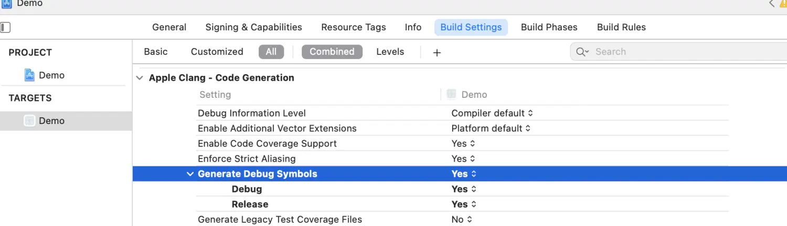
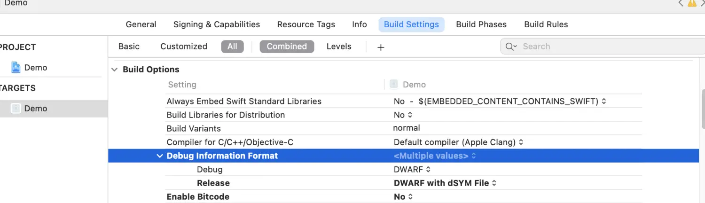
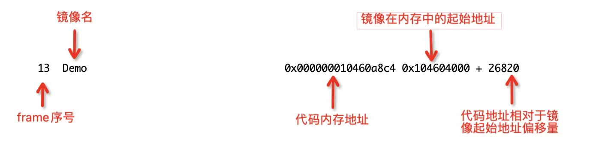
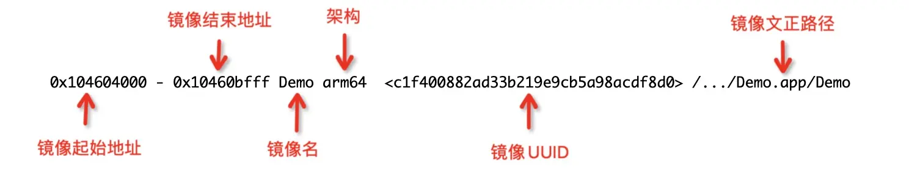
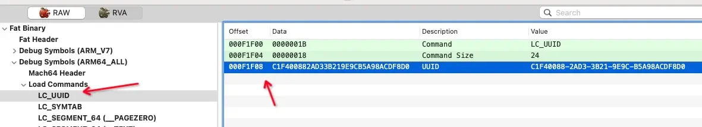
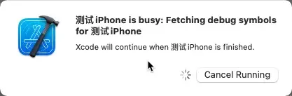

# iOS Crash Report 文件探索

> 📅 发布时间：2018-10-11
>
> 🏷️ 标签：`iOS` `Crash Report`
>
> ⏱️ 阅读时长：约 30 分钟

当 App 发生 Crash 时，系统会生成 Crash Report 并存储在设备上。Crash Report 会记录 App Crash 信息，一般情况下会包括完整的线程调用堆栈。

本篇笔记分为两个阶段：

- 看懂 Crash Report 文件里面每部分记录的是啥
- 符号化，把 Crash Report 里面不可读的地址符号转变成可读的函数或方法名

## 1. 符号文件

### 1.1 什么是符号文件？

符号文件就是我们常见的以`.dSYM`（debugging symbols）为后缀的文件，又称为调试符号表，是苹果为了方便调试和定位问题而使用的一种调试方案，本质上使用的是起源于贝尔实验室的 DWARF（Debugging With Attributed Record Formats）。符号文件是保存十六进制函数地址映射信息的中转文件，我们调试的 symbols 都会包含在这个文件中，并且每次编译项目的时候都会生成一个新符号文件，该文件目录结构如下

```
--ProductName.app.dSYM
 |--Contents
   |--Resources
     |--DWARF
       |--ProductName
```

### 1.2 如何生成符号文件

#### 1.2.1 Xcode 编译生成符号文件

**首先将 Build Settings 里面的 Generate Debug Symbols 设置为 YES，不过该选项在 Xcode7.2.1 之后，默认 Release 和 Debug 模式下都为 YES。**
通过比对 YES 和 NO 两种状态下的编译过程发现，状态为 YES 时，编译参数多了`-g`和`-gmodules`两项。
状态为 YES 时，编译产生的.o 文件会大一些，当然最终生成的可执行文件也大一些。
状态为 NO 时，程序中的断点不会起作用。
Clang 文档对`-g`的描述是：Generate complete debug info.



**`Build Settings`里面的`Debug Information Format`配置如下**
`Debug`模式下默认为`DWARF`，`Release`模式下默认为`DWARF with dSYM File`。
`DWARF`：不会生成符号文件
`DWARF with dSYM File`：生成符号文件



Xcode 编译阶段，`DWARF with dSYM File`选项会多一步`Generate xx.app.dSYM`（ps：里面使用的`dsymutil`指令），如下图，其他的与`DWARF`选项是一样的


#### 1.2.2 使用 dsymutil 指令生成符号文件

使用`dsymutil`指令，从可执行文件中生成符号文件（**注：上面 Xcode 编译期间生成符号文件使用的就是`dsymutil`指令，详情如上图的`Generate Demo.app.dSYM`这步**），该指令详情如下

```
$ dsymutil --help

OVERVIEW: 操作存档的DWARF调试符号文件

USAGE: /Applications/Xcode.app/Contents/Developer/Toolchains/XcodeDefault.xctoolchain/usr/bin/dsymutil [options] <input files>

Dsymutil Options:
  ...
  --arch <arch>           指定cpu架构
  --help                  Prints this help output.
  -h                      Alias for --help
  --out <filename>        Alias for -o
  -o <filename>           指定输出文件，默认为<input files>.dwarf
  ...
```

使用示例

```
$ dsymutil Demo.app/Demo -o Demo.app.dSYM
```

对于同一个可执行文件，使用该指令生成符号文件跟 Xcode 编译时生成符号文件是一模一样的，文件的 MD5 值都是一样的。

### 1.3 符号文件有什么作用？

当 App `release`模式打包或上线后，不会像我们在 Xcode 中调试那样直观地看到崩溃的错误，这个时候我们就需要分析 Crash Report 文件了，iOS 设备中会有日志文件（导出为`.crash`后缀文件）保存应用出错的函数内存地址，这个时候就需要结合符号文件，将这些内存地址翻译成具体的符号（函数或方法名）

## 2. Crash Report 文件

Crash Report 就是我们平时见到 Crash 日志文件，Xcode 导出为`.crash`后缀的文件，该文件主要由以下六个部分组成，**Header**、**Exception Information**、**Diagnostic Messages**、**Backtraces**、**Thread State、Binary Images**。

### 2.1 Header

一份 Crash Report 报告以标题部分开始，描述了 Crash Report 发生的环境。

```
Incident Identifier: 09969176-C3B9-4978-8420-1840A96F474C
CrashReporter Key:   e94bda8b777f2c74f2b552ebfec45094afd9b5c4
Hardware Model:      iPhone13,2
Process:             Demo [6920]
Path:                /private/var/containers/Bundle/Application/EA6FDAE0-E5AB-4B14-890C-F6F972683B8F/Demo.app/Demo
Identifier:          com.alicom.sdkdemo.AliComAuth
Version:             1 (1.0)
Code Type:           ARM-64 (Native)
Role:                Foreground
Parent Process:      launchd [1]
Coalition:           com.alicom.sdkdemo.AliComAuth [1307]


Date/Time:           2021-09-23 19:33:47.2358 +0800
Launch Time:         2021-09-23 19:33:43.8654 +0800
OS Version:          iPhone OS 14.6 (18F72)
Release Type:        User
Baseband Version:    1.71.01
Report Version:      104
```

列举一些重要字段含义：

- **Incident Identifier：**每个 Crash Report 的唯一 ID
- **CrashReporter Key：**标识设备相关 ID。同一个设备上所有 Crash Report 文件该字段是一样的
- **Process：**发生 Crash 时的进程名（程序名）
- **Version：**发生 Crash 程序的当前版本
- **Code Type：**发生 Crash 的上下文所在架构环境，有 ARM-64、ARM、X86-64、X86...
- **OS Version：**系统版本，需要根据该字段匹配对应系统库版本的符号表，进行系统类堆栈符号化

### 2.2 Exception Information

每个崩溃报告都包含异常信息，这个信息部分告诉你进程是如何终止的。

先来一个 Objective-C 异常，因未被捕获，导致程序向自身发送了 SIGABRT 信号而崩溃

```
Exception Type:  EXC_CRASH (SIGABRT)
Exception Codes: 0x0000000000000000, 0x0000000000000000
Exception Note:  EXC_CORPSE_NOTIFY
Triggered by Thread:  0
```

再来一个 Mach 异常，因未在 Mach 层捕获，在 Host 层被转换成 SIGSEGV 信号投递到出错的线程

```
Exception Type:  EXC_BAD_ACCESS (SIGSEGV)
Exception Subtype: KERN_INVALID_ADDRESS at 0x0010ea18323ace7a -> 0x00000018323ace7a (possible pointer authentication failure)
VM Region Info: 0x18323ace7a is in 0x1000000000-0x7000000000;  bytes after start: 35202453114  bytes before end: 377114407301
      REGION TYPE                 START - END      [ VSIZE] PRT/MAX SHRMOD  REGION DETAIL
      commpage (reserved)      fc0000000-1000000000 [  1.0G] ---/--- SM=NUL  ...(unallocated)
--->  GPU Carveout (reserved) 1000000000-7000000000 [384.0G] ---/--- SM=NUL  ...(unallocated)
      UNUSED SPACE AT END

Termination Signal: Segmentation fault: 11
Termination Reason: Namespace SIGNAL, Code 0xb
Terminating Process: exc handler [6922]
Triggered by Thread:  0
```

列举一些重要字段含义：

- **Exception Type：**终止进程的 Mach 异常的名称，以及括号中对应的 BSD 终止信号的名称。详情可以看[《Understanding the Exception Types in a Crash Report》](https://developer.apple.com/documentation/xcode/understanding-the-exception-types-in-a-crash-report)
- **Exception Codes：**关于异常的处理器特定信息，编码为一个或多个 64 位十六进制数字。通常情况下，这个字段不会出现。
- **Exception Subtype：**可读的 exception codes 描述。
- **Exception Message：**从 exception code 中解析出来的附加的可读信息。
- **Exception Note：**不特指某一种异常的额外信息。如果这个字段包含”SIMULATED”(不是 Crash)，进程并没有发生 Crash，而是在系统层面被 kill 掉了，比如看门狗机制。
- **Termination Reason：**操作系统终止进程的指定信息。
- **Triggered by Thread or Crashed Thread：**异常起源线程。

其他字段详细介绍可以参考[《Examining the Fields in a Crash Report》](https://developer.apple.com/documentation/xcode/examining-the-fields-in-a-crash-report)

### 2.3 Diagnostic Messages

操作系统有时包括额外的诊断信息。这些信息使用不同的格式，取决于崩溃的原因，并不是每个崩溃报告中都有。

下面是是因为 Objective-C 异常导致的 abort 的额外诊断信息

```
Application Specific Information:
abort() called
```

### 2.4 Backtraces

记录进程崩溃时的每个线程的堆栈信息，跟我们在 Debug 时看到的信息类似。
Objective-C 异常会额外包附带一个 Last Exception Backtrace，记录了奔溃点的具体堆栈信息，如果有 Last Exception Backtrace，则优先去分析他。

下面来一组 Objective-C 异常（未找到方法实现）的堆栈信息，未被符号化

```
Last Exception Backtrace:
(0x1ab4ae754 0x1bff757a8 0x1ab3b1c3c 0x1ab4b12ac 0x1ab4b35b0 0x10460a804 0x10460a648 0x1adea3464 0x1ad7d51a0 0x1ad7d54f0 0x1ad7d3d6c 0x1adee1328 0x1adee2c48 0x1adebc6e8 0x1adf45b60 0x1adf4a574 0x1adf41974 0x1ab4289e8 0x1ab4288e4 0x1ab427be8 0x1ab421bc8 0x1ab421360 0x1c2a5f734 0x1ade9c584 0x1adea1df4 0x10460a8c4 0x1ab0ddcf8)

Thread 0 name:  Dispatch queue: com.apple.main-thread
Thread 0 Crashed:
0   libsystem_kernel.dylib        	0x00000001d96df334 0x1d96b6000 + 168756
1   libsystem_pthread.dylib       	0x00000001f7129a9c 0x1f7127000 + 10908
2   libsystem_c.dylib             	0x00000001b485cb90 0x1b47e5000 + 490384
3   libc++abi.dylib               	0x00000001c0056bb8 0x1c0043000 + 80824
4   libc++abi.dylib               	0x00000001c0047ec8 0x1c0043000 + 20168
5   libobjc.A.dylib               	0x00000001bff5405c 0x1bff4d000 + 28764
6   libc++abi.dylib               	0x00000001c0055fa0 0x1c0043000 + 77728
7   libc++abi.dylib               	0x00000001c0058eac 0x1c0043000 + 89772
8   libobjc.A.dylib               	0x00000001bff75904 0x1bff4d000 + 166148
9   CoreFoundation                	0x00000001ab42144c 0x1ab385000 + 640076
10  GraphicsServices              	0x00000001c2a5f734 0x1c2a5c000 + 14132
11  UIKitCore                     	0x00000001ade9c584 0x1ad2d2000 + 12363140
12  UIKitCore                     	0x00000001adea1df4 0x1ad2d2000 + 12385780
13  Demo                          	0x000000010460a8c4 0x104604000 + 26820
14  libdyld.dylib                 	0x00000001ab0ddcf8 0x1ab0dc000 + 7416

Thread 1:
...
```

Last Exception Backtrace:(0x1ab4ae754 0x1bff757a8 ...)，这个主要描述的是异常点具体的堆栈信息，后面的地址是**调用的函数地址**，具体符号化请看后面的符号化解析。

紧接着就是各个线程对应的堆栈信息，拿第 13 行做一个分析



- **frame 序号：**标识堆栈调用顺序，0 是在程序被终止时执行的函数
- **镜像名：**包含该函数的 Mach-O 文件的名称，可以看 Crash Report 文件最后面的 Binary Images
- **代码内存地址：**代码在内存中地址（镜像起始地址+偏移量）
- **镜像内存起始地址：**包含该函数的 Mach-O 文件在内存中的起始地址，同一个镜像文件的起始地址是一样的
- **偏移地址：**该函数内存地址相对于镜像二进制文件起始地址偏移量

## 5、Thread State

Thread State 中记录了 Crash 线程寄存器的值，对于一些问题的定位是有一定帮助的。

```
Thread 0 crashed with ARM Thread State (64-bit):
    x0: 0x0000000000000000   x1: 0x0000000000000000   x2: 0x0000000000000000   x3: 0x0000000000000000
    x4: 0x000000016b7fae30   x5: 0x000000016b7fb3d0   x6: 0x000000000000006e   x7: 0x0000000000000600
    x8: 0x0373647c53a22975   x9: 0x0373647d5731d1b5  x10: 0x0000000000000002  x11: 0x0000000000000003
   x12: 0x0000000000000000  x13: 0x0000000000000000  x14: 0x0000000000000010  x15: 0x0000000000000000
   x16: 0x0000000000000148  x17: 0x000000010493f8c0  x18: 0x0000000000000000  x19: 0x0000000000000006
   x20: 0x0000000000000103  x21: 0x000000010493f9a0  x22: 0x0000000000000001  x23: 0x0000000281c001b0
   x24: 0x0000000000000000  x25: 0x0000000000000001  x26: 0x0000000eb1e31100  x27: 0x000000020e304000
   x28: 0x0000000000000001   fp: 0x000000016b7fb340   lr: 0x00000001f7129a9c
    sp: 0x000000016b7fb320   pc: 0x00000001d96df334 cpsr: 0x40000000
   esr: 0x56000080  Address size fault
```

比如通过`fp`，`sp`的值配合异常码中的地址判断是否是栈溢出问题。
出现野指针问题时，我们可以尝试分析`x1`的值（最后调用的`selector`）再结合代码就很容易定位出野指针对象是谁了。

### 2.6 Binary Images

Binary Images 中记录了进程加载的镜像文件列表（ps：也可以叫可执行文件在内存中的映射文件），这块内容是符号化 Crash 日志的关键，符号化的原理就是通过这里镜像文件的 UUID 来找到对应的符号化文件，从而进行对堆栈的符号化工作的。

```
Binary Images:
0x104604000 - 0x10460bfff Demo arm64  <c1f400882ad33b219e9cb5a98acdf8d0> /var/containers/Bundle/Application/EA6FDAE0-E5AB-4B14-890C-F6F972683B8F/Demo.app/Demo
0x1046e8000 - 0x1046f3fff libobjc-trampolines.dylib arm64e  <26cb4bb90880358ba280192f8ed6d0ad> /usr/lib/libobjc-trampolines.dylib
0x104890000 - 0x104903fff dyld arm64e  <65bac7abef933e93b5640506d0e36590> /usr/lib/dyld
0x1ab097000 - 0x1ab0dbfff libdispatch.dylib arm64e  <daf300624c853b92b15950602a0c9d97> /usr/lib/system/libdispatch.dylib
0x1ab0dc000 - 0x1ab118fff libdyld.dylib arm64e  <e574a3659878348a8e8491e163cfc128> /usr/lib/system/libdyld.dylib
...
```

拿第一个镜像文件 Demo 来分析



重点注意：

- 当我们只有相关函数地址时（比方说上面列举的 Last Exception Backtrace 里面的地址），我们可以根据镜像的起始地址和结束地址来判断该函数属于哪个镜像文件。使用函数地址减去镜像起始地址算出其在内存中的偏移量。
- 镜像的 UUID 跟符号文件里面的 UUID 做对应，找到对应的符号文件进行接下来的符号化工作。
- 可以根据是否有加载越狱的动态库来判断设备是否越狱（例如：`/Library/MobileSubstrate/MobileSubstrate.dylib`）。

## 3. Crash Report 文件符号化

### 3.1 符号化指令

符号化之前，我们需要先了解两个符号化指令，这里做下简单介绍，具体使用请接着往下看

**`dwarfdump`指令**

```
$ dwarfdump --help

OVERVIEW: 在对象文件和调试信息档案中漂亮地打印DWARF调试信息。

USAGE: dwarfdump [options] <input object files or .dSYM bundles>
  ...
  --debug-info[=<offset>]      - Dump the .debug_info section
  --debug-line[=<offset>]      - Dump the .debug_line section
  ...
  --arch=<string>    - 指定cpu架构
  --lookup=<address> - 在调试信息中查找<address>，并打印出任何可用的文件、函数、块和行表的细节
  --uuid             - 显示每个架构的UUID
  -o=<filename>      - 将输出重定向到指定的文件
  ...
```

**`atos`指令**

```
$ atos --help

Usage: atos [-p pid] [-o executable/dSYM] [-f file] [-s slide | -l loadAddress] [-arch architecture] [-printHeader] [-fullPath] [-inlineFrames] [-d delimiter] [address ...]

  -d/--delimiter     delimiter when outputting inline frames. Defaults to newline.
  --fullPath         show full path to source file
  -i/--inlineFrames  display inlined functions
```

### 3.2 找到 Crash Report 对应的符号文件

通过 UUID 做对应

#### 3.2.1 获取对应可执行文件的`UUID`

找到 Crash Report 的`UUID`：首先从镜像文件列表里面找到内存地址所属的镜像文件，拿到镜像文件对应的`UUID`。

```
Binary Images:
0x104604000 - 0x10460bfff Demo arm64  <c1f400882ad33b219e9cb5a98acdf8d0> /.../Demo.app/Demo
...
0x1ac707000 - 0x1ac9bcfff Foundation arm64e  <0d9893a458043f0dbb3f73989ea36ad3> /.../Foundation.framework/Foundation
...
```

例如上面是 Demo 某一次 Crash Report 里面的镜像列表（省略了其他），可知镜像文件 `Demo`在`arm64`下的`UUID`为`c1f400882ad33b219e9cb5a98acdf8d0`，系统动态库`Foundation`镜像文件在`arm64`下的`UUID`为`0d9893a458043f0dbb3f73989ea36ad3`

#### 3.2.2 获取符号表的`UUID`

通过`dwarfdump`指令获取`.dSYM`文件的`UUID`，例如找`Demo.app.dSYM`文件的`UUID`指令如下

```
$ dwarfdump --uuid Demo.app.dSYM

UUID: 93EB9B71-B4DD-35E8-9698-ABBAF7BF96AB (armv7) Demo.app.dSYM/Contents/Resources/DWARF/Demo
UUID: C1F40088-2AD3-3B21-9E9C-B5A98ACDF8D0 (arm64) Demo.app.dSYM/Contents/Resources/DWARF/Demo
```

也可以通过 MachOView 来找



得出该符号文件在`arm64`架构下，`UUID`为`C1F400882AD33B219E9CB5A98ACDF8D0`，跟上面镜像文件`Demo`的`UUID`对上了

### 3.3 计算内存地址对应符号表中的地址

因为 iOS 加载 Mach-O 文件时为了安全使用了 ASLR(Address Space Layout Randomization) 机制，导致可执行文件每次加载到内存的首地址都会不一样，但是偏移量，内存地址，起始地址的计算规则是一样的。

Crash 堆栈中的起始地址（所属镜像镜像文件的起始地址）和 Crash 地址均为运行时地址，根据虚拟内存偏移量不变原理，只要提供了符号表`TEXT`段的起始地址，再加上偏移量就能得到符号表中的对应的符号地址，即：**符号表中地址 = 符号表 TEXT 段起始地址 + 偏移量**

#### 3.3.1 获取符号表`TEXT`段起始地址

符号表`TEXT`段的起始地址可通过以下`otool`命令获得可执行文件的`load commands`得到，具体操作如下

```
$ otool -l Demo.app.dSYM/Contents/Resources/DWARF/Demo | grep __TEXT -C 5

   nsects 0
    flags 0x0
Load command 3
      cmd LC_SEGMENT
  cmdsize 532
  segname __TEXT
   vmaddr 0x00004000
   vmsize 0x00008000
  fileoff 0
 filesize 0
  maxprot 0x00000005
--
...
--
   nsects 0
    flags 0x0
Load command 3
      cmd LC_SEGMENT_64
  cmdsize 712
  segname __TEXT
   vmaddr 0x0000000100000000
   vmsize 0x0000000000008000
  fileoff 0
 filesize 0
  maxprot 0x00000005
--
...
```

过滤掉其他信息，可以得到有两个相关的`load commands`，分别对应`armv7`和`arm64`架构，`TEXT`段起始地址分别为`0x00004000`和`0x100000000`

也可以使用 MachOView 来查看`TEXT`段起始地址


可以得出，符号表在`arm64`架构下的`TEXT`段起始地址为`0x100000000`

#### 3.3.2 获取 Crash 地址的偏移量

提取一条 Demo Crash 线程堆栈信息进行计算

```
13  Demo                          	0x000000010460a8c4 0x104604000 + 26820
```

根据上面对 Crash Report 堆栈分析可知，其偏移量为`26820`
但是像下面 `Last Exception Backtrace`这样没有直接表明偏移量的地址，这个时候就需要结合`Binary Images`列表里面对应的镜像文件信息来计算出偏移量。

```
Last Exception Backtrace:
(0x1ab4ae754 0x1bff757a8 0x1ab3b1c3c 0x1ab4b12ac 0x1ab4b35b0 0x10460a804 0x10460a648 0x1adea3464 0x1ad7d51a0 0x1ad7d54f0 0x1ad7d3d6c 0x1adee1328 0x1adee2c48 0x1adebc6e8 0x1adf45b60 0x1adf4a574 0x1adf41974 0x1ab4289e8 0x1ab4288e4 0x1ab427be8 0x1ab421bc8 0x1ab421360 0x1c2a5f734 0x1ade9c584 0x1adea1df4 0x10460a8c4 0x1ab0ddcf8)
...

Binary Images:
0x104604000 - 0x10460bfff Demo arm64  <c1f400882ad33b219e9cb5a98acdf8d0> /var/containers/Bundle/Application/EA6FDAE0-E5AB-4B14-890C-F6F972683B8F/Demo.app/Demo
...
0x1ab385000 - 0x1ab744fff CoreFoundation arm64e  <4fbdf167161a324ca233d516922c67e5> /System/Library/Frameworks/CoreFoundation.framework/CoreFoundation
...
```

像第一个地址`0x1ab4ae754`是落在`CoreFoundation.framework/CoreFoundation`镜像文件地址区间里面的，所以他应该是`CoreFoundation`里面的函数调用，先不解析系统的。系统堆栈符号化有兴趣的话可以参考[《iOS Crash 日志分析必备：符号化系统库方法》](https://juejin.cn/post/6844903582655840270)

看落在`Demo.app/Demo`地址区间里面的地址。
可以看到，`0x10460a804`、`0x10460a648`、`0x10460a8c4`三个地址正好落在`Demo.app/Demo`镜像文件地址区间里面（这个后面符号化举例会用到），应该都是 Demo 工程里面的函数调用信息。
分别算出其偏移量：
`0x10460a804`偏移量：`0x10460a804 - 0x104604000 = 0x6804`
`0x10460a648`偏移量：`0x10460a648 - 0x104604000 = 0x6648`
`0x10460a8c4`偏移量：`0x10460a8c4 - 0x104604000 = 0x68C4`

#### 3.3.3 得到符号表中对应的地址

根据上面计算公式，得出他们在符号表中地址为（这个后面符号化举例会用到）
`0x10460a804`对应的符号表中地址：`0x6804 + 0x100000000 = 0x100006804`
`0x10460a648`对应的符号表中地址：`0x6648 + 0x100000000 = 0x100006648`
`0x10460a8c4`对应的符号表中地址：`0x68C4 + 0x100000000 = 0x1000068C4`

### 3.4 内存地址符号化

#### 3.4.1 使用`dwarfdump`指令符号化

可以使用`dwarfdump`指令，在符号文件的`debug-info`中就查找到包含该地址的`DIE`（`Debug Information Entry`）单元
输出该符号文件的所有`DIE`单元，从里面找到所查询地址所有的`DIE`单元

```
$ dwarfdump --debug-info Demo.app.dSYM > info.txt
```

输出所有符号对应的行信息，从里面找到所查询地址（或相邻地址）所在的行

```
$ dwarfdump --debug-line Demo.app.dSYM > line.txt
```

上面的方法需要自己一个个比对去找，非常麻烦，下面来个一步到位的指令

```
$ dwarfdump --lookup=<address> <.dSYM文件或.dSYM里面的可执行文件>
```

操作示例如下，用上面计算出来的`0x100006804`地址（符号表里面的地址）为例


- **DW_TAG_Subprogram：**表示这个`DIE`单元表示的是函数方法
- **DW_AT_low_pc：**表示这个方法起始地址为`0x1000067c4`
- **DW_AT_high_pc：**表示这个方法结束地址为`0x100006814` ，这就表示分析的符号地址`0x100006804`正好位于这 DW_AT_low_p 和 DW_AT_high_pc 之间。
- **DW_AT_name：**表示我们的函数名为`-[Person testMethod]`
- **DW_AT_decl_file：**表示函数所在文件路径为
- **DW_AT_decl_line：**表示函数开始行数为`35`

#### 3.4.2 使用`atos`指令

```
$ atos -o <.dSYM文件/.dSYM里面的可执行文件/.app里面的可执行文件> <符号表中的地址1> <符号表中的地址2> ...
```

操作示例如下，用上面计算出来的符号表中地址（`0x100006804`、`0x100006648`、`0x1000068C4`）为例


#### 3.4.3 使用`atos`指令升级版（推荐）

这次不需要计算偏移量，也不需要计算对应的符号文件中的地址，直接拿内存地址和所属镜像文件起始地址来计算，使用方法如下

```
$ atos -o <.dSYM文件/.dSYM里面的可执行文件/.app里面的可执行文件> -l <所属镜像文件起始地址> <内存地址1> <内存地址2> ...
```

拿上面 三 > 3.3 里面提到的内存落在 Demo 镜像文件内存区间里面的三个地址举例（`0x10460a804`、`0x10460a648`、`0x10460a8c4`），该镜像文件起始地址为`0x104604000`，输出如下


### 3.5 整体符号化

不管是以下两种方式中的何种，符号化系统库的内存地址，都需要在`~/Library/Developer/Xcode/iOS DeviceSupport`目录下有对应版本的符号文件夹。
大部分系统库符号文件只能从真机上获取，苹果也没有提供下载。
当你用 Xcode 第一次连接手机进行真机调试时，会看到 Xcode 显示`Fetching debug symbols for ...`，这时候就是在拷贝真机上的符号文件到电脑的`~/Library/Developer/Xcode/iOS DeviceSupport`目录下。




**根据 Crash Report 头部的 OS Version 来这里匹配对应的版本**，如果没有对应版本的真机符号文件，那么系统堆栈地址将没法符号化。

#### 3.5.1 使用 Xcode 符号化

实现步骤：Xcode -> Window -> Devices and Simulators -> 左侧 Devices -> 选中对应的真机 -> View Device Logs -> 将以.crash 结尾的待符号化文件拖进左侧 This Device 列表里面 -> 选中拖进来的.crash 文件 -> 右击选择 Re-Symbolicate Log -> 等待符号化完成即可


5.2、使用`symbolicatecrash`指令符号化
`symbolicatecrash`指令路径并没有加到系统`PATH`变量中，执行需要手动指定其路径，路径为：`/Applications/Xcode.app/Contents/SharedFrameworks/DVTFoundation.framework/Versions/A/Resources/symbolicatecrash`

1、首次运行需要设置一个环境变量`DEVELOPER_DIR`，指定开发工具路径

```
export DEVELOPER_DIR="/Applications/XCode.App/Contents/Developer"
```

2、使用`symbolicatecrash`对`.crash`文件进行符号化

```
/Applications/Xcode.App/Contents/SharedFrameworks/DVTFoundation.framework/Versions/A/Resources/symbolicatecrash <待符号化的.crash文件> <.dSYM文件/.dSYM里面的可执行文件/.app里面的可执行文件>
```

具体使用如下

```
/Applications/Xcode.App/Contents/SharedFrameworks/DVTFoundation.framework/Versions/A/Resources/symbolicatecrash Demo.crash Demo.app.dSYM > Demo.log
```

