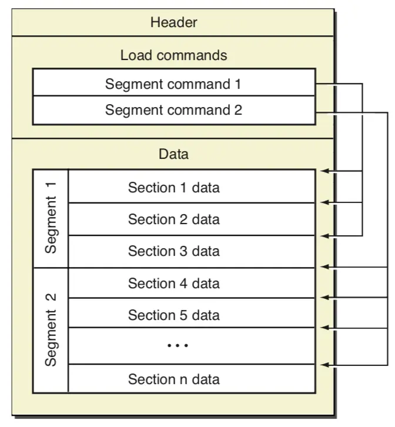
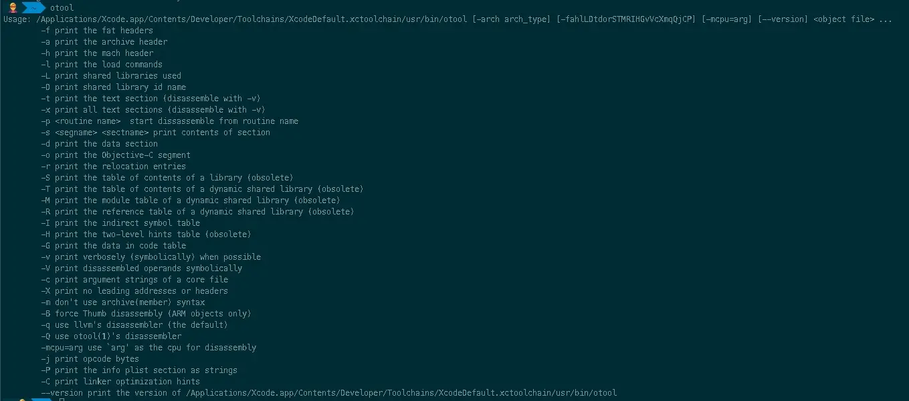
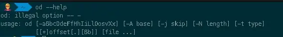
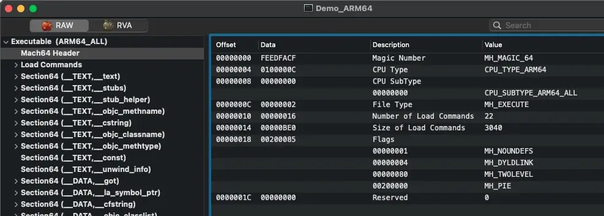
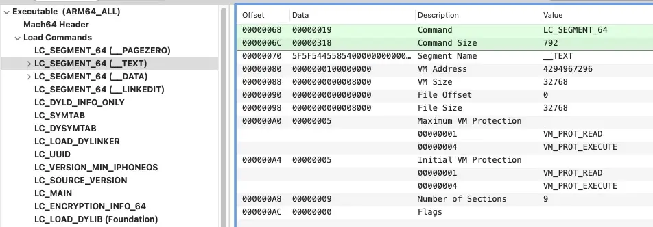

# 简单剖析 Mach-O 文件

> 📅 发布时间：2018-10-13
>
> 🏷️ 标签：`iOS` `Mach-O`
>
> ⏱️ 阅读时长：约 30 分钟

最近尝试做符号分析及静态链接相关方面的探索，发现离不开对 Mach-O 文件结构的分析。所以这里整理一篇笔记，来梳理下 Mach-O 文件格式，一来是为了加深理解，二来是为了方便后期知识回顾。

Mach-O 是 Apple 系统上（包括 MacOS 以及 iOS）的可执行文件格式，类似于 windows 上的 PE 文件以及 linux 上的 ELF 文件。可执行格式确定将二进制文件中的代码和数据读入内存的顺序。

了解 Mach-O 文件的格式，对于静态分析、动态调试、自动化测试及安全都很有意义。在熟悉了 Mach-O 文件之后，一切也都会显得没那么神秘。

有关 Mach-O 的官方资料比较少，到时相关源码都开放在 xnu 里面，[xnu 压缩包下载地址](https://opensource.apple.com/tarballs/xnu/)、[xnu 源码在线查看地址](https://opensource.apple.com/source/xnu/xnu-4903.221.2/EXTERNAL_HEADERS/mach-o/)。

## 1. 整体结构

首先来看下出自官方文档《OS X ABI Mach-O File Format Reference》里面的描述图（该文档目前官网上已经找不到了，但是这里有[备份](https://github.com/aidansteele/osx-abi-macho-file-format-reference/blob/master/Mach-O_File_Format.pdf)），可以非常清晰的看到，这种文件格式由文件头（Header）、加载命令（Load Commands）以及具体数据（Segment&Section）组成。



## 2. Header（头部）

描述了 Mach-O 的 CPU 架构、文件类型以及加载命令等信息。

与 Mach-O 文件格式有关的结构体定义都可以从`xnu`源码的`EXTERNAL_HEADERS/mach-o/loader.h`中找到
32 位和 64 位的 mach header 分别如下

```
/*
 * The 32-bit mach header appears at the very beginning of the object file for
 * 32-bit architectures.
 */
struct mach_header {
	uint32_t	magic;		/* mach magic number identifier */
	cpu_type_t	cputype;	/* cpu specifier */
	cpu_subtype_t	cpusubtype;	/* machine specifier */
	uint32_t	filetype;	/* type of file */
	uint32_t	ncmds;		/* number of load commands */
	uint32_t	sizeofcmds;	/* the size of all the load commands */
	uint32_t	flags;		/* flags */
};

/*
 * The 64-bit mach header appears at the very beginning of object files for
 * 64-bit architectures.
 */
struct mach_header_64 {
	uint32_t	magic;		/* mach magic number identifier */
	cpu_type_t	cputype;	/* cpu specifier */
	cpu_subtype_t	cpusubtype;	/* machine specifier */
	uint32_t	filetype;	/* type of file */
	uint32_t	ncmds;		/* number of load commands */
	uint32_t	sizeofcmds;	/* the size of all the load commands */
	uint32_t	flags;		/* flags */
	uint32_t	reserved;	/* reserved */
};
```

### 2.1 字段简介

#### magic

魔数（特征数字），用来标记当前设备是大端序还是小端序。占 4 个字节，可在`EXTERNAL_HEADERS/mach-o/loader.h`中找到相关定义，如下

```
/* Constant for the magic field of the mach_header (32-bit architectures) */
#define	MH_MAGIC	0xfeedface	/* the mach magic number */
#define MH_CIGAM	0xcefaedfe	/* NXSwapInt(MH_MAGIC) */

/* Constant for the magic field of the mach_header_64 (64-bit architectures) */
#define MH_MAGIC_64 0xfeedfacf /* the 64-bit mach magic number */
#define MH_CIGAM_64 0xcffaedfe /* NXSwapInt(MH_MAGIC_64) */
```

如上面的宏定义可知，32 位下魔数可以为 `MH_MAGIC`或`MH_CIGAM`，64 位下其可能为`MH_MAGIC_64`或`MH_MAGIC_64`。因为两种架构 mach header 长度不一样，也可以用魔数值来区分当前 mach header 是 32 位架构还是 64 位架构。

#### cputype

标识 CPU 的架构，例如 ARM、ARM64、X86_64 等。类型是`cpu_type_t`实际上就是`int`类型，占 4 个字节，可在`osfmk/mach/machine.h`中找到相关定义，常见的`cputype`如下

```
#define CPU_ARCH_ABI64          0x01000000      /* 64 bit ABI */

#define CPU_TYPE_X86            ((cpu_type_t) 7)
#define CPU_TYPE_X86_64         (CPU_TYPE_X86 | CPU_ARCH_ABI64)

#define CPU_TYPE_ARM            ((cpu_type_t) 12)
#define CPU_TYPE_ARM64          (CPU_TYPE_ARM | CPU_ARCH_ABI64)
```

#### cpusubtyp

标识 CPU 的具体类型，区分不同版本的处理器。类型是`cpu_subtype_t`实际上也是`int`类型，占 4 个字节，也可在`osfmk/mach/machine.h`中找到相关定义，常见的`cputype`如下

```
#define CPU_SUBTYPE_LIB64       0x80000000      /* 64 bit libraries */ot

#define CPU_SUBTYPE_X86_ALL             ((cpu_subtype_t)3)
#define CPU_SUBTYPE_X86_64_ALL          ((cpu_subtype_t)3)

#define CPU_SUBTYPE_ARM64_ALL           ((cpu_subtype_t) 0)
#define CPU_SUBTYPE_ARM_V7              ((cpu_subtype_t) 9)  /* ARMv7-A and ARMv7-R */
```

#### ncmds

Mach-O 文件中加载命令（load commands）的条数。

#### sizeofcmds

Mach-O 文件中加载命令（load commands）的总大小。

#### filetype

Mach-O 文件类型。由于 Mach-O 支持多种类型文件，所以此处引入了 filetype 字段来标明，这些文件类型定义在`EXTERNAL_HEADERS/mach-o/loader.h`文件中同样可以找到。

```
#define	MH_OBJECT	0x1		/* relocatable object file */
#define	MH_EXECUTE	0x2		/* demand paged executable file */
#define	MH_FVMLIB	0x3		/* fixed VM shared library file */
#define	MH_CORE		0x4		/* core file */
#define	MH_PRELOAD	0x5		/* preloaded executable file */
#define	MH_DYLIB	0x6		/* dynamically bound shared library */
#define	MH_DYLINKER	0x7		/* dynamic link editor */
#define	MH_BUNDLE	0x8		/* dynamically bound bundle file */
#define	MH_DYLIB_STUB	0x9		/* shared library stub for static */ /*  linking only, no section contents */
#define	MH_DSYM		0xa		/* companion file with only debug */ /*  sections */
#define	MH_KEXT_BUNDLE	0xb		/* x86_64 kexts */
```

**常见类型解释**

- `MH_OBJECT`：可重定位目标文件（.o），源文件和可执行文件的中间产物，比如.c 编译成.o 链接后成可执行文件；静态库文件（.a），静态库就是多个.o 文件合并在一起
- `MH_EXECUTE`：可执行文件，.app.xx
- `MH_DYLIB`：动态库文件（.dylib、.framework/xx）
- `MH_DYLINKER`：动态链接编辑器（/usr/lib/dyld）
- `MH_DSYM`：存储着二进制符号信息的文件（.dSYM/Contents/Resources/DWARF/xx，常用于分析 APP 的崩溃信息）

#### flag

标识着 Mach-O 文件的一些重要信息，也可在`EXTERNAL_HEADERS/mach-o/loader.h`文件中找到相关的宏定义，常见的宏定义如下

```
/* Constants for the flags field of the mach_header */
#define	MH_NOUNDEFS	0x1		/* the object file has no undefined references */
#define MH_DYLDLINK	0x4		/* the object file is input for the dynamic linker and can't be staticly link edited again */
#define MH_TWOLEVEL	0x80	/* the image is using two-level name space bindings */
#define	MH_PIE 0x200000		/* When this bit is set, the OS will load the main executable at a random address.  Only used in MH_EXECUTE filetypes. */
```

- `MH_NOUNDEFS`：没有未定义的符号，不存在连接依赖
- `MH_DYLDLINK`：是 dyld 的输入文件，不能被再次静态链接
- `MH_PIE`：这个值得注意下，这个标记在`MH_EXECUTE`中使用，意思是启用 ASLR（Address Space Layout Randomization，地址空间布局随机化）来增加程序的安全性。简单地说，程序每次启动后，加载地址都会随机变化，这样程序里的所有代码引用都是错的，需要重新对代码地址进行计算修正才能正常访问。

### 2.2 mach header 查看

#### 使用`otool`指令

我们可以使用`otool`指令来查看 mach header，该指定使用详情如下



使用该指令`-h`选项查看可执行文件的 mach header

```
$ otool -h Demo_ARM64

Mach header
      magic  cputype cpusubtype  caps    filetype ncmds sizeofcmds      flags
 0xfeedfacf 16777228          0  0x00           2    22       3040 0x00200085
```

#### 使用`od`指令自己解析

我们可以使用`od`指令来输出该二进制文件，然后按位解析。该指令各个参数解释可以参考[Linux od 命令](https://www.runoob.com/linux/linux-comm-od.html)



这里只需要直到几个重要参数的意思

- `-A`：( 地址进制)按指定的进制显示地址信息。
  - `o`：八进制（系统默认值）
  - `d`：十进制
  - `x`：十六进制
  - `n`：不打印位移值
- `-t`：指定数据显示的格式。
  - `c`：ASCII 字符或反斜杠序列(如\n)
  - `d`：有符号十进制数
  - `f`：浮点数
  - `o`：八进制（系统默认值）
  - `u`：无符号十进制数
  - `x`：十六进制数
- `-N`：到设置的字符数目为止
- `-j`：略过设置的字符数目

使用该指令查看可执行文件的 mach header，可知在 64 位下，mach header 长度位 32byte，所以我们只需输出该二进制文件的前 32 个字节

```
$ od -Ax -tx -N 32 Demo_ARM64

0000000          feedfacf        0100000c        00000000        00000002
0000010          00000016        00000be0        00200085        00000000
0000020
```

注：最左边一列为地址，后面四列为对应地址上存放的具体内容。

从这些二进制文件中可以看出，magic 为`0xfeedfacf`，cputype 为 `CPU_TYPE_ARM64`（`0x0100000c`），subcputype 为`CPU_SUBTYPE_ARM64_ALL`（`00000000`），filetype 为 `MH_EXECUTE`（`0x00000002`），ncmds（number of load commands）为 `0x00000016` 换算成 10 进制 load commands 个数是 22 个，sizeofcmds（the size of all the load commands）为 `0x00000be0` 换算成 10 进制表示 load commands 大小为 3040 个字节

#### 使用 MachOView 来查看



## 3. oad Commands（加载命令）

描述了文件中数据的具体组织结构，紧跟在 mach header 的后面，不同的数据类型使用不同的加载命令表示。

### 概序

所有的 load command 必须遵守下面的格式，前 4 个字节表示类型，不同类型的 load command 作用不一样，紧跟其后的 4 个字节表示该 load command 的大小，指明大小是解析可执行文件中至关重要的一步。

```
struct load_command {
	uint32_t cmd;		/* type of load command */
	uint32_t cmdsize;	/* total size of command in bytes */
};
```

load commands 的类型有很多种，从`EXTERNAL_HEADERS/mach-o/loader.h`文件中可以找到

```
/* Constants for the cmd field of all load commands, the type */
#define	LC_SEGMENT	0x1	/* segment of this file to be mapped */
#define	LC_SYMTAB	0x2	/* link-edit stab symbol table info */
#define	LC_SYMSEG	0x3	/* link-edit gdb symbol table info (obsolete) */
#define	LC_THREAD	0x4	/* thread */
#define	LC_UNIXTHREAD	0x5	/* unix thread (includes a stack) */
#define	LC_LOADFVMLIB	0x6	/* load a specified fixed VM shared library */
#define	LC_IDFVMLIB	0x7	/* fixed VM shared library identification */
#define	LC_IDENT	0x8	/* object identification info (obsolete) */
#define LC_FVMFILE	0x9	/* fixed VM file inclusion (internal use) */
#define LC_PREPAGE      0xa     /* prepage command (internal use) */
#define	LC_DYSYMTAB	0xb	/* dynamic link-edit symbol table info */
#define	LC_LOAD_DYLIB	0xc	/* load a dynamically linked shared library */
#define	LC_ID_DYLIB	0xd	/* dynamically linked shared lib ident */
#define LC_LOAD_DYLINKER 0xe	/* load a dynamic linker */
#define LC_ID_DYLINKER	0xf	/* dynamic linker identification */
#define	LC_PREBOUND_DYLIB 0x10	/* modules prebound for a dynamically */
				/*  linked shared library */
#define	LC_ROUTINES	0x11	/* image routines */
#define	LC_SUB_FRAMEWORK 0x12	/* sub framework */
#define	LC_SUB_UMBRELLA 0x13	/* sub umbrella */
#define	LC_SUB_CLIENT	0x14	/* sub client */
#define	LC_SUB_LIBRARY  0x15	/* sub library */
#define	LC_TWOLEVEL_HINTS 0x16	/* two-level namespace lookup hints */
#define	LC_PREBIND_CKSUM  0x17	/* prebind checksum */

/*
 * load a dynamically linked shared library that is allowed to be missing
 * (all symbols are weak imported).
 */
#define	LC_LOAD_WEAK_DYLIB (0x18 | LC_REQ_DYLD)

#define	LC_SEGMENT_64	0x19	/* 64-bit segment of this file to be mapped */
#define	LC_ROUTINES_64	0x1a	/* 64-bit image routines */
#define LC_UUID		0x1b	/* the uuid */
#define LC_RPATH       (0x1c | LC_REQ_DYLD)    /* runpath additions */
#define LC_CODE_SIGNATURE 0x1d	/* local of code signature */
#define LC_SEGMENT_SPLIT_INFO 0x1e /* local of info to split segments */
#define LC_REEXPORT_DYLIB (0x1f | LC_REQ_DYLD) /* load and re-export dylib */
#define	LC_LAZY_LOAD_DYLIB 0x20	/* delay load of dylib until first use */
#define	LC_ENCRYPTION_INFO 0x21	/* encrypted segment information */
#define	LC_DYLD_INFO 	0x22	/* compressed dyld information */
#define	LC_DYLD_INFO_ONLY (0x22|LC_REQ_DYLD)	/* compressed dyld information only */
#define	LC_LOAD_UPWARD_DYLIB (0x23 | LC_REQ_DYLD) /* load upward dylib */
#define LC_VERSION_MIN_MACOSX 0x24   /* build for MacOSX min OS version */
#define LC_VERSION_MIN_IPHONEOS 0x25 /* build for iPhoneOS min OS version */
#define LC_FUNCTION_STARTS 0x26 /* compressed table of function start addresses */
#define LC_DYLD_ENVIRONMENT 0x27 /* string for dyld to treat like environment variable */
#define LC_MAIN (0x28|LC_REQ_DYLD) /* replacement for LC_UNIXTHREAD */
#define LC_DATA_IN_CODE 0x29 /* table of non-instructions in __text */
#define LC_SOURCE_VERSION 0x2A /* source version used to build binary */
#define LC_DYLIB_CODE_SIGN_DRS 0x2B /* Code signing DRs copied from linked dylibs */
#define	LC_ENCRYPTION_INFO_64 0x2C /* 64-bit encrypted segment information */
#define LC_LINKER_OPTION 0x2D /* linker options in MH_OBJECT files */
#define LC_LINKER_OPTIMIZATION_HINT 0x2E /* optimization hints in MH_OBJECT files */
#define LC_VERSION_MIN_TVOS 0x2F /* build for AppleTV min OS version */
#define LC_VERSION_MIN_WATCHOS 0x30 /* build for Watch min OS version */
#define LC_NOTE 0x31 /* arbitrary data included within a Mach-O file */
#define LC_BUILD_VERSION 0x32 /* build for platform min OS version */
#define LC_DYLD_EXPORTS_TRIE (0x33 | LC_REQ_DYLD) /* used with linkedit_data_command, payload is trie */
#define LC_DYLD_CHAINED_FIXUPS (0x34 | LC_REQ_DYLD) /* used with linkedit_data_command */
```

这里列举几个看上去比较常见的

- `LC_SEGMENT`和`LC_SEGMENT_64`：将`segment`中的标识区域数据加载并映射到进程的内存空间去
- `LC_DYLD_INFO`和`LC_DYLD_INFO_ONLY`：记录了动态链接的重要信息（重定向地址、弱引用绑定、懒加载绑定、开放函数等的偏移值等信息）
- `LC_SYMTAB`：文件所使用的符号表，找到后分别获取符号表偏移量、符号数、字符串表偏移量、字符串表大小
- `LC_DYSYMTAB`：动态连接器所使用的符号表，找到后获取间接符号表偏移量
- `LC_LOAD_DYLINKER`：动态加载器地址（/usr/lib/dyld）
- `LC_UUID`：Mach-O 文件的唯一标识，crash.log 和 dSYM 文件（符号文件）都存在这个值，配对对应文件，可用来分析 crash 信息对应的堆栈
- `LC_VERSION_MIN_MACOSX`和`LC_VERSION_MIN_IPHONEOS`：确定二进制文件要求的最低操作系统版本，和 Xcode 中配置的 target 有关
- `LC_SOURCE_VERSION`：构建该二进制文件使用的源代码版本
- `LC_MAIN`：程序入口
- `LC_ENCRYPTION_INFO`和`LC_ENCRYPTION_INFO_64`：加密信息，如果是从 App Store 上下载的应用，外面被加了一层壳，对应的加密标记（Crypt ID）不为 0，如果不是 App Store 上下载的应用（例如 PP 助手上），或这个已经被脱过壳的，加密标记（Crypt ID）便为 0
- `LC_LOAD_DYLIB`：依赖的动态库，包括动态库路径、当前版本、兼容版本等信息
- `LC_RPATH`：@rpath 的路径，指定动态库链接器搜索路径列表，以便定位框架（framework）
- `LC_FUNCTION_STARTS`：函数起始地址表，使调试器和其他程序能够判断一个地址是否在该表范围内
- `LC_DATA_IN_CODE`：定义在代码段内的非指令表
- `LC_CODE_SIGNATURE`：代码签名信息，校验签名及修复脱壳后的应用闪退需要用到

不同类型的 load command 的结构都不一样，可以使用`otool -l <mach-o>`来查看可执行文件所有的 load commands，也可以使用 MachOView 来查看。

```
$ otool -l Demo_ARM64

Load command 0
      cmd LC_SEGMENT_64
  cmdsize 72
  segname __PAGEZERO
   vmaddr 0x0000000000000000
   vmsize 0x0000000100000000
  fileoff 0
 filesize 0
  maxprot 0x00000000
 initprot 0x00000000
   nsects 0
    flags 0x0
Load command 1
      cmd LC_SEGMENT_64
  cmdsize 792
  segname __TEXT
   vmaddr 0x0000000100000000
   vmsize 0x0000000000008000
  fileoff 0
 filesize 32768
  maxprot 0x00000005
 initprot 0x00000005
   nsects 9
    flags 0x0
...
```

下面列举下几种重要的 load command

### load commands 列举

#### LC_SEGMENT

`LC_SEGMENT_64`和`LC_SEGMENT`是加载的主要命令，翻译成中文叫做“段”，它负责指导内核来设置进程的内存空间，说白了，只要是这个类型的 load command，系统会将其指示的内容全部加载到指定的虚拟内存地址上来。

```
struct segment_command { /* for 32-bit architectures */
	uint32_t	cmd;		/* LC_SEGMENT */
	uint32_t	cmdsize;	/* includes sizeof section structs */
	char		segname[16];	/* segment name */
	uint32_t	vmaddr;		/* memory address of this segment */
	uint32_t	vmsize;		/* memory size of this segment */
	uint32_t	fileoff;	/* file offset of this segment */
	uint32_t	filesize;	/* amount to map from the file */
	vm_prot_t	maxprot;	/* maximum VM protection */
	vm_prot_t	initprot;	/* initial VM protection */
	uint32_t	nsects;		/* number of sections in segment */
	uint32_t	flags;		/* flags */
};

struct segment_command_64 { /* for 64-bit architectures */
	uint32_t	cmd;		/* LC_SEGMENT_64 */
	uint32_t	cmdsize;	/* includes sizeof section_64 structs */
	char		segname[16];	/* segment name */
	uint64_t	vmaddr;		/* memory address of this segment */
	uint64_t	vmsize;		/* memory size of this segment */
	uint64_t	fileoff;	/* file offset of this segment */
	uint64_t	filesize;	/* amount to map from the file */
	vm_prot_t	maxprot;	/* maximum VM protection */
	vm_prot_t	initprot;	/* initial VM protection */
	uint32_t	nsects;		/* number of sections in segment */
	uint32_t	flags;		/* flags */
};
```

- `cmd`：该加载命令类型，为`LC_SEGMENT_64`（64 位）或`LC_SEGMENT`（32 位）
- `cmdsize`：该加载命令大小，包括`segement`下`session`结构所占大小
- `segname[16]`：`segment` 名字
- `vmaddr`：为当前`segment`分配的虚拟内存地址
- `vmsize`：为当前`segment`分配的虚拟内存大小
- `fileoff`： 当前`segment`在 Mach-O 文件中的偏移量
- `filesize`：当前`segment`在 Mach-O 文件中占用的字节
- `maxprot`：`segment`所在页所需要的最高内存保护
- `initprot`：`segment`所在页原始内存保护
- `nsects`：`segment`中`section`数量
- `flags`：标识符

**大概解释下：系统 Mach-O 从`fileoff`处加载`filesie`大小的内容到虚拟内存`vmaddr`处，大小为`vmsize`，`segment`页权限`initport`进行初始化，这些权限可以被修改，但是不能超过`maxprot`的值。用大白话来说就是，`fileoff`和`filesie`指导和说明了内容从哪里来，`vmaddr`和`vmsize`指导和说明了文件到哪里去。需要留意，对某些`segment`来说，`vmsize`可能会大于 `filesize`，如`__DATA`、`__LINKEDIT`。这里很重要，一定要理清这些概念，内存地址符号化会用到这些知识。**

`segname`是用下划线和大写字母组成，分类如下

- `__PAGEZERO`：静态链接器创建了`__PAGEZERO`命名的段作为可执行文件的第一个段，该段在文件中所占大小为 0，在 32 位系统上，加载到虚拟内存中是 0x4000，也就是 16kb，在 64 位系统上，加载到虚拟未存中是 0x100000000，也就是 4GB。是一个不可读、不可写、不可执行的空间，能够在空指针访问时抛出异常。
- `__TEXT`：代码段，里面包含了可执行代码和其他一些只读数据，该段是可读、可执行，但是不可写。
- `__DATA`：数据段，里面主要是存放将会被更改的数据，该段是可读、可写，但不可执行。
- `__LINKEDIT`：包含需要被动态链接器使用的符号和其他表，包括符号表、字符串表等，可读，但不可写不可执行。

使用 MachOView 来查看下名字为`__TEXT`的`segment`



**其中`segname`为`__TEXT`和`__DATA`两个`segment`可以进一步分解为`section`。**之所以按照`segment` -> `section`的结构组织方式，是因为在同一个`segment`下的`section`，可以控制相同的权限，也可以不完全按照 Page 的大小进行内存对其，节省内存的空间。而`segment`对外整体暴露，在程序载入阶段映射成一个完整的虚拟内存，更好的做到内存对齐。

关于`section`结构的具体定义，也可以从`EXTERNAL_HEADERS/mach-o/loader.h`文件中可以找到

```
struct section { /* for 32-bit architectures */
	char		sectname[16];	/* name of this section */
	char		segname[16];	/* segment this section goes in */
	uint32_t	addr;		/* memory address of this section */
	uint32_t	size;		/* size in bytes of this section */
	uint32_t	offset;		/* file offset of this section */
	uint32_t	align;		/* section alignment (power of 2) */
	uint32_t	reloff;		/* file offset of relocation entries */
	uint32_t	nreloc;		/* number of relocation entries */
	uint32_t	flags;		/* flags (section type and attributes)*/
	uint32_t	reserved1;	/* reserved (for offset or index) */
	uint32_t	reserved2;	/* reserved (for count or sizeof) */
};

struct section_64 { /* for 64-bit architectures */
	char		sectname[16];	/* name of this section */
	char		segname[16];	/* segment this section goes in */
	uint64_t	addr;		/* memory address of this section */
	uint64_t	size;		/* size in bytes of this section */
	uint32_t	offset;		/* file offset of this section */
	uint32_t	align;		/* section alignment (power of 2) */
	uint32_t	reloff;		/* file offset of relocation entries */
	uint32_t	nreloc;		/* number of relocation entries */
	uint32_t	flags;		/* flags (section type and attributes)*/
	uint32_t	reserved1;	/* reserved (for offset or index) */
	uint32_t	reserved2;	/* reserved (for count or sizeof) */
	uint32_t	reserved3;	/* reserved */
};
```

- `sectname`：`section`名字
- `segname`：`section`所在的`segment`名称
- `addr`：`section`所在的内存地址
- `size`：`section`的大小
- `offset`：`section`所在的文件偏移
- `align`：`section`的内存对齐边界 (2 的次幂)
- `reloff`：重定位信息的文件偏移
- `nreloc`：重定位条目的数目
- `flags`：标志属性
- `reserved`：保留字段

根据`segname.sectname`结构对`section`进行分类，使用 MachOView 进行查看


各个`section`作用如下：

- `__TEXT.__text`：主程序代码
- `__TEXT.__stubs`、`__TEXT.__stub_helper`：用于帮助动态链接器绑定符号
- `__TEXT.__const`：`const`关键字修饰的常亮
- `__TEXT.__objc_methodname`：OC 方法名
- `__TEXT.__cstring`：只读的 C 语言字符串
- `__TEXT.__objc_classname`：OC 类名
- `__TEXT.__objc_methtype`：OC 方法类型（方法签名）
- `__TEXT.__gcc_except_tab`、`__ustring`、`__unwind_info`：GCC 编译器自动生成，用于确定异常发生是栈所对应的信息（包括栈指针、返回地址及寄存器信息等）
- `__DATA.__got`：全局非懒绑定符号指针表
- `__DATA.__la_symbol_ptr`：懒绑定符号指针表
- `__DATA.__mod_init_func`：C++类的构造函数
- `__DATA.__const`：未初始化过的常量
- `__DATA.__cfstring`：`Core Foundation`字符串
- `__DATA.__objc_classlist`：OC 类列表
- `__DATA.__objc_nlclslist`：实现`+load`方法的 OC 类列表
- `__DATA.__catlist`：OC 分类（`Category`）列表
- `__DATA.__protolist`：OC 协议（`Protocol`）列表
- `__DATA.__imageinfo`：镜像信息，可用它区别 OC 1.0 与 2.0
- `__DATA.__const`：OC 初始化过的常量
- `__DATA.__selrefs`：OC 选择器（`SEL`）引用列表
- `__DATA.__protorefs`：OC 协议引用列表
- `__DATA.__classrefs`：OC 类引用列表
- `__DATA.__superrefs`：OC 超类（即父类）引用列表
- `__DATA.__ivar`：OC 类的实例变量
- `__DATA.__objc_data`：OC 初始化过的变量
- `__DATA.__data`：实际初始化数据段
- `__DATA.__common`：未初始化过的符号申明
- `__DATA.__bss`：未初始化的全局变量

#### LC_UUID

Mach-O 文件的唯一标识，crash.log 和 dSYM 文件（符号文件）都存在这个值，配对对应文件，可用来分析 crash 信息对应的堆栈。在`EXTERNAL_HEADERS/mach-o/loader.h`文件中定义结构如下

```
/*
 * The uuid load command contains a single 128-bit unique random number that
 * identifies an object produced by the static link editor.
 */
struct uuid_command {
    uint32_t	cmd;		/* LC_UUID */
    uint32_t	cmdsize;	/* sizeof(struct uuid_command) */
    uint8_t	uuid[16];	/* the 128-bit uuid */
};
```

#### LC_SYMTAB

文件所使用的符号表，找到后分别获取符号表偏移量、符号数、字符串表偏移量、字符串表大小。在`EXTERNAL_HEADERS/mach-o/loader.h`文件中定义结构如下

```
/*
 * The symtab_command contains the offsets and sizes of the link-edit 4.3BSD
 * "stab" style symbol table information as described in the header files
 * <nlist.h> and <stab.h>.
 */
struct symtab_command {
	uint32_t	cmd;		/* LC_SYMTAB */
	uint32_t	cmdsize;	/* sizeof(struct symtab_command) */
	uint32_t	symoff;		/* symbol table offset */
	uint32_t	nsyms;		/* number of symbol table entries */
	uint32_t	stroff;		/* string table offset */
	uint32_t	strsize;	/* string table size in bytes */
};
```

- `symoff`：符号表的偏移量
- `nsyms`：符号表中的符号条数
- `stroff`：字符表的偏移量
- `strsize`：字符表大小

这四个参数相对于符号解析来说很重要，具体后面符号解析的时候再细说。

还有其他 load commands 就不一一列举了，遇到具体的再具体分析，这里只是做下了解。

## 4. 总结 Mach-O 文件结构

随便打开一个 Mach-O 文件一般会有四个`segment`，其中`__PAGEZERO`加载的 File Offset 和 File Size 都为 0，也就是不会引导内核加载 Mach-O 文件。`__TEXT`的 File Offset 一般为 0，也就是从 Mach-O 文件的第一个字节开始加载，到`__DATA`指定的开始加载位置结束，`__LINKEDIT`指定的加载区域是从`__DATA`结束的位置一直到 Mach-O 文件的最后一个字节。用个 MachOView 截个图表示下（ps：新建的一个 Command Line 空工程），如下图


综上，我认为一个典型的 Mach-O 结构图的更清晰描述应该是这个样子：


## 5. 写在最后

刚开始探索 Mach-O 文件的时候，一度把自己给绕进去，当初一心想弄清楚各个 load commands 的字段信息和作用，上网各种扒资料。结果浪费了时间，也把自己弄得心态崩溃，越挖越深，像个无底洞一样。
回过头来发现，正确探索 Mach-O 文件不应该是这样，首先只需了解下他的结构及组成。在后面遇到某个需要深究 load command 的时候再查资料研究，这样结合实际情况进行学习更容易理解。
