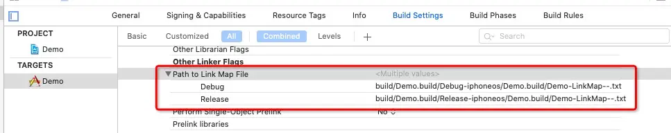
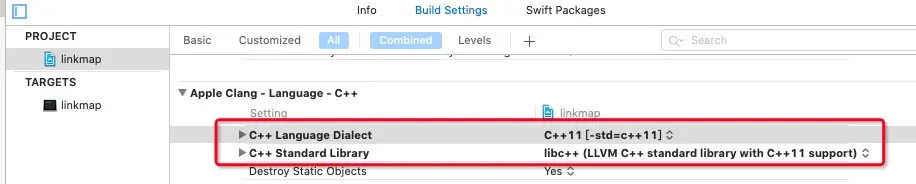
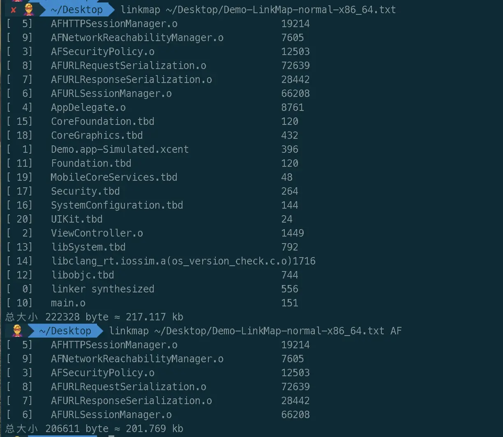

# Link Map File探索和脚本计算

> 📅 发布时间：2021-10-21
>
> 🏷️ 标签：`iOS` `LinkMapFile` `C++` `Shell` `Python`
>
> ⏱️ 阅读时长：约 30 分钟

## 1. Link Map File 是啥

我们编写的 OC 代码需要经过**预编译->编译->汇编->链接（静态链接）**，最终生成一个可执行文件。汇编阶段完成后，每个类都会生成一个对应的`.o`文件（可重定位的目标文件），在链接阶段（静态），会把所有的`.o`文件链接到一起，生成一个可执行文件。Link Map File 就是这样一个记录链接相关信息的纯文本文件，里面记录了可执行文件的路径、CPU 架构、目标文件、符号等信息。

## 2. 探索 Link Map File 的意义

探索 Link Map File 可以帮助我们更好的**理解链接过程、理解内存分段及分区、分析可执行文件中哪个类或库占用比较大，进行安装包瘦身**。

苹果对上传到 App Store 上的 app 大小也有严格的规定 [Apple 规定最大构建版本文件大小](https://help.apple.com/app-store-connect/#/dev611e0a21f)


**翻译：**
执行文件大小是指执行文件的\_\_TEXT 部分

- 当 iOS 最低版本小于 7.0，最多为 80MB；
- 想 iOS 系统版本位于 7.0~8.0 之间时，每个分区是 60MB（并不是指 32 位+64 位最多为 120MB，当 32 位分区占用 50MB，64 位分区占用 61MB，总 111MB 也不行，因为 64 位分区超出了）；
- 当 iOS 大于等于 9.0，总限制 500MB；

对 App 来说，可以用 Link Map File 来分析各个文件占用大小，有针对性进行优化。
对 SDK 来说，也可以用 Link Map File 来计算自身大小，控制好大小这个度。一般大 App 对集成二方和三方这样的 SDK 大小是有很严格的限制。

## 3. 如何生成 Link Map File

Xcode 默认情况下是不会去生成 Link Map File，需要开发者自己手动去打开生成配置开关，如下图，**Target -> Build Setting -> Linking -> Write Link Map File 为 YES**


**存放 Link Map File 文件路径如下图**



默认存放路径是

```
$(TARGET_TEMP_DIR)/$(PRODUCT_NAME)-LinkMap-$(CURRENT_VARIANT)-$(CURRENT_ARCH).txt
```

最终翻译成实体文件路径如下

```
/Users/chao/Library/Developer/Xcode/DerivedData/Demo-fvacayrprqdluqdcpzegtlzjjoqp/Build/Intermediates.noindex/Demo.build/Debug-iphonesimulator/Demo.build/Demo-LinkMap-normal-x86_64.txt
```

我们也可更改 Link Map File 文件存放位置，这个要看自己需要了

## 4. Link Map File 组成

**1. Path：生成可执行文件的路径**

```
# Path: /Users/chao/Library/Developer/Xcode/DerivedData/Demo-fvacayrprqdluqdcpzegtlzjjoqp/Build/Products/Debug-iphonesimulator/Demo.app/Demo
```

**2. Arch：架构类型**

```
# Arch: x86_64
```

**3. Object files：列举了可执行文件里所有的 obj 以及 tbd。**

```
# Object files:
[  0] linker synthesized
[  1] /Users/chao/Library/Developer/Xcode/DerivedData/Demo-fvacayrprqdluqdcpzegtlzjjoqp/Build/Intermediates.noindex/Demo.build/Debug-iphonesimulator/Demo.build/Demo.app-Simulated.xcent
[  2] /Users/chao/Library/Developer/Xcode/DerivedData/Demo-fvacayrprqdluqdcpzegtlzjjoqp/Build/Intermediates.noindex/Demo.build/Debug-iphonesimulator/Demo.build/Objects-normal/x86_64/ViewController.o
[  3] /Users/chao/Library/Developer/Xcode/DerivedData/Demo-fvacayrprqdluqdcpzegtlzjjoqp/Build/Intermediates.noindex/Demo.build/Debug-iphonesimulator/Demo.build/Objects-normal/x86_64/AFSecurityPolicy.o
[  4] /Users/chao/Library/Developer/Xcode/DerivedData/Demo-fvacayrprqdluqdcpzegtlzjjoqp/Build/Intermediates.noindex/Demo.build/Debug-iphonesimulator/Demo.build/Objects-normal/x86_64/AppDelegate.o
...
```

**4. Sections：主要用展示代码和数据在内存中的分布，涉及到 Mach-O 可执行文件内存分布相关，这里不做过多解释**

```
# Sections:
# Address	Size    	Segment	Section
0x100004350	0x0002308D	__TEXT	__text
0x1000273DE	0x000002A0	__TEXT	__stubs
0x100027680	0x00000470	__TEXT	__stub_helper
......
0x100030000	0x00000008	__DATA	__nl_symbol_ptr
0x100030008	0x000000F0	__DATA	__got
0x1000300F8	0x00000380	__DATA	__la_symbol_ptr
......
```

**5. Symbols：记录符号相关信息，也是我们统计的关键**

```
# Symbols:
# Address	Size    	File  Name
0x100004350	0x00000040	[  2] -[ViewController viewDidLoad]
0x100004390	0x000000E0	[  2] -[ViewController touchesBegan:withEvent:]
0x100004470	0x00000050	[  2] ___41-[ViewController touchesBegan:withEvent:]_block_invoke
0x1000044C0	0x00000080	[  2] ___41-[ViewController touchesBegan:withEvent:]_block_invoke_2
0x100004540	0x00000074	[  2] ___41-[ViewController touchesBegan:withEvent:]_block_invoke_3
0x1000045C0	0x00000330	[  3] +[AFSecurityPolicy certificatesInBundle:]
0x1000048F0	0x00000080	[  3] +[AFSecurityPolicy defaultPolicy]
```

根据`Sections`的起始地址，可以将`Symbols`分为`Sections`个数的组
Symbols 包含的信息有：

- `Address`：符号起始地址
- `Size`：所占内存大小（16 进制）。
- `File`：该`Name`所在的文件编号，也就是`Object files`部分的中括号的数字，例如`-[ViewController viewDidLoad]`对应的文件编号为`[  2]`，根据`Object files`部分可以看到所属的文件为：`ViewController.o`。这样可以计算某个`.o`文件所占内存的大小。只需要把`Symbols`中编号为`.o`对应编号符号累加统计即可。
- `Name`：符号的名称。

**6. Dead Stripped Symbols：链接器认为无用的符号，统计大小的时候不统计它下面的符号**

```
# Dead Stripped Symbols:
#        	Size    	File  Name
<<dead>> 	0x00000018	[  2] CIE
<<dead>> 	0x00000015	[  3] literal string: supportsSecureCoding
<<dead>> 	0x0000000F	[  3] literal string: SSLPinningMode
<<dead>> 	0x00000011	[  3] literal string: pinnedPublicKeys
```

## 5. Link Map File 信息统计

接下里正式进入本文主题，使用 Link Map 文件统计各个文件的大小。

说到统计，真的是心酸的不行，开始写了一个 shell 的统计脚本，结果发现计算速度太慢（主要是没有面向对象的思想，也没有我想要的数据结构，例如 map）。为了加快统计的速度，我用 OC 写了个 linkmap 计算程序，速度是快了，但是想到运行 OC 毕竟要装 Xcode 才能运行，哎！还能怎样，接着探索呗。这个时候我想到一门语言，Python！ 面向对象写脚本，正是我需要的，于是扒资料扒教程得去学习 Python，学完出山，写了一个 linkmap.sh 程序，计算速度果然大幅度增加，比较满意。这样就满足了吗？不！生命不息，折腾不止！这让我想起了之前无意间看到 C++之父说过的一句话，大概的意思是“我为全球变暖做出的贡献就是让 C ++运行更高效”，这句话激励了我去重新去认识 C ++这门语言，于是我买了[李明杰的 C++课程](https://ke.qq.com/course/336509)，一番学习下来收获颇丰，于是用 C ++重写了计算程序。

### 5.1 人狠话不多，先上耗时对比

首先我用工程编译出一个 Link Map File，有 1.7w 多行符号，也就是说脚本要解析计算 1.7w 多行文本信息
程序|耗时
---|:--:
shell 脚本|548.183s
Python 脚本|0.231s
C++程序|0.107s

### 5.2 慢速的 shell

初期写了个 shell 统计脚本，但是 shell 脚本没有 map 这样的数据结构，这让人很痛苦，因为一个文件可能对应很多符号，解析到某一个符号之后，首先要找出文件，再找出文件之前统计的大小，加上该符号大小，以此类推。设计上我用了两个数组，一个装文件编号，一个装文件对应累加大小，两个数组通过位置对应起来。解析某个文件对应的符号需要遍历两个数组，所以慢的要死。脚本代码如下

```bash
#!/bin/sh

if [[ $# < 1 ]]; then
  echo "脚本正确使用方式：./linkmap.sh <link-map-file-pat> <keyword>"
  echo "示例：./linkmap.sh ./linkmap.txt"
  echo "示例：./linkmap.sh ./linkmap.txt ATAuthSDK"
  exit 0
fi

declare -a file_number_arr
declare -a file_name_arr
declare -a file_size_arr

reach_files=0
reach_sections=0
reach_symbols=0

number=`cat $1 | wc -l`
progress_view=''
current_number=0
progress=0

while read line
do
  #进度条相关
  ((current_number++))
  if [[ $((current_number * 100 / number)) -ge $((progress + 1)) ]]; then
    progress_view+='#'
    progress=$((current_number * 100 / number))
  fi
  printf "[%-100s] %d%% \r" "$progress_view" "$progress";


  if [[ -n `echo $line | grep '^# Object files:'` ]]; then
    reach_files=1
  elif [[ -n `echo $line | grep '^# Sections:'` ]]; then
    reach_sections=1
  elif [[ -n `echo $line | grep '^# Symbols:'` ]]; then
    reach_symbols=1
  elif [[ -n `echo $line | grep '^# Dead Stripped Symbols:'` ]]; then
    break;
  fi

  if [[ $reach_files -ne	0 && $reach_sections -eq 0 && $reach_symbols -eq 0 ]]; then
    if [[ -n `echo $line | grep ']'` ]]; then
      count=${#file_number_arr[@]}
      file_number_arr[count]=`echo $line | egrep -o '\[([0-9 ]*)\]'`
      file_name_arr[count]=${line#*] }
      file_size_arr[count]=0
    fi
  elif [[ $reach_files -ne	0 && $reach_sections -ne 0 && $reach_symbols -ne 0 ]]; then
    file_number=`echo $line | egrep -o '\[([0-9 ]*)\]'`
    file_size=`echo ${line%]*} | cut -d ' ' -f 2`
    echo "第 $current_number 行 大小为：$file_size" >> log.txt
    if [[ -n "${file_number}" && -n "${file_size}" ]]; then
      idx=-1
      for (( i = 0; i < ${#file_number_arr[@]}; i++ )); do
        if [[ "${file_number_arr[$i]}" = "${file_number}" ]]; then
          idx=$i
        fi
      done

      if [[ $idx -ge 0 ]]; then
        file_size_arr[$idx]=$(( ${file_size_arr[$idx]} + ((file_size)) ))
      fi
    fi
  fi

  ((tag++))
done < "${1}"

total_size=0

printf "\n%-40s \t\t %-10s %-20s\n" "文件名" "文件编号" "文件大小"
for (( i = 0; i < ${#file_name_arr[@]}; i++ )); do
  if [[ -n "${2}" ]]; then
    if [[ -n `echo "${file_name_arr[i]}" | grep "${2}"` ]]; then
      printf "%-40s \t %-10s %-20s\n" "${file_name_arr[$i]##*/}" "${file_number_arr[$i]}" "${file_size_arr[$i]} byte"
      ((total_size+=${file_size_arr[$i]}))
    fi
  else
    printf "%-40s \t %-10s %-20s\n" "${file_name_arr[$i]##*/}" "${file_number_arr[$i]}" "${file_size_arr[$i]} byte"
    ((total_size+=${file_size_arr[$i]}))
  fi
done

echo "\n总大小 ${total_size} byte ≈ $((total_size / 1024)) kb"
```

### 5.3 高铁速度的 Python

对比上面的 shell 脚本，Python 脚本快了不止一倍两倍，上面有数据统计。因为 Python 是面向对象的编程语言，所以代码上更清晰明朗，看起来也很舒服，同时还增加了排序功能，可以根据需要，选择文件名排序、文件大小升序排序、文件大小降序排序中的一种，只需要传入不同的参数即可实现。

```python
#!/usr/bin/python
# -*- coding: UTF-8 -*-

import sys,os
from enum import Enum, unique

@unique
class LMPStep(Enum):
    Initial     = 0
    Object      = 1
    Section     = 2
    Symbols     = 3
    Finish      = 4

class LMPOrder(Enum):
    FileName    = 0 #按文件名输出显示
    SizeAsc     = 1 #按文件大小升序排序
    SizeDesc    = 2 #按文件大小降序排序


class LMPModel(object):
    "符号信息记录类"
    def __init__(self, number, path, name, size=0):
        self.number = number
        self.path = path
        self.name = name
        self.size = size
    def add(self, size):
        self.size += size
    def __str__(self):
        return 'number=%s,name=%s,size=%d' \
        % (self.number, self.name, self.size)

def build_symbol_model(line):
    "根据 # Object files: 中的行构建 LCSymbolModel 对象"
    if '[' not in line or ']' not in line:
        return None
    snumber = line[line.index('['):line.index(']') + 1]
    spath = line[line.index(']') + 1:]
    sname = spath.split('/')[-1].strip()
    model = LMPModel(snumber, spath, sname)
    return model

def parse_linkmap_file(filepath):
    if os.path.exists(filepath) == False:
        print '请检查 %s 文件是否存在' % filepath
        return None
    try:
        linkmap_file = open(filepath, mode='r')
    except Exception as e:
        print '%s 文件读取失败' % filepath
        return None
    dict = {}
    step = LMPStep.Initial
    line = linkmap_file.readline()
    while line:
        line = line.strip()
        if len(line) > 0:
            if line.startswith('#'):
                if line.startswith('# Object files:'):
                    step = LMPStep.Object
                elif line.startswith('# Sections:'):
                    step = LMPStep.Section
                elif line.startswith('# Symbols:'):
                    step = LMPStep.Symbols
                elif line.startswith('# Dead Stripped Symbols:'):
                    step = LMPStep.Finish
            else:
                if step == LMPStep.Object:
                    model = build_symbol_model(line)
                    if model and len(model.number) > 0:
                        dict[model.number] = model
                    else:
                        print 'Object 解析异常：%s' % line
                elif step == LMPStep.Symbols:
                    snumber = line[line.index('['):line.index(']') + 1]
                    array = line.split('\t')
                    if len(snumber) <= 0 or snumber not in dict or len(array) < 3:
                        print 'Symbols 解析异常：%s' % line
                    else:
                        size = int(array[1], 16)
                        dict[snumber].add(size)
                    pass
                elif step == LMPStep.Finish:
                    break
        line = linkmap_file.readline()
    linkmap_file.close()
    return dict

def show(dict, keyword = None, order = LMPOrder.FileName):
    total_size = 0
    if dict:
        if order == LMPOrder.SizeAsc.value:
            models = sorted(dict.values(), key = lambda m: m.size)
        elif order == LMPOrder.SizeDesc.value:
            models = sorted(dict.values(), key = lambda m: m.size, reverse=True)
        else:
            models = sorted(dict.values(), key = lambda m: m.name)
        for model in models:
            if keyword:
                if keyword in model.name:
                    print '%-40s %-6d byte' % (model.name, model.size)
                    total_size += model.size
            else:
                print '%-40s %-6d byte' % (model.name, model.size)
                total_size += model.size
    print '总大小 %d byte ≈ %.2f kb' % (total_size, total_size / 1024.0)

if __name__ == '__main__':
    if len(sys.argv) < 2:
        print '脚本正确使用方式：./linkmap.py <link-map-file-pat> <keyword> <order(0:文件名 1:文件大小升序 2:文件大小降序)>'
        print '示例：./linkmap.py ./linkmap.txt'
        print '示例：./linkmap.py ./linkmap.txt ATAuthSDK'
        print '示例：./linkmap.py ./linkmap.txt ATAuthSDK 0'
        sys.exit(0)
    filepath = sys.argv[1]
    keyword = None
    order = LMPOrder.FileName
    if len(sys.argv) > 2:
        keyword = sys.argv[2]
    if len(sys.argv) > 3:
        order = int(sys.argv[3])
    dict = parse_linkmap_file(filepath)
    if dict:
        show(dict, keyword, order)
```

### 5.4 火箭速度的 C++

```c++
#include <string>
#include <unordered_map>
#include <fstream>
#include <vector>
#include <iomanip>
using namespace std;

class Model {
    string number;
    string path;
    string name;
    int size;
public:
    Model();
    Model(string number, string path);
    void add(int size);
    string getNumber();
    string getPath();
    string getName();
    int getSize();
    friend ostream& operator<<(ostream &, const Model&);
};

void parse_linkmap_file(string&, unordered_map<string, Model>&);
void show(unordered_map<string, Model>&, string&, int);

int main(int argc, const char * argv[]) {
    //1. 参数检查
    if (argc < 2) {
        cout << "命令正确使用方式：./linkmap <link-map-file-path> <keyword> <order(0:文件名 1:文件大小升序 2:文件大小降序)>" << endl;
        cout << "示例：./linkmap ./linkmap.txt" << endl;
        cout << "示例：./linkmap ./linkmap.txt ATAuthSDK" << endl;
        cout << "示例：./linkmap ./linkmap.txt ATAuthSDK 0" << endl;
        return 0;
    }
    string filepath = argv[1];
    string keyword{};
    if (argc > 2) {
        keyword = argv[2];
    }
    int order = 0;
    if (argc > 3) {
        order = *(argv[3]) - '0';
    }

    //2. 解析
    unordered_map<string, Model> map = {};
    parse_linkmap_file(filepath, map);

    //3. 展示
    show(map, keyword, order);
    return 0;
}


Model::Model() {}
Model::Model(string number, string path) : number(number), path(path), size(0) {
    string::size_type idx = path.rfind('/');
    if (idx == string::npos) {
        name = path;
    } else {
        name = path.substr(idx + 1);
    }
}
string Model::getNumber() { return number; }
string Model::getPath() { return path; }
string Model::getName() { return name; }
int Model::getSize() { return size; }

void Model::add(int size) {
    this->size += size;
}

bool starts_with(const string& s1, const string& s2) {
    return s1.size() >= s2.size() && s1.compare(0, s2.size(), s2) == 0;
}
vector<string> split(const string& str, const string& delim) {
    vector<string> tokens;
    size_t prev = 0, pos = 0;
    do {
        pos = str.find(delim, prev);
        if (pos == string::npos) {
            pos = str.size();
        }
        string token = str.substr(prev, pos - prev);
        if (!token.empty()) {
            tokens.push_back(token);
        }
        prev = pos + delim.size();
    } while (pos < str.size() && prev < str.size());
    return tokens;
}

string find_number(const string& line) {
    string::size_type ns = line.find('[');
    string::size_type ne = line.find(']');
    if (ns == string::npos || ne == string::npos || ns > ne) {
        return string();
    }
    return line.substr(ns, ne - ns + 1);
}
Model build_model(const string& line) {
    string snumber = find_number(line);
    if (snumber.size() == 0) {
        return Model();
    }
    string spath = line.substr(line.find(']')+2);
    return Model(snumber, spath);
}

void parse_linkmap_file(string& filepath, unordered_map<string, Model>& map) {
    ifstream fin(filepath);
    if (!fin) {
        cout << "请检查 " << filepath << " 是否存在" << endl;
        return;
    }
    enum { Initial, Object, Section, Symbols, Finish } step;
    step = Initial;
    string line;
    while (getline(fin, line)) {
        if (line.size() == 0) continue;
        if (starts_with(line, "#")) {
            if (starts_with(line, "# Object files:")) {
                step = Object;
            }
            else if (starts_with(line, "# Sections:")) {
                step = Section;
            }
            else if (starts_with(line, "# Symbols:")) {
                step = Symbols;
            }
            else if (starts_with(line, "# Dead Stripped Symbols:")) {
                step = Finish;
            }
        }
        else {
            if (step == Object) {
                Model m = build_model(line);
                if (m.getNumber().size() > 0) {
                    map[m.getNumber()] = m;
                } else {
                    cout << "Object 解析异常：" << line << endl;
                }
            }
            else if (step == Symbols) {
                string snumber = find_number(line);
                vector<string> array = split(line, "\t");
                if (snumber.size() == 0 || map.count(snumber) == 0 || array.size() < 3) {
                    cout << "Symbols 解析异常：" << line << endl;
                }
                else {
                    int size = (int)strtol(array[1].c_str(), nullptr, 16);
                    unordered_map<string, Model>::iterator it = map.find(snumber);
                    it->second.add(size);
                }
            }
            else if (step == Finish) {
                break;
            }
        }
    }
    fin.close();
}

void show(unordered_map<string, Model>& map, string& keyword, int order) {
    typedef pair<string, Model> Pair;

    int total_size = 0;
    vector<Pair> pairs(map.begin(), map.end());
    sort(pairs.begin(), pairs.end(), [=](Pair& lhs, Pair& rhs) {
        if (order == 1) {
            return lhs.second.getSize() < rhs.second.getSize();
        }
        else if (order == 2) {
            return lhs.second.getSize() > rhs.second.getSize();
        }
        else {
            return lhs.second.getName() < rhs.second.getName();
        }
    });

    for (int i = 0; i != pairs.size(); ++i) {
        Model model = pairs[i].second;
        if (keyword.size() > 0) {
            if (model.getName().find(keyword) != string::npos) {
                cout << model << endl;
                total_size += model.getSize();
            }
        }
        else {
            cout << model << endl;
            total_size += model.getSize();
        }
    }

    cout << "总大小 " << total_size << " byte ≈ " << total_size / 1024.0 << " kb" << endl;
}

ostream& operator<<(ostream& os, const Model& m) {
    os << left << setw(8) <<  m.number << left << setw(40) << m.name << m.size;
    return os;
}
```

C++ 代码写出来了，接下来就是编译成可执行文件了

#### 5.4.1 Mac OS 系统下

当然是使用 Xcode 自带的`Clang`编译器了，虽然底层用的还是`GCC`，编译指令如下

```
clang++ -std=c++11 -stdlib=libc++ linkmap.cpp -o linkmap
```

- `-std`指定编译的标准，我这里选择的是 C++11 这个标准，因为我的代码是基于该标准开发的
- `-stdlib`指定 C++标准库
- `-o`后面指定编译成可执行文件的名字，不指定会默认编译成`a.out`（ps：其实这里的`a.out`是 Unix 系统很早版本的可执行文件格式后缀，感兴趣可以查下相关资料）

这两个编译配置在 Xcode 里面也能找到



现在已经编译出来了可执行文件了(名字为 linkmap)，让我们一起开心的使用，我的 linkmap 可执行文件放在 Documents 目录下

```
# 1. cd 到 linkmap可执行文件目录下
cd ~/Documents

# 2. 使用 linkmap 计算程序
./linkmap LinkMap.txt
```

**NO！这不是我们想要的，每次还要 cd 到可执行文件对应的目录下，才能使用该指令，我在其他目录下就不能使用了吗？我想要随心所欲地用，任何地方打开终端就可以用。这个时候我让我想到了环境变量`PATH`，想到咱就来，没有一丝犹豫**

首先回顾下 Mac 系统默认配置文件加载顺序：`/etc/profile` `/etc/paths` `~/.bash_profile`
`~/.bash_login` `~/.profile` `~/.bashrc`，其中`/etc/profile`和`/etc/paths`是系统级别的，系统启动就会加载，后面三个是当前用户级的环境变量。如果`~/.bash_profile`文件存在，则后面的两个文件就会被忽略不读了，如果`~/.bash_profile`文件不存在，才会以此类推读取后面的文件。`~/.bashrc`没有上述规则，它是 bash shell 打开的时候载入的。

**如果让我来选择配置环境变量，肯定是放在`~/.bash_profile`文件里面喽，但是因为我的电脑安装了`zsh`，导致`~/.bash_profile`不会被执行，而是执行`~/.zshrc`，所以这里我会放到`~/.zshrc`里面去配置环境变量，当然如果你安装了`zsh`，同时又在 `~/.zshrc` 执行了`~/.bash_profile`（`source ~/.bash_profile`），那也可以配置在`~/.bash_profile`里面**

接下来正式开始环境变量配置工作：
1、首先我们在用户目录下创建一个 mybin 目录专门用来存放我们自己写的程序指令

```
mkdir ~/mybin
```

2、将我们编译好的 linkmap 可执行文件放到新建好的`~/mybin`目录下
3、配置环境变量
将如下代码加入到对应的配置文件（ps：我的电脑因安装了`zsh`，所以要在`~/.zshrc`文件里面配置，如果没有安装`zsh`，需要在`~/.bash_profile`文件里面配置）

```
PATH=$PATH:~/mybin
export PATH
```

最后执行`source ~/.zshrc`或重启终端即可，这样我就可以在地方打开终端，随用所欲使用 linkmap 指令啦。

看下效果，我 cd 到不同目录下去调用 linkmap 指令，都能识别到。效果如下，舒服了！舒服了！



用起来方便、快捷、高效！满意！！！
