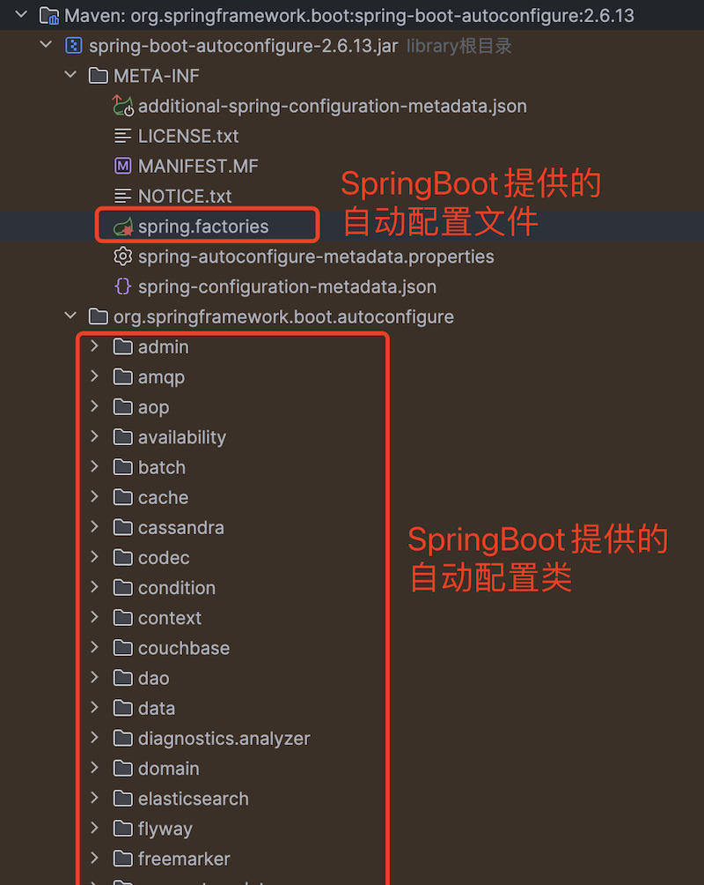

# SpringBoot自动配置原理

> 📅 发布时间：2022-03-18
>
> 🏷️ 标签：`Java` `SpringBoot`
>
> ⏱️ 阅读时长：约 20 分钟

> 现在 SpringBoot 框架应用越来越广泛，提供的自动化配置大大减轻了开发者的配置工作，那今天就来探究一下 SpringBoot 内部是怎么实现自动化配置的，在弄清楚自动化配置之后，也会再讲述下自定义一个 SpringBoot 启动器流程。

## 1. 自动配置原理

### 1.1 `@SpringBootApplication` 启动类注解

一切都要从`SpringBoot`的启动类上的`@SpringBootApplication`注解说起，代码如下

```java
@SpringBootApplication
public class SpringCloudDemoApplication {
    public static void main(String[] args) {
        SpringApplication.run(SpringCloudDemoApplication.class, args);
    }
}
```

在`@SpringBootApplication`注解类里面代码如下

```java
@Target(ElementType.TYPE)
@Retention(RetentionPolicy.RUNTIME)
@Documented
@Inherited
@SpringBootConfiguration
@EnableAutoConfiguration
@ComponentScan(excludeFilters = { @Filter(type = FilterType.CUSTOM, classes = TypeExcludeFilter.class),
		@Filter(type = FilterType.CUSTOM, classes = AutoConfigurationExcludeFilter.class) })
public @interface SpringBootApplication {
  ...
}
```

其中有三个比较重要的注解要说一下，分别是`@SpringBootConfiguration`、`@EnableAutoConfiguration`、`@ComponentScan`

- `@SpringBootConfiguration`：主要用于标识一个类为`SpringBoot`应用的配置类，是`@Configuration`注解的一个特化。
- `@EnableAutoConfiguration`：加载自动配置的核心注解，下面会展开详细讲。
- `@ComponentScan`：是扫描指定的包路径及其子包路径中的`Spring`组件，并将它们注册为`Spring`应用上下文中的`Bean`，下面也会展开详细讲。

### 1.2 `@ComponentScan` 注解

该注解的作用是扫描指定的包路径及其子包路径中的`Spring`组件（例如被`@Component`、`@Service`、`@Repository`或`@Controller`注解标注的类），并将它们注册为`Spring`应用上下文中的`Bean`。内部精简后的代码如下

```java
@Target(ElementType.TYPE)
@Retention(RetentionPolicy.RUNTIME)
@Documented
@Repeatable(ComponentScans.class) // 允许多次使用
public @interface ComponentScan {
    String[] value() default {}; // 指定基础扫描包路径
    String[] basePackages() default {}; // 等价于 value 属性
    Class<?>[] basePackageClasses() default {}; // 指定扫描包中的类作为基准
    Filter[] includeFilters() default {}; // 包含的过滤器
    Filter[] excludeFilters() default {}; // 排除的过滤器
    boolean lazyInit() default false; // 是否延迟初始化，true，则扫描到的 Bean 在第一次使用时才初始化
}
```

**具体工作流程可归纳如下**

- `ComponentScanAnnotationParser`类负责接下`@ComponentScan`注解，提取配置信息（如扫描路径、过滤规则等），精简后的代码如下

```java
class ComponentScanAnnotationParser {
  ...
	public Set<BeanDefinitionHolder> parse(AnnotationAttributes componentScan, final String declaringClass) {
		ClassPathBeanDefinitionScanner scanner = new ClassPathBeanDefinitionScanner(...);
    ...
    scanner.setBeanNameGenerator..
    scanner.setScopedProxyMode...
    scanner.setScopeMetadataResolver...
    scanner.setResourcePattern...
    scanner.addIncludeFilter...
    scanner.addExcludeFilter...
    scanner.getBeanDefinitionDefaults().setLazyInit...
    ...
		return scanner.doScan(StringUtils.toStringArray(basePackages));
	}
  ...
}
```

- `ClassPathBeanDefinitionScanner`执行实际扫描工作，找到所有符合条件的类，将扫描到的类封装为 BeanDefinition，并注册到 BeanFactory 中，精简后的代码如下

```java
public class ClassPathBeanDefinitionScanner extends ClassPathScanningCandidateComponentProvider {
	...
	protected Set<BeanDefinitionHolder> doScan(String... basePackages) {
		Set<BeanDefinitionHolder> beanDefinitions = new LinkedHashSet<>();
		// 遍历所有指定的包路径
		for (String basePackage : basePackages) {
			// 扫描包路径，并通过 isCandidateComponent 方法过滤出符合条件的类。
			Set<BeanDefinition> candidates = findCandidateComponents(basePackage);
			for (BeanDefinition candidate : candidates) {
				ScopeMetadata scopeMetadata = this.scopeMetadataResolver.resolveScopeMetadata(candidate);
				candidate.setScope(scopeMetadata.getScopeName());
				// 生成 Bean 的名称（通常是类名的简写或自定义名称）
				String beanName = this.beanNameGenerator.generateBeanName(candidate, this.registry);
				if (candidate instanceof AbstractBeanDefinition) {
					postProcessBeanDefinition((AbstractBeanDefinition) candidate, beanName);
				}
				if (candidate instanceof AnnotatedBeanDefinition) {
					AnnotationConfigUtils.processCommonDefinitionAnnotations((AnnotatedBeanDefinition) candidate);
				}
				// 检查是否需要进行额外的处理（如是否符合注册条件）
				if (checkCandidate(beanName, candidate)) {
					// 创建 BeanDefinitionHolder，用于存储 BeanDefinition 和 Bean 的名称
					BeanDefinitionHolder definitionHolder = new BeanDefinitionHolder(candidate, beanName);
					// 如果需要，为 Bean 设置代理增强功能（例如 AOP 的作用）
					definitionHolder =
							AnnotationConfigUtils.applyScopedProxyMode(scopeMetadata, definitionHolder, this.registry);
					// 将 BeanDefinitionHolder 添加到集合中
					beanDefinitions.add(definitionHolder);
					// 将当前 BeanDefinition 注册到 BeanFactory（核心注册步骤）
					registerBeanDefinition(definitionHolder, this.registry);
				}
			}
		}
		return beanDefinitions;
	}
  ...
}
```

### 1.3 `@EnableAutoConfiguration` 注解

该注解作用是启用`SpringBoot`的自动配置机制。通过这个注解，`SpringBoot`可以根据应用程序的类路径依赖和环境配置自动装配`Spring`应用上下文中的配置`Bean`，从而减少了繁琐的手动配置。内部精简后的代码如下

```java
@Target(ElementType.TYPE)
@Retention(RetentionPolicy.RUNTIME)
@Documented
@Inherited
@AutoConfigurationPackage // 自动注册基础包
@Import(AutoConfigurationImportSelector.class) // 导入自动配置选择器
public @interface EnableAutoConfiguration {
    String[] exclude() default {}; // 排除特定的自动配置类
    Class<?>[] excludeName() default {}; // 排除特定的自动配置类（通过类名）
}
```

#### 1.3.1 `@Import` 注解

`@Import`是`Spring`框架中的一个重要注解，用于将一个或多个类导入到当前`Spring`容器中，并根据导入类的类型执行不同的逻辑。

它支持以下几种类型：

- 普通配置类：导入的类会作为一个标准的`Spring`配置类（类似于`@Configuration`）。
- 实现`ImportSelector`的类，提供一种动态选择要导入的组件的机制。
- 实现`ImportBeanDefinitionRegistrar`的类，手动注册`BeanDefinition`，实现更精细的控制。
- 普通组件类，非配置类的普通组件也可以通过`@Import`导入，并注册为一个`Spring Bean`。

#### 1.3.2 `@AutoConfigurationPackage` 注解

用于注册指定包及其子包为组件扫描路径，使得这些包下的类可以自动被`Spring`容器管理。内部代码如下

```java
@Target(ElementType.TYPE)
@Retention(RetentionPolicy.RUNTIME)
@Documented
@Inherited
@Import(AutoConfigurationPackages.Registrar.class)
public @interface AutoConfigurationPackage {
	String[] basePackages() default {};
	Class<?>[] basePackageClasses() default {};
}
```

使用`@Import`导入了`AutoConfigurationPackages.Registrar`，这是一个`ImportBeanDefinitionRegistrar`实现类，负责将指定包及其子包注册为组件扫描路径。

```java
public abstract class AutoConfigurationPackages {
  ...
	static class Registrar implements ImportBeanDefinitionRegistrar, DeterminableImports {
		@Override
		public void registerBeanDefinitions(AnnotationMetadata metadata, BeanDefinitionRegistry registry) {
			register(registry, new PackageImports(metadata).getPackageNames().toArray(new String[0]));
		}
    ...
	}
  ...
}
```

断点调试下看看`metadata`信息


结论：`@AutoConfigurationPackage`就是将主配置类（`@SpringBootApplication`标注的类）所在的包及其子包注册为组件扫描路径。

#### 1.3.3 `@Import(AutoConfigurationImportSelector.class)` 注解

这个是将自动配置类注入进容器的核心注解。

使用`@Import`导入了`AutoConfigurationImportSelector.class`，自动配置类注入容器的核心。内部代码如下

```java
public class AutoConfigurationImportSelector implements ... {
	@Override
	public String[] selectImports(AnnotationMetadata annotationMetadata) {
		// 检查自动配置功能是否启用
		if (!isEnabled(annotationMetadata)) {
			return NO_IMPORTS;
		}
		// 获取自动配置条目封装实体
		AutoConfigurationEntry autoConfigurationEntry = getAutoConfigurationEntry(annotationMetadata);
		// 返回自动配置条目，Spring会加载这些配置类
		return StringUtils.toStringArray(autoConfigurationEntry.getConfigurations());
	}
	...
	protected AutoConfigurationEntry getAutoConfigurationEntry(AnnotationMetadata annotationMetadata) {
		if (!isEnabled(annotationMetadata)) {
			return EMPTY_ENTRY;
		}
		AnnotationAttributes attributes = getAttributes(annotationMetadata);
		// 获取自动配置条目
		List<String> configurations = getCandidateConfigurations(annotationMetadata, attributes);
		// 剔除掉重复的
		configurations = removeDuplicates(configurations);
		// 排除掉指定排除的
		Set<String> exclusions = getExclusions(annotationMetadata, attributes);
		checkExcludedClasses(configurations, exclusions);
		configurations.removeAll(exclusions);
		configurations = getConfigurationClassFilter().filter(configurations);
		fireAutoConfigurationImportEvents(configurations, exclusions);
		// 将条目封装 AutoConfigurationEntry 实体
		return new AutoConfigurationEntry(configurations, exclusions);
	}
	...
	protected List<String> getCandidateConfigurations(AnnotationMetadata metadata, AnnotationAttributes attributes) {
		// 加载配置类下面指定key的配置条目，key为EnableAutoConfiguration的全名（包括类路径）
		List<String> configurations = SpringFactoriesLoader.loadFactoryNames(getSpringFactoriesLoaderFactoryClass(),
				getBeanClassLoader());
		Assert.notEmpty(configurations, "No auto configuration classes found in META-INF/spring.factories. If you "
				+ "are using a custom packaging, make sure that file is correct.");
		return configurations;
	}
	...
  protected Class<?> getSpringFactoriesLoaderFactoryClass() {
		return EnableAutoConfiguration.class;
	}
}
```

我们看到内部关键方法调用流程如下

- 调用`selectImports()`
- 调用`getAutoConfigurationEntry()`
- 调用`getCandidateConfigurations()`
- 调用`SpringFactoriesLoader.loadFactoryNames(EnableAutoConfiguration.class, getBeanClassLoader())`

最后一步把`EnableAutoConfiguration.class`作为`factoryType`传了下去，下面看看`SpringFactoriesLoader`里面的代码

```java
public final class SpringFactoriesLoader {
    ...
    public static List<String> loadFactoryNames(Class<?> factoryType, @Nullable ClassLoader classLoader) {
        ClassLoader classLoaderToUse = classLoader;
        if (classLoader == null) {
            classLoaderToUse = SpringFactoriesLoader.class.getClassLoader();
        }

        // 获取传入进来的factoryType的全名（包括类路径）
        String factoryTypeName = factoryType.getName();
        // 首先获取配所有的配置条目，然后取出factoryType的全名为key的配置值
        return (List)loadSpringFactories(classLoaderToUse).getOrDefault(factoryTypeName, Collections.emptyList());
    }

    private static Map<String, List<String>> loadSpringFactories(ClassLoader classLoader) {
        Map<String, List<String>> result = (Map)cache.get(classLoader);
        if (result != null) {
            return result;
        } else {
            Map<String, List<String>> result = new HashMap();

            try {
                // 获取到项目包及其所以依赖子包下面的 META-INF/spring.factories 文件
                Enumeration<URL> urls = classLoader.getResources("META-INF/spring.factories");
                // 解析这些文件下面的配置，并将结果缓存到 result 里面
                while(urls.hasMoreElements()) {
                    URL url = (URL)urls.nextElement();
                    UrlResource resource = new UrlResource(url);
                    Properties properties = PropertiesLoaderUtils.loadProperties(resource);
                    Iterator var6 = properties.entrySet().iterator();

                    while(var6.hasNext()) {
                        Map.Entry<?, ?> entry = (Map.Entry)var6.next();
                        String factoryTypeName = ((String)entry.getKey()).trim();
                        String[] factoryImplementationNames = StringUtils.commaDelimitedListToStringArray((String)entry.getValue());
                        String[] var10 = factoryImplementationNames;
                        int var11 = factoryImplementationNames.length;

                        for(int var12 = 0; var12 < var11; ++var12) {
                            String factoryImplementationName = var10[var12];
                            ((List)result.computeIfAbsent(factoryTypeName, (key) -> {
                                return new ArrayList();
                            })).add(factoryImplementationName.trim());
                        }
                    }
                }

                result.replaceAll((factoryType, implementations) -> {
                    return (List)implementations.stream().distinct().collect(Collectors.collectingAndThen(Collectors.toList(), Collections::unmodifiableList));
                });
                cache.put(classLoader, result);
                return result;
            } catch (IOException var14) {
                throw new IllegalArgumentException("Unable to load factories from location [META-INF/spring.factories]", var14);
            }
        }
    }
}
```

方法执行流程如下

- 调用`loadFactoryNames()`
- 调用`loadSpringFactories()`，加载项目包及其所以依赖子包下面的`META-INF/spring.factories`文件，解析文件配置
- 从上面解析里面获取指定配置（以`factoryTypeName`为`key`，这个流程里面是`org.springframework.boot.autoconfigure.EnableAutoConfiguration`）

最后我们看下配置文件里面都写了些啥，首先我们直接看`SpringBoot`的自动配置文件




**由上面代码我们分析出，首先加载当前项目类路径及其所有依赖子包路径下面的`META-INF/spring.factories`文件，解析里面的配置，然后取出里面以`org.springframework.boot.autoconfigure.EnableAutoConfiguration`为`key`的那些配置，也就是上面图中红线全部来的部分。**

当然`SpringBoot`配置了很多配置类，截图只截了部分，大家想看的话自己点进去看。

那么这么多自动配置类，我们随便抽一个自动配置类，进去看看都是怎么写的，那就看看`RedisAutoConfiguration`自动配置类是怎么写的


这个配置类上面`@Conditional`注解来进行判断，满足条件的话才会将该配置类加载进容器中，然后再根据里面`Bean`上面的`@Conditional`来选择性加载对应的`Bean`进容器中

**这里补充下`@Conditional`注解及其衍生的注解**

- `@ConditionalOnClass`：类路径中存在指定类，才会启用配置或加载组件。
- `@ConditionalOnMissingClass`：类路径中不存在指定类，才会启用配置或加载组件。
- `@ConditionalOnBean`：容器中存在指定 Bean 类型，才会启用配置或加载组件。
- `@ConditionalOnMissingBean`：容器中不存在指定 Bean 类型，才会启用配置或加载组件。
- `@ConditionalOnProperty`：配置属性满足指定条件，才会启用配置或加载组件。
- `@ConditionalOnResource`：存在指定资源文件，才会启用配置或加载组件。
- `@ConditionalOnWebApplication`：当前为 Web 应用，才会启用配置或加载组件。
- `@ConditionalOnNotWebApplication`：当前非 Web 应用，才会启用配置或加载组件。
- `@ConditionalOnJava`：当前运行的 Java 版本满足条件，才会启用配置或加载组件。

## 2.自定义 SpringBoot Starter 实战

一般`SpringBoot`官方提供的启动器都是`spring-boot-starter-xx`，我们自定义的一般是`xx-spring-boot-starter`。

下面我们用伪代码封装一个阿里支付 SDK 的启动器，名字就叫`ali-pay-spring-boot-starter`

### 2.1 创建工程


### 2.2 配置 `pom.xml`

```xml
<?xml version="1.0" encoding="UTF-8"?>
<project xmlns:xsi="http://www.w3.org/2001/XMLSchema-instance" xmlns="http://maven.apache.org/POM/4.0.0"
         xsi:schemaLocation="http://maven.apache.org/POM/4.0.0 http://maven.apache.org/xsd/maven-4.0.0.xsd">
    <modelVersion>4.0.0</modelVersion>
    <groupId>com.ali.pay</groupId>
    <artifactId>ali-pay-spring-boot-starter</artifactId>
    <dependencies>
        <!-- Spring Boot Starter 基础库 -->
        <dependency>
            <groupId>org.springframework.boot</groupId>
            <artifactId>spring-boot-starter</artifactId>
        </dependency>
    </dependencies>
</project>
```

### 2.3 定义 Properties 类

用于在配置文件中（yml）进行配置

```java
@Data
@ConfigurationProperties(prefix = "pay.ali")
public class AliProperties {

	/** 是否开启支付宝支付功能，不配置则默认不开启，参考AliPayConfiguration类上的@ConditionalOnProperty注解 */
	private Boolean enable;

	/** APPID */
	private String appId;
}
```

### 2.4 编写自动配置类

用于配置和注册 Bean，也就是具体的接口实现类实例

```java
@Configuration
@EnableConfigurationProperties(AliProperties.class)
@ConditionalOnProperty(value = "pay.ali.enable", havingValue = "true")
public class AliPayConfiguration {

	private final AliProperties properties;

	public AliPayConfiguration(AliProperties properties) {
		this.properties = properties;
	}

	@Bean
	public AliPayClient aliStandardPayClient() {
		return new AliPayClientImpl(properties);
	}
}
```

### 2.5 编写功能接口

用于定义功能实现规范

```java
public interface AliPayClient {
  Response createPayOrder(Request request);
}
```

### 2.6 编写实现类

用于实现具体功能，可以有不同的实现类

```java
public class AliPayClientImpl {

	private final AliProperties properties;

	public AliPayClientImpl(AliProperties properties) {
		this.properties = properties;
		// 初始化相关
	}

	public Response createPayOrder(Request request) {
		// 创建支付账单
	}
}
```

### 2.7 创建并编写 `spring.factories`

该文件放在`src/main/resources/META-INF`目录下

因为`Starter`的包名跟项目包名应该不一致，所以`SpringBoot`没法扫描和注入`Starter 里面的配置，

`SpringBoot`程序在启动时会通过`@EnableAutoConfiguration`注解扫描所有项目和项目引用 jar 包里面的`classpath`路径下的`META-INF/spring.factories`文件中自定义的配置类，将对应配置加载进容器中

```
org.springframework.boot.autoconfigure.EnableAutoConfiguration=\
com.ali.pay.AliPayConfiguration
```

### 2.8 使用说明

- 项目依赖进该启动器
- 在`yml`文件中进行配置
- 注入`@Autowired private AliPayClient aliPayClient`，然后使用
